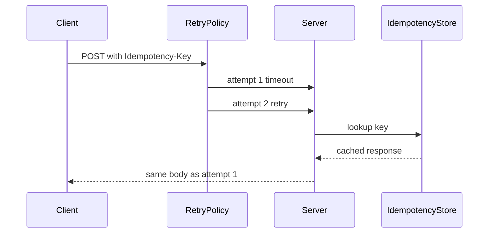

# ADR-004: Idempotency and Retry Policy

## Status

Accepted on 2026-07-22.

## Context

Clients and gateways retry on timeouts and `503` responses ([[07-Backend/06-Reliability-and-Abuse-Resistance/Retries Jitter and Idempotent Handlers|Retries Jitter and Idempotent Handlers]]). Unsafe retries on POST create duplicate side effects unless [[07-Backend/01-HTTP-APIs-and-Contracts/Idempotency Keys and Safe Retries|Idempotency Keys]] are honored.

## Decision

Toolkit implements:

1. **Server middleware:** `Idempotency-Key` header stores response fingerprint with TTL for configured mutating routes.
2. **Client `RetryPolicy`:** Retries only when:
   - HTTP method is idempotent (`GET`, `HEAD`, `PUT`, `DELETE`, `OPTIONS`), **or**
   - `Idempotency-Key` present on request, **or**
   - explicit override flag for tests only.
3. **Backoff:** exponential with full jitter; max attempts configurable; honor `429 Retry-After` when present.
4. **Never retry** non-idempotent POST without idempotency key (default).

## Options Considered

| Option | Pros | Cons |
| --- | --- | --- |
| Strict safe matrix (chosen) | Prevents amplification | More client complexity |
| Retry all 5xx | Simple | Duplicate writes |
| Idempotency only in docs | No code | Learners repeat outages |

## Consequences

URL shortener lab demonstrates idempotent create. Reliability harness tests unsafe POST retry blocked. Rate limiter integrates with retry budget to avoid storms.

## Related Documents

- [[07-Backend/projects/URL Shortener API/Architecture|URL Shortener Architecture]]
- [[07-Backend/projects/API Contract and Reliability Harness/Security|Reliability Harness Security]]
