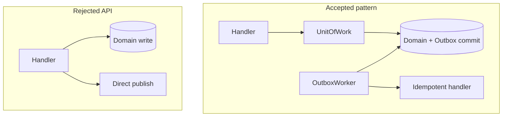

# ADR-005: Outbox vs Dual-Write

## Status

Accepted on 2026-07-22.

## Context

Services that write database state **and** publish events risk **dual-write** inconsistency: commit succeeds but message publish fails, or vice versa ([[07-Backend/07-Caching-Jobs-and-Messaging/Transactional Outbox and Inbox Patterns|Transactional Outbox and Inbox Patterns]]). Learners often reach for "write DB then call Kafka" without understanding failure windows.

## Decision

Toolkit teaches **transactional outbox** only:

- Domain mutation and outbox insert in one **unit of work** (fake transaction in lab; real DB transaction in production handoff).
- **In-process poller** claims outbox rows and dispatches to typed `JobRegistry` handlers.
- Handlers must be **idempotent**—at-least-once delivery is assumed.
- No direct "publish then write" or "write then publish" dual-write API in toolkit.

Message broker clients are **patterns + fake adapter**, not Kafka/Redis engine implementations—handoff to [[08-Databases/README|Databases]] and [[09-System-Design/README|System Design]] for broker operations at scale.

## Options Considered

| Option | Pros | Cons |
| --- | --- | --- |
| Transactional outbox (chosen) | Teaches safe default | Requires worker/poller |
| Dual-write demo | Shows failure vividly | Anti-pattern might be copied |
| Real Kafka in labs | Realistic | Engine scope creep |

Dual-write appears only in **tests as fault injection contrast**, not as supported API.

## Consequences

Job Worker mini project is mandatory portfolio gate. Documentation states in-process poller is not horizontally scalable. Dead-letter state after max attempts is queryable in tests.

## Related Documents

- [[07-Backend/projects/Job Worker and Outbox Lab/README|Job Worker and Outbox Lab]]
- [[07-Backend/projects/Backend Service Toolkit/Database|Database]]
