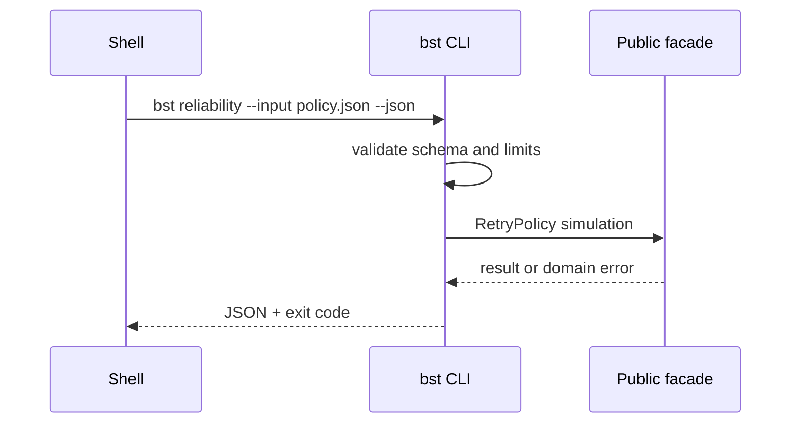

# API — Backend Service Toolkit

## Library Surface

| Module | Symbols | Contract summary |
| --- | --- | --- |
| mini-express | `MiniApp`, `Router`, `createProblemDetails` | middleware stack on `node:http` |
| auth | `createAuthRouter`, `requireAuth`, `requireRole`, `AuthMode` | session or JWT per ADR-002 |
| validation | `validateBody`, `ValidationError` | schema at edge → problem+json |
| reliability | `withTimeout`, `RetryPolicy`, `createRateLimiter`, `CircuitBreaker`, `idempotencyMiddleware` | ADR-004 policies |
| cache | `cacheAside`, `withStampedeLock` | in-memory fake store |
| jobs | `UnitOfWork`, `OutboxWorker`, `JobRegistry` | outbox sketch per ADR-005 |
| persistence | `LinkRepository`, `FakeDbAdapter` | swappable fake adapter |
| contracts | `contractSmoke`, `loadOpenApiSpec` | executable OpenAPI checks |
| demo-server | `createDemoApp`, `startDemoServer` | composes modules |

Source: [[07-Backend/code/src|07-Backend/code/src]]. Educational APIs—not drop-in replacements for production Express stacks, Auth0, or ORMs.

## Demo HTTP Routes

| Method | Path | Auth | Purpose |
| --- | --- | --- | --- |
| GET | `/health` | none | liveness |
| GET | `/ready` | none | readiness with fake dependency check |
| POST | `/v1/links` | optional | URL shortener slice |
| GET | `/v1/links` | optional | paginated list |
| GET | `/:code` | none | redirect |
| POST | `/auth/register` | none | auth lab |
| POST | `/auth/login` | none | auth lab |
| GET | `/metrics` | none | RED demo counters |

Full OpenAPI: [[07-Backend/code/openapi/demo-api.yaml|demo-api.yaml]].

## CLI Contract (Target)

Syntax: `bst <express|auth|validate|reliability|cache|jobs|demo|contract> --input <json> --json`

The adapter reads bounded JSON, writes one JSON result to stdout, diagnostics to stderr, and never executes input as code.

## Error Model

| Exit | Code | Meaning | Caller action |
| --- | --- | --- | --- |
| 0 | OK | Completed | Consume stdout |
| 2 | INVALID_INPUT | Parse/schema failure | Correct input |
| 3 | DOMAIN_ERROR | Validation, auth, breaker, outbox failure | Inspect details |
| 4 | ABORTED | Timeout or abort signal | Retry only if safe |
| 70 | INTERNAL_ERROR | Unexpected defect | Preserve stderr and report |

HTTP errors use problem+json per [[07-Backend/projects/Backend Service Toolkit/ADR/ADR-003 Error Envelope Format|ADR-003]].

## Compatibility

Semantic versioning applies after first tagged release. Export names, JSON fields, exit codes, and problem `type` URIs are compatibility surfaces. Express or JWT library parity is not.

## Related Documents

- [[07-Backend/projects/Backend Service Toolkit/Requirements|Requirements]]
- [[07-Backend/projects/Backend Service Toolkit/Testing|Testing]]
