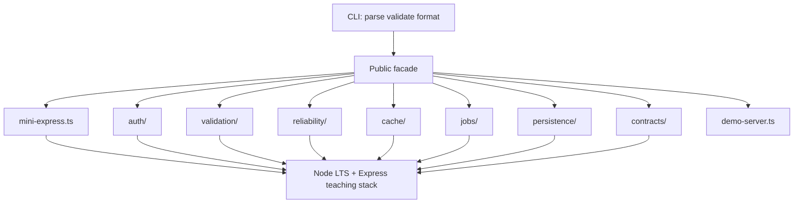
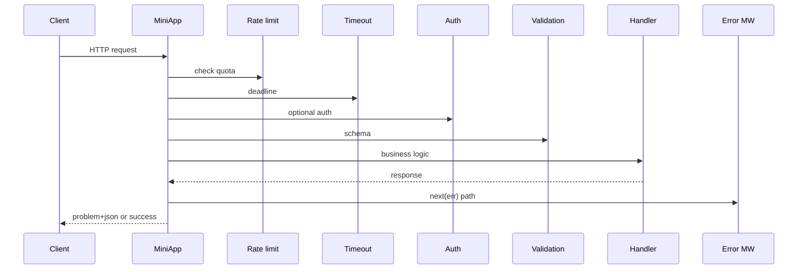

# Architecture — Backend Service Toolkit

## Summary

A modular monolith: one installable package (`@seb/backend-service-toolkit` target name in [[07-Backend/code|07-Backend/code]]), independent domain modules, demo server optional, no real database engine. The CLI validates and serializes input; domain modules own behavior.

## Request Pipeline (Demo Server)

## Key Components

| Component | Responsibility | Boundary |
| --- | --- | --- |
| Public facade | Stable exports and semver | No policy in re-exports |
| CLI adapter (`bst`) | Parsing, limits, JSON, exit codes | No domain logic |
| mini-express | Layer stack, router, error MW | Not Express 4 parity |
| auth | Register/login/refresh, guards | Not OAuth broker |
| validation | Schema + problem+json mapper | Edge validation only |
| reliability | Timeout, retry, idempotency, RL, CB | Not service mesh |
| cache | Cache-aside + stampede lock | In-memory fake store |
| jobs | Outbox poller + registry | Not Kafka/Redis |
| persistence | Repository + FakeDbAdapter | Not SQL engine |
| contracts | OpenAPI smoke | Not full codegen pipeline |
| demo-server | Composes modules for learning | Loopback default |

## Supporting Mini Projects

Each mini project README maps to one module family. Portfolio integrates them under one facade without merging unrelated invariants.

## Quality Attributes

- **Correctness:** explicit middleware order, auth mode, idempotency, and outbox invariants; contract smoke on demo API.
- **Security:** no `eval`, secret redaction, CSRF notes for session mode; see [[07-Backend/projects/Backend Service Toolkit/Security|Security]].
- **Performance:** bounded stores and token buckets; benchmarks gate demonstrated regressions only.
- **Operability:** RED metric hooks in demo `/metrics`; structured logs with correlation id.

## Trade-offs

One package simplifies learning but couples releases. Mini Express default teaches pipeline mechanics before adopting real Express in production apps. Fake adapters keep persistence in application pattern space—real engines live in [[08-Databases/README|Databases]].

## Decisions

- [[07-Backend/projects/Backend Service Toolkit/ADR/ADR-001 Express as Teaching Default|ADR-001: Express as Teaching Default]]
- [[07-Backend/projects/Backend Service Toolkit/ADR/ADR-002 Auth Default Sessions vs JWT|ADR-002: Auth Default Sessions vs JWT]]
- [[07-Backend/projects/Backend Service Toolkit/ADR/ADR-003 Error Envelope Format|ADR-003: Error Envelope Format]]
- [[07-Backend/projects/Backend Service Toolkit/ADR/ADR-004 Idempotency and Retry Policy|ADR-004: Idempotency and Retry Policy]]
- [[07-Backend/projects/Backend Service Toolkit/ADR/ADR-005 Outbox vs Dual-Write|ADR-005: Outbox vs Dual-Write]]

## Related Documents

- [[07-Backend/projects/Backend Service Toolkit/API|API]]
- [[07-Backend/projects/Backend Service Toolkit/Testing|Testing]]
