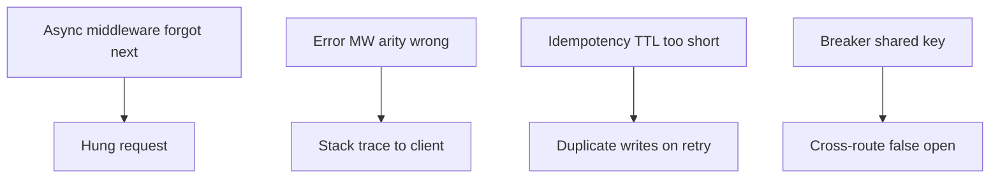

# Debug Diary — Backend Service Toolkit

## Investigation Template

Each entry should capture: symptom, hypothesis, reproduction, bisection, root cause, fix, regression test, and links to ADR or Known Issue if policy changed.

## Entries

| ID | Date | Symptom | Root cause | Fix | Test added |
| --- | --- | --- | --- | --- | --- |
| DD-001 | — | *(reserved)* | — | — | — |

No production incidents yet—portfolio in active documentation and implementation phase. First investigations expected around async middleware error propagation (mini-express), refresh rotation races (auth), and outbox lease reclaim timing (jobs).

## Common Failure Clusters (Anticipated)

## Related Documents

- [[07-Backend/projects/Backend Service Toolkit/Known Issues|Known Issues]]
- [[07-Backend/projects/Backend Service Toolkit/Postmortem|Postmortem]]
