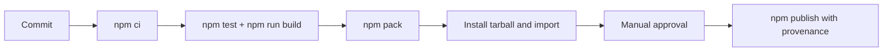

# Deployment — Backend Service Toolkit

## Environments

| Environment | Purpose | Promotion rule |
| --- | --- | --- |
| local | implementation and focused tests | `npm install` and `npm test` pass |
| CI | reproducible multi-platform verification | required checks and package smoke pass |
| npm release | immutable library/CLI artifact | reviewed tag, provenance, manual approval |
| demo | optional loopback server for learning | never exposed to internet without proxy + auth review |



## Demo Server Deployment (Single Service)

For learning only—maps to [[07-Backend/10-Production-Services/Deployment Topologies for Single Services|Deployment Topologies for Single Services]]:

- Bind `127.0.0.1` by default; `HOST` env override requires explicit opt-in.
- Graceful shutdown via [[06-NodeJS/10-Production-Node/Graceful Shutdown and Drain|Graceful Shutdown and Drain]] patterns from Node track.
- Health `/health` liveness; `/ready` checks fake dependency flag.
- Reverse proxy expectations documented in [[07-Backend/10-Production-Services/Reverse Proxy Expectations and Trusted Headers|Reverse Proxy Expectations]]—not enabled in lab defaults.

## Release and Rollback

Build from [[07-Backend/code|07-Backend/code]] using `package.json` exports map. Inspect `npm pack` contents before publishing. Pin CI Node LTS versions; use least-privilege publish tokens. npm versions are immutable: rollback means deprecating the bad version and publishing a corrected semver.

## Local Bootstrap

```bash
cd 07-Backend/code
npm install
npm test
npm run build
npm run demo
npm pack
```

## Checklist

- [ ] Clean checkout: install and `npm test` pass.
- [ ] Tarball smoke import resolves public facade on Windows/Linux/macOS Node LTS.
- [ ] Artifact excludes tests, journals, secrets, and local caches.
- [ ] Changelog, compatibility notes, and provenance recorded.
- [ ] Demo server defaults to loopback.

## Related Documents

- [[07-Backend/projects/Backend Service Toolkit/Monitoring|Monitoring]]
- [[07-Backend/10-Production-Services/Operational Readiness for Backend Services|Operational Readiness for Backend Services]]
