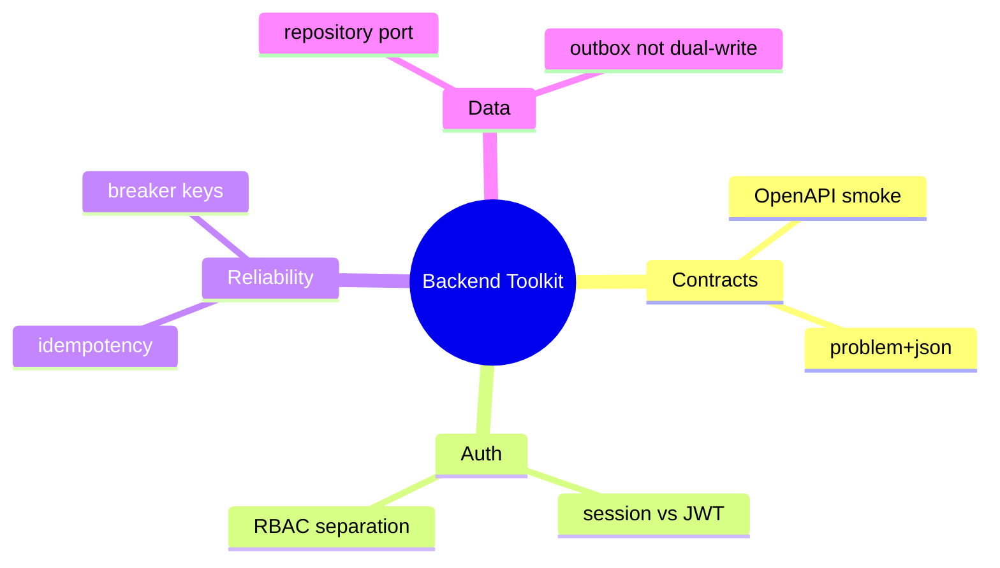

# Lessons Learned — Backend Service Toolkit

## Durable Takeaways

1. **Product failures differ from host failures.** Node can be healthy while auth, idempotency, or outbox semantics break customers—Backend track docs must foreground contracts, not sockets.

2. **Teaching defaults need ADRs.** Session vs JWT, error envelope shape, and outbox vs dual-write are opinionated; documenting decisions prevents portfolio readers from copying accidental choices as universal law.

3. **Fake adapters are a feature, not a gap.** Keeping persistence in application pattern space preserves clean handoff to [[08-Databases/README|Databases]] without implying engine expertise in Backend labs.

4. **Executable contracts beat prose.** OpenAPI smoke tests catch drift between demo implementation and documented API—especially status codes and error schemas.

5. **Reliability primitives amplify if misconfigured.** Retries without idempotency and shared circuit breakers without careful keys recreate outages—test negative paths, not only happy paths.

6. **Mini projects de-risk the portfolio.** Integrating five bounded labs before the monolithic facade reduces coupling surprises and gives learners incremental wins.

## Related Documents

- [[07-Backend/projects/Backend Service Toolkit/Postmortem|Postmortem]]
- [[07-Backend/projects/Backend Service Toolkit/Ideas|Ideas]]
