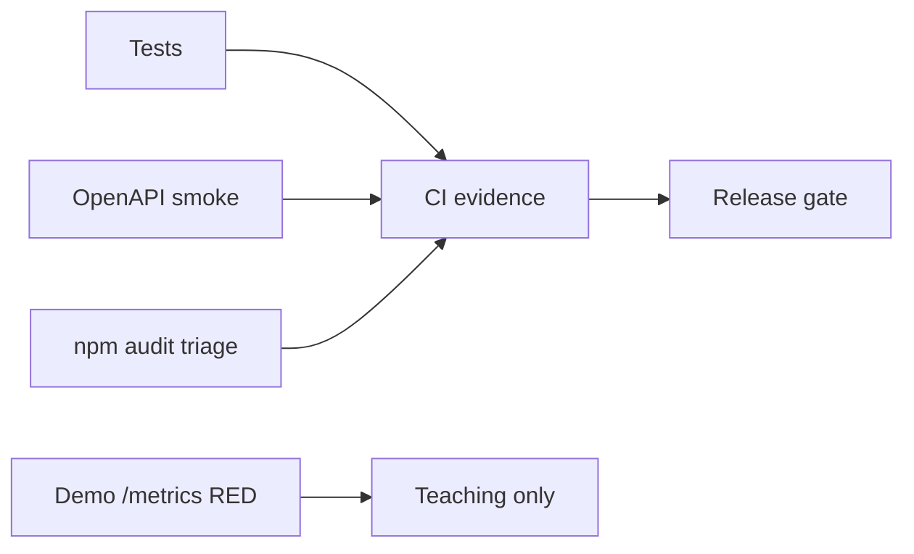

# Monitoring — Backend Service Toolkit

## Operability Model

Primary artifact is a **library + demo server**, not a always-on production fleet. Release health uses CI, tarball smoke, and contract tests. Demo server exposes RED-style counters to teach [[07-Backend/09-API-Observability-and-Testing/RED Metrics and SLIs for APIs|RED Metrics and SLIs for APIs]].

| Signal | Target | Evidence |
| --- | --- | --- |
| Supported-platform verification | 100% required jobs pass | CI checks |
| Tarball smoke success | 100% before publish | install/import run |
| Contract smoke | 100% on demo OpenAPI | labs.test.ts |
| Auth negative suite | 100% pass | dual-mode matrix |
| Critical dependency exposure | 0 unmitigated releasable findings | audit record |

## Demo `/metrics` (Teaching)

Counters exposed as plain text or JSON for lab inspection:

- `http_requests_total{route,status,method}`
- `http_request_duration_seconds` histogram buckets (simplified)
- `rate_limit_rejected_total`
- `circuit_breaker_state{dependency}` gauge
- `outbox_pending_gauge`

Not a production Prometheus deployment—handoff to [[16-DevOps/README|DevOps]] for scrape config and alerting.

## Structured Logging

Request correlation id middleware attaches `x-request-id` or generates uuid; logs JSON lines with `level`, `msg`, `requestId`, `route`, `status`—never passwords or tokens. See [[07-Backend/09-API-Observability-and-Testing/Structured Logs with Request Correlation|Structured Logs with Request Correlation]].

## Diagnostics

CLI emits diagnostics to stderr only with `BST_DEBUG=1`: command, duration bucket, module, stable error code—never raw secrets.

## Triage

Reproducible wrong result or import failure blocks release. Link confirmed defects to [[07-Backend/projects/Backend Service Toolkit/Debug Diary|Debug Diary]] and [[07-Backend/projects/Backend Service Toolkit/Known Issues|Known Issues]].

## Related Documents

- [[07-Backend/projects/Backend Service Toolkit/Deployment|Deployment]]
- [[07-Backend/09-API-Observability-and-Testing/Distributed Tracing Across Handlers|Distributed Tracing Across Handlers]]
