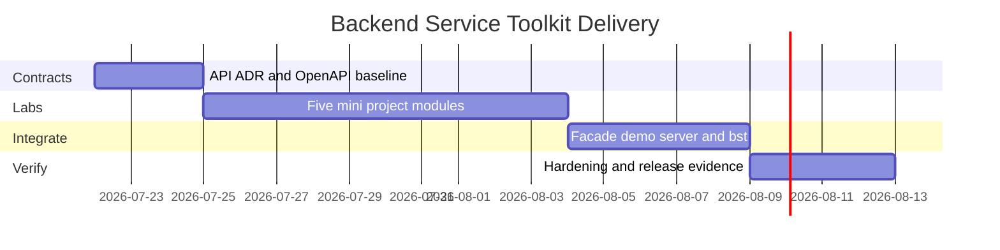

# Planning — Backend Service Toolkit

## Problem Statement

Backend track wiki notes explain product HTTP contracts, but learners lack a discoverable package surface, demo server, CLI workflow, compatibility contract, and release evidence suitable for a portfolio—especially across auth, validation, reliability, and outbox patterns.

## Success Definition

Every documented capability is importable and demonstrable through stable contracts; a clean checkout installs and passes tests; documentation states handoff boundaries without implying database engine or multi-region expertise.

## Scope

**In scope:** package facade, CLI adapter (`bst`), mini-express kit, auth modules, validation/errors, reliability primitives, cache/job helpers, repository + fake adapter, OpenAPI smoke, demo server, typed contracts, tests, release artifact, security checks, RED metric demo hooks.

**Out of scope:** Node core reimplementation, database engine internals, Kafka/Redis engines, OAuth IdP products, multi-region system design, ORM query planners, production Express drop-in claims.

## Milestones

| Milestone | Outcome | Exit criteria |
| --- | --- | --- |
| M1 Contracts | Public exports, OpenAPI, ADRs fixed | ADRs accepted; contract tests define gaps |
| M2 Mini projects | Five labs green in `labs.test.ts` | Each mini project acceptance checklist satisfied |
| M3 Integration | Facade + demo server + CLI slice | Demo routes + `bst` commands pass positive/negative tests |
| M4 Hardening | Release-ready evidence | clean install, vitest, npm pack smoke, docs match behavior |

## Risks

| Risk | Impact | Mitigation |
| --- | --- | --- |
| Docs exceed implementation | Misleading portfolio | Test every claimed export; Known Issues tracks gaps |
| Express parity implied | Incorrect learning | ADR-001 explicit simplifications |
| Auth mistakes in portfolio | Security harm | Dual-mode tests; threat model links |
| Outbox taught as "easy Kafka" | Wrong abstraction | ADR-005 + fake adapter only |
| Flaky timeout/breaker tests | CI noise | Fake timers; seeded jitter |

## Dependencies

- [[06-NodeJS/code|Node code labs]] for host primitives (HTTP, shutdown patterns)
- [[07-Backend/code|Backend code labs]] as implementation home
- Five mini project README acceptance criteria as module gates

## Related Documents

- [[07-Backend/projects/Backend Service Toolkit/Roadmap|Roadmap]]
- [[07-Backend/projects/Backend Service Toolkit/Requirements|Requirements]]
