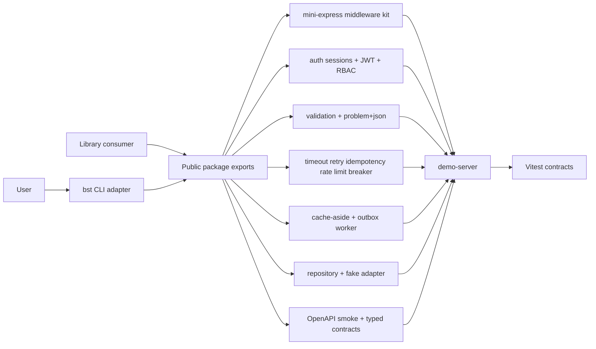

# Backend Service Toolkit

## One-Line Purpose

A tested TypeScript library and thin CLI (`bst`) learning surface that exposes selected **product HTTP service** mechanics: middleware kit, auth modules, validation and problem+json errors, reliability primitives, cache/job helpers, typed contracts, repository + fake adapters, and a demo server—without reimplementing Node core, database engines, or multi-region system design.

## Status

**Active.** Core modules and tests target [[07-Backend/code/src|07-Backend/code/src]] and [[07-Backend/code/tests/labs.test.ts|labs.test.ts]]. Package facade, public re-exports, and CLI integration (`bst`) are the active portfolio scope.

This toolkit is **not a production Express replacement, ORM, OAuth IdP, message broker, or database engine**. It is an inspectable educational model with explicit behavioral limits.

## Goals

- Present integrated backend service capabilities through one versioned package boundary and a deterministic CLI.
- Preserve small modules that can be tested and reasoned about independently.
- Make errors, auth boundaries, idempotency, retries, and outbox semantics visible.
- Demonstrate production disciplines: contracts, security, tests, releases, and observability.

## Non-Goals

- Reimplementing Node core, libuv, or V8 → [[06-NodeJS/README|Node.js]]
- Database engine internals, query planners, or replication → [[08-Databases/README|Databases]]
- Multi-region capacity, consistency, and federation → [[09-System-Design/README|System Design]]
- Full OAuth/OIDC broker or enterprise IdP products.
- Kafka/Redis engine implementations—only application patterns with fake/in-process adapters.

## Architecture Snapshot



## Document Map

| Document | Purpose |
| --- | --- |
| [[07-Backend/projects/Backend Service Toolkit/Planning\|Planning]] | Scope, milestones, risks |
| [[07-Backend/projects/Backend Service Toolkit/Requirements\|Requirements]] | Functional and non-functional requirements |
| [[07-Backend/projects/Backend Service Toolkit/Architecture\|Architecture]] | System shape and major components |
| [[07-Backend/projects/Backend Service Toolkit/Database\|Database]] | App patterns + fake adapters only |
| [[07-Backend/projects/Backend Service Toolkit/API\|API]] | Interfaces and contracts |
| [[07-Backend/projects/Backend Service Toolkit/Deployment\|Deployment]] | Environments and release path |
| [[07-Backend/projects/Backend Service Toolkit/Security\|Security]] | Threats, controls, secrets |
| [[07-Backend/projects/Backend Service Toolkit/Testing\|Testing]] | Verification strategy |
| [[07-Backend/projects/Backend Service Toolkit/Monitoring\|Monitoring]] | Release health and API SLI demos |
| [[07-Backend/projects/Backend Service Toolkit/Engineering Journal\|Engineering Journal]] | Session logs |
| [[07-Backend/projects/Backend Service Toolkit/Debug Diary\|Debug Diary]] | Bug investigations |
| [[07-Backend/projects/Backend Service Toolkit/Known Issues\|Known Issues]] | Open defects and debt |
| [[07-Backend/projects/Backend Service Toolkit/Lessons Learned\|Lessons Learned]] | Durable takeaways |
| [[07-Backend/projects/Backend Service Toolkit/Postmortem\|Postmortem]] | Retrospectives |
| [[07-Backend/projects/Backend Service Toolkit/Ideas\|Ideas]] | Backlog |
| [[07-Backend/projects/Backend Service Toolkit/Roadmap\|Roadmap]] | Phased delivery |
| [[07-Backend/projects/Backend Service Toolkit/ADR/ADR-001 Express as Teaching Default\|ADR-001]] · [[07-Backend/projects/Backend Service Toolkit/ADR/ADR-002 Auth Default Sessions vs JWT\|ADR-002]] · [[07-Backend/projects/Backend Service Toolkit/ADR/ADR-003 Error Envelope Format\|ADR-003]] · [[07-Backend/projects/Backend Service Toolkit/ADR/ADR-004 Idempotency and Retry Policy\|ADR-004]] · [[07-Backend/projects/Backend Service Toolkit/ADR/ADR-005 Outbox vs Dual-Write\|ADR-005]] |

## Mini Projects

| Mini project | Module focus |
| --- | --- |
| [[07-Backend/projects/Express Clone/README\|Express Clone]] | `MiniApp`, middleware stack |
| [[07-Backend/projects/Authentication Server/README\|Authentication Server]] | sessions/JWT, RBAC |
| [[07-Backend/projects/URL Shortener API/README\|URL Shortener API]] | REST, repository, validation |
| [[07-Backend/projects/Job Worker and Outbox Lab/README\|Job Worker and Outbox Lab]] | outbox worker, UoW |
| [[07-Backend/projects/API Contract and Reliability Harness/README\|API Contract and Reliability Harness]] | OpenAPI smoke, reliability kit |

## Run and Test

```bash
cd 07-Backend/code
npm install
npm test
```

The documented CLI target is `bst <command> --json`; until its adapter lands under [[07-Backend/code|07-Backend/code]], use imported TypeScript APIs described in [[07-Backend/projects/Backend Service Toolkit/API|API]].

Demo server:

```bash
cd 07-Backend/code
npm run demo
```

## Portfolio Acceptance Checklist

- [ ] All documented capabilities export from one package boundary.
- [ ] CLI output is deterministic JSON; errors use stable non-zero exit codes.
- [ ] Unit and integration tests cover happy paths, auth failures, idempotency, outbox, and contract smoke.
- [ ] Package ships typed public symbols and excludes test fixtures from artifacts.
- [ ] Security and monitoring checks pass before a tagged release.
- [ ] Database stance remains fake adapters—engines handed off to Databases track.

## Related Notes

- [[07-Backend/code/README|Backend Code Labs]]
- [[07-Backend/README|Backend Track]]
- [[06-NodeJS/projects/Node Runtime Toolkit/README|Node Runtime Toolkit]]
- [[Projects/README|Projects]]
- [[Career/README|Career]]
