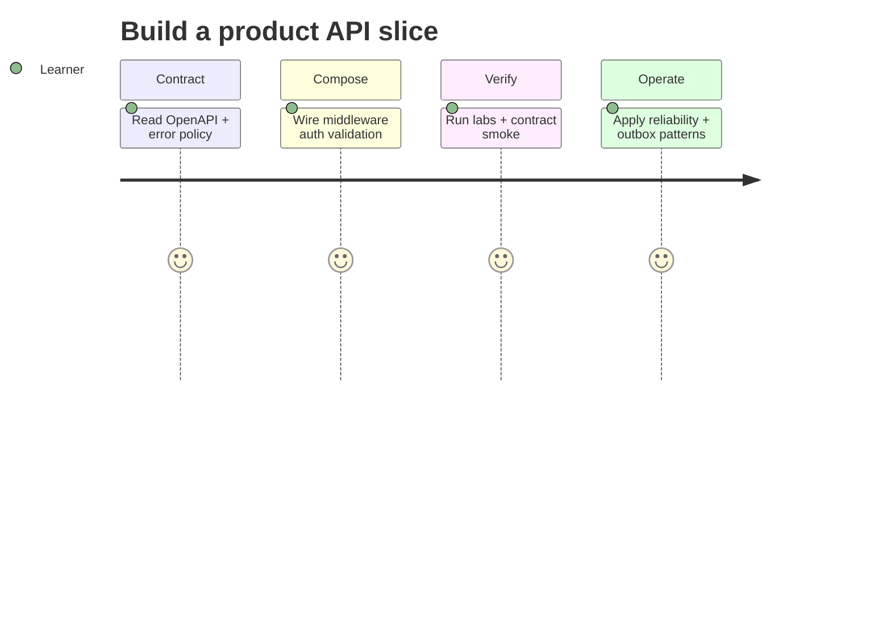

# Requirements — Backend Service Toolkit

## Actors

| Actor | Goal |
| --- | --- |
| Learner | Inspect backend service patterns and reproduce failure modes |
| Library consumer | Import typed, documented APIs into labs |
| CLI user | Run deterministic demo commands without writing code |
| Maintainer | Change modules without silently breaking contracts |

## Functional Requirements

| ID | Requirement | Acceptance |
| --- | --- | --- |
| FR-001 | Export mini Express middleware kit | `MiniExpress` integration tests pass |
| FR-002 | Export auth router + guards (session and JWT modes) | Dual-mode auth tests pass |
| FR-003 | Export schema validation + problem+json errors | Validation and envelope tests pass |
| FR-004 | Export timeout, retry, idempotency, rate limit, circuit breaker | Reliability harness tests pass |
| FR-005 | Export cache-aside with stampede lock helper | Cache tests pass on fake store |
| FR-006 | Export outbox worker + unit of work sketch | Outbox lab tests pass |
| FR-007 | Export repository port + fake DB adapter | URL shortener repository tests pass |
| FR-008 | Export OpenAPI contract smoke runner | Contract tests pass against demo spec |
| FR-009 | Offer demo HTTP server composing modules | `npm run demo` serves `/health` |
| FR-010 | Offer JSON CLI for each capability | Valid input → documented JSON + exit 0 |

## Non-Functional Requirements

| ID | Category | Requirement | Measurement |
| --- | --- | --- | --- |
| NFR-001 | Correctness | Deterministic results for deterministic inputs | 100% contract suite pass |
| NFR-002 | Performance | Bounded body, queue, and idempotency store sizes | limits enforced before work |
| NFR-003 | Security | No eval of CLI input; auth secrets from env | negative security tests pass |
| NFR-004 | Portability | Node LTS on Windows/Linux/macOS | CI matrix passes |
| NFR-005 | Observability | JSON stdout; structured stderr for diagnostics | integration tests assert separation |
| NFR-006 | Honesty | Document handoff boundaries to Node/Databases/System Design | each module links limitations |

## Traceability

FR-001 → [[07-Backend/projects/Backend Service Toolkit/ADR/ADR-001 Express as Teaching Default|ADR-001]]; FR-002 → [[07-Backend/projects/Backend Service Toolkit/ADR/ADR-002 Auth Default Sessions vs JWT|ADR-002]]; FR-003 → [[07-Backend/projects/Backend Service Toolkit/ADR/ADR-003 Error Envelope Format|ADR-003]]; FR-004 → [[07-Backend/projects/Backend Service Toolkit/ADR/ADR-004 Idempotency and Retry Policy|ADR-004]]; FR-006 → [[07-Backend/projects/Backend Service Toolkit/ADR/ADR-005 Outbox vs Dual-Write|ADR-005]].

## Related Documents

- [[07-Backend/projects/Backend Service Toolkit/API|API]]
- [[07-Backend/projects/Backend Service Toolkit/Testing|Testing]]
