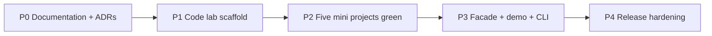

# Roadmap — Backend Service Toolkit

## Phase Overview

## P0 — Documentation + ADRs (2026-07-22)

**Status:** Complete.

- Five mini project README/Architecture/Testing/Security sets
- Toolkit portfolio doc set + ADR-001–005
- Acceptance criteria linked to `07-Backend/code`

## P1 — Code Lab Scaffold

**Goal:** `07-Backend/code` package with Vitest, tsconfig, empty module stubs, `labs.test.ts` skeleton.

**Exit criteria:**

- [ ] `npm install && npm test` runs (skipped or pending tests allowed with explicit `it.skip` count documented)
- [ ] `07-Backend/code/README` documents module map
- [ ] OpenAPI demo spec file present

## P2 — Mini Projects Green

**Goal:** Each mini project acceptance checklist satisfied.

| Module | Target file | Gate |
| --- | --- | --- |
| Express Clone | `mini-express.ts` | `-t MiniExpress` |
| Auth Server | `auth-server.ts` | `-t AuthServer` |
| URL Shortener | `url-shortener.ts` | `-t UrlShortener` |
| Outbox Worker | `outbox-worker.ts` | `-t OutboxWorker` |
| Reliability | `reliability-harness.ts` | `-t ReliabilityHarness` |

## P3 — Integration

**Goal:** Public facade, demo server, `bst` CLI.

- [ ] Single export surface from package root
- [ ] `npm run demo` serves demo routes on loopback
- [ ] `bst` commands documented in API with integration tests
- [ ] Contract smoke passes on demo app

## P4 — Release Hardening

**Goal:** Portfolio-ready npm artifact.

- [ ] npm pack smoke on three platforms
- [ ] Security negative suite complete
- [ ] Monitoring demo `/metrics` documented
- [ ] Known Issues KI-001/KI-002 closed

## Related Documents

- [[07-Backend/projects/Backend Service Toolkit/Planning|Planning]]
- [[07-Backend/projects/Backend Service Toolkit/Known Issues|Known Issues]]
- [[07-Backend/README|Backend MOC Implementation Checklist]]
