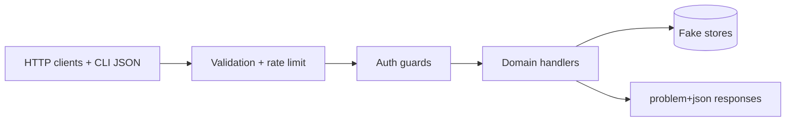

# Security — Backend Service Toolkit

## Trust Boundaries

## Threat Model

| Threat | Example | Control |
| --- | --- | --- |
| Broken auth middleware order | public route before guard | Document stack order; auth integration tests |
| JWT misconfiguration | weak secret, alg confusion | Env keys; fixed alg; negative tests |
| Session fixation / CSRF | cookie auth without CSRF | SameSite + CSRF token docs for session mode |
| Retry amplification | client retries POST | ADR-004 safe retry matrix |
| Rate limit bypass | spoofed forwarded IP | Distrust forwarded headers by default |
| Outbox payload injection | dynamic handler lookup | Typed JobRegistry only |
| Secret leakage | password in logs | Redact structured logs; test log capture |
| Supply-chain compromise | malicious dependency | Lockfile, audit, minimal deps |

## Controls

- bcrypt for passwords; refresh tokens stored hashed.
- problem+json errors without stack in production mode.
- Body/header/size limits at middleware edge.
- CLI parses JSON only—no `eval` or dynamic `import()` from user paths.
- Demo server loopback default; `Secure` cookies when `NODE_ENV=production`.
- Open redirect and dangerous URL schemes blocked in URL shortener validation.

## Security Acceptance

- Negative tests cover auth failures, tampered JWT, CSRF fixture, rate limit exhaustion, and oversize payloads.
- `npm audit` findings triaged by exploitability before release.
- Publish token scope is publish-only; unavailable to pull-request jobs.
- Limitations link to [[07-Backend/projects/Backend Service Toolkit/Known Issues|Known Issues]] and [[07-Backend/10-Production-Services/Security Review Checklist for APIs|Security Review Checklist for APIs]].

## Related Documents

- [[07-Backend/projects/Backend Service Toolkit/Requirements|Requirements]]
- [[07-Backend/projects/Backend Service Toolkit/ADR/ADR-002 Auth Default Sessions vs JWT|ADR-002]]
- [[07-Backend/04-Authentication/Authentication Server Threat Model|Authentication Server Threat Model]]
