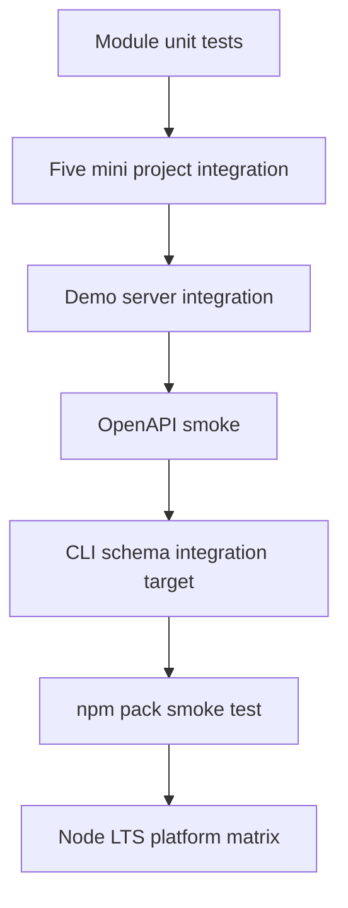

# Testing — Backend Service Toolkit

## Strategy



## Test Layers

| Layer | Coverage |
| --- | --- |
| Unit | mini-express layers, retry/breaker, cache lock, outbox UoW |
| Integration | auth dual-mode, URL shortener HTTP, outbox worker drain |
| Contract | OpenAPI smoke, problem+json shape, exit codes |
| Package | install tarball, import facade, invoke `bst` entry |
| Platform | Windows/Linux/macOS on Node 20+ LTS |

## Current Command

```bash
cd 07-Backend/code
npm install
npm test
```

Target executable coverage: [[07-Backend/code/tests/labs.test.ts|labs.test.ts]].

## Module Test Filters

| Capability | Vitest filter |
| --- | --- |
| Mini Express | `-t "MiniExpress"` |
| Auth | `-t "AuthServer"` |
| URL Shortener | `-t "UrlShortener"` |
| Outbox | `-t "OutboxWorker"` |
| Reliability | `-t "ReliabilityHarness"` |
| OpenAPI | `-t "OpenApiContract"` |
| Demo server | `-t "DemoServer"` |

## Definition of Done (Portfolio)

- [ ] All five mini project acceptance checklists satisfied by filtered tests
- [ ] Contract smoke fails on intentional schema drift fixture
- [ ] Auth tests run in session and JWT CI matrix jobs
- [ ] Demo server tests always `close()` and free ephemeral ports
- [ ] Packed artifact smoke test imports public facade

## Related Documents

- [[07-Backend/projects/Backend Service Toolkit/Requirements|Requirements]]
- [[07-Backend/09-API-Observability-and-Testing/Contract Integration and Load Testing|Contract Integration and Load Testing]]
- [[07-Backend/_exercises/README|Backend Exercises]]
