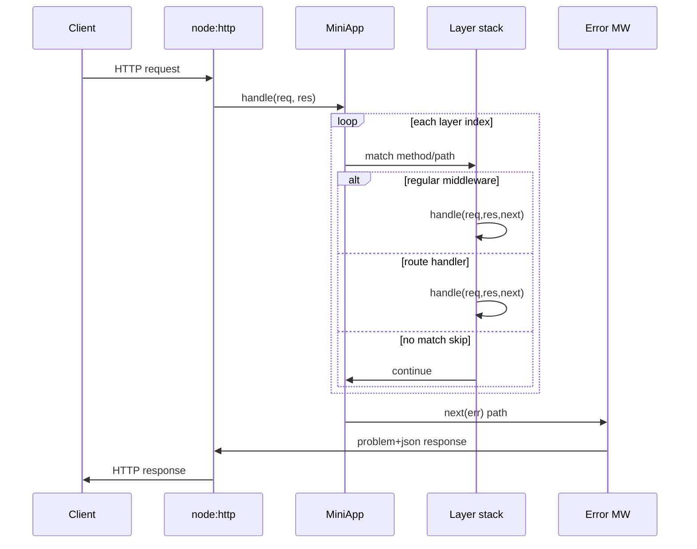

# Architecture — Express Clone

## Summary

The lab isolates product HTTP pipeline semantics behind a small typed API. Source of truth: [[07-Backend/code/src/mini-express.ts|mini-express.ts]]. Tests call public behavior through real HTTP integration, not mocked `req`/`res` objects alone.

## Component and Data Flow

## Public Surface

| Symbol | Responsibility |
| --- | --- |
| `MiniApp` | Owns layer stack, `listen`, root `handle` |
| `Router` | Sub-stack mountable at path prefix |
| `Layer` | Path regexp, optional method, handle, error flag |
| `createProblemDetails` | RFC 7807-shaped error envelope helper |

## Invariants

- Layer index only advances on `next()` without error; `next(err)` resets to error middleware scan.
- First matching error middleware consumes the error; subsequent error middleware runs only if it calls `next(err)`.
- `res.headersSent` guard prevents double `writeHead` after handler completion.
- Mount strips prefix from `req.url` for inner routers while preserving `req.originalUrl`.

## Failure Model

Unhandled rejections in async middleware route to error middleware via wrapper. Sync throws in handlers invoke error middleware when caught at boundary. Exhausted stack without response sends `404` with stable envelope. Process must not exit on handler errors in tests.

## Complexity and Ownership

The app owns the layer stack for process lifetime. Handlers must not retain `req`/`res` after response finish. No database or auth in core lab—downstream mini projects compose on this stack.

## Trade-offs and Simplifications

| Gap | Engineering consequence |
| --- | --- |
| Linear layer scan | Acceptable for teaching; production routers use optimized structures |
| Subset of Express 4 edge cases | Document differences; link real Express for parity questions |
| No built-in body parser | Add as explicit middleware in URL Shortener lab |
| Single-threaded dispatch | CPU work blocks loop—offload per [[06-NodeJS/projects/Worker Pool Lab/README\|Worker Pool Lab]] |

Using platform `http` is intentional: the learning goal is middleware pipeline mechanics, not reimplementing Node core or Express internals.

## Evolution Rules

- Preserve dispatch ordering and error envelope shape unless ADR documents a breaking change.
- Add failing test in [[07-Backend/code/tests/labs.test.ts|labs.test.ts]] before fixing edge cases.
- Integrate into [[07-Backend/projects/Backend Service Toolkit/README|Backend Service Toolkit]] facade without merging unrelated invariants.

## Related Documents

- [[07-Backend/projects/Express Clone/README|Project README]]
- [[07-Backend/02-Frameworks-and-Middleware/Express Clone Design|Express Clone Design]]
- [[07-Backend/projects/Backend Service Toolkit/Architecture|Toolkit Architecture]]
