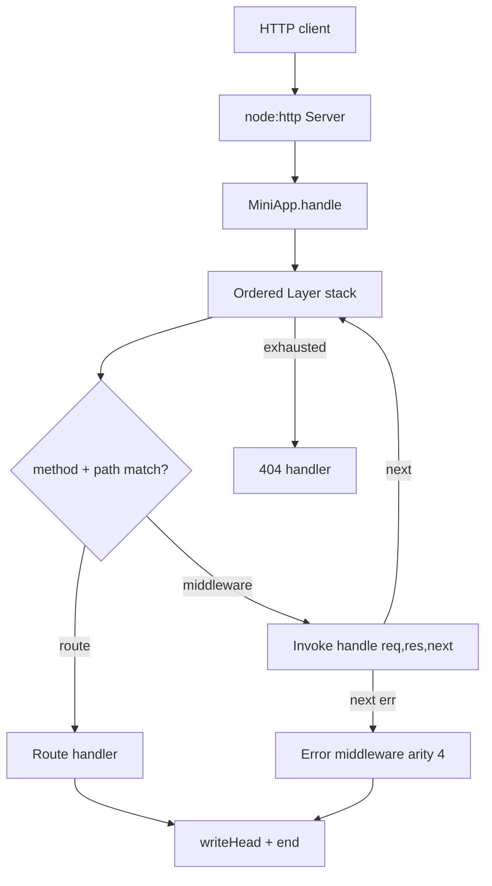

# Express Clone

## One-Line Purpose

Build a minimal but faithful Express-style application: ordered middleware stack, method/path routing, mount prefix stripping, `next`/`next(err)` dispatch, and error middleware—on top of Node `http` without importing Express.

## Status

**Active.** The learning surface targets [[07-Backend/code/src/mini-express.ts|mini-express.ts]] and executable checks in [[07-Backend/code/tests/labs.test.ts|labs.test.ts]]. This folder defines layer contracts, dispatch invariants, and acceptance against integration vectors.

## Prerequisites

- [[07-Backend/02-Frameworks-and-Middleware/Express Application and Router Internals|Express Application and Router Internals]]
- [[07-Backend/02-Frameworks-and-Middleware/Middleware Pipeline and Error Middleware|Middleware Pipeline and Error Middleware]]
- [[07-Backend/02-Frameworks-and-Middleware/Express Clone Design|Express Clone Design]]
- [[06-NodeJS/05-Networking/http and https Platform Servers|http and https Platform Servers]]
- [[06-NodeJS/projects/HTTP Server From Scratch/README|HTTP Server From Scratch]]

## Architecture



See [[07-Backend/projects/Express Clone/Architecture|Architecture]] for dispatch algorithm and deliberate simplifications vs Express 4.

## Acceptance Criteria

- [ ] `MiniApp` exposes `use`, `get`, `post`, `listen`, and nested `Router` mount with prefix stripping.
- [ ] Middleware runs in registration order; route handlers run only on matching method/path.
- [ ] `next(err)` skips remaining regular middleware and invokes first error middleware (4-arg).
- [ ] Async handler rejections propagate to error middleware without crashing the process.
- [ ] `listen` binds ephemeral port; `GET /health` returns `200` JSON via stack.
- [ ] Unknown routes return `404` with stable problem+json envelope from error middleware.
- [ ] Integration tests use real HTTP against loopback—no supertest dependency in lab scope.

## Run and Test

From the repository root:

```bash
cd 07-Backend/code
npm install
npm test -- tests/labs.test.ts -t "MiniExpress"
```

Run the complete Backend lab suite with `npm test`. Keep experiments in [[07-Backend/code|07-Backend/code]]; this directory contains documentation, not a second implementation.

## Benchmarks

| Workload | Variants | Primary metrics |
| --- | --- | --- |
| 1k GET /health through 3 middleware layers | sync vs async middleware | req/s, p99 latency |
| Deep stack (20 layers) | all pass-through | dispatch overhead per layer |
| Route table 100 entries | linear scan vs first match | match time at scale |
| Error path | thrown vs `next(err)` | response time, no double-finish |

Benchmark entry point (when added): `07-Backend/code/bench/mini-express.bench.ts`.

## Security and Failure Constraints

- Do not expose stack traces in production error envelope; use generic `500` with correlation id.
- Cap body size at middleware boundary before JSON parsers run.
- Reject path segments containing `..` before any static or filesystem middleware is added.
- Bind lab servers to `127.0.0.1` in tests; document production bind policy separately.
- No automatic `trust proxy`—forwarded headers are untrusted unless explicitly configured.

## Exercises and Reflection

1. Implement `next('route')` to skip remaining handlers on current router only.
2. Add parametric routes `:id` with typed `req.params` extraction.
3. Compare dispatch cost of your layer list vs Express `router` for 50 routes.

**Reflection prompts**

- Why does error middleware require arity `4` to be recognized?
- What breaks if async middleware forgets to call `next()`?
- When is a framework clone insufficient for production APIs?

## Interview Questions

- Walk through Express dispatch from `app.handle` to route handler.
- How do mount prefixes affect `req.url` vs `req.originalUrl`?
- Why did Express 5 change default async error handling?

## Related Notes

- [[07-Backend/projects/Express Clone/Architecture|Architecture]]
- [[07-Backend/projects/Express Clone/Testing|Testing]]
- [[07-Backend/projects/Express Clone/Security|Security]]
- [[07-Backend/README|Backend MOC]]
- [[07-Backend/code/README|Backend Code Labs]]
- [[07-Backend/projects/Backend Service Toolkit/README|Backend Service Toolkit]]
- [[Career/README|Career]]
