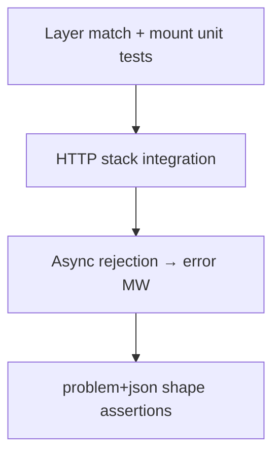

# Testing — Express Clone

## Strategy

Integration-first: spin real `http.Server` via `MiniApp.listen` on ephemeral port, drive with Node `http.request`. Unit tests cover layer matching, mount prefix stripping, and error middleware selection in isolation.



## Critical Paths

1. Three middleware layers: request id attached, order logged, handler reached
2. `GET /health` through stack → `200` JSON
3. Unknown path → `404` problem+json with stable `type` and `title`
4. Handler `throw` and async rejection → `500` via error middleware without stack in body
5. Mounted router at `/api` serves `/api/v1/items` with stripped inner path
6. `next(err)` skips remaining regular middleware
7. Server `close()` completes without hanging connections

## Commands

```bash
cd 07-Backend/code
npm install
npm test -- tests/labs.test.ts -t "MiniExpress"
```

Full suite: `npm test`. No network beyond `127.0.0.1` in CI.

## Definition of Done

- [ ] Integration tests bind ephemeral ports and always `close()` server in `afterEach`
- [ ] Error envelope tests assert `Content-Type: application/problem+json`
- [ ] Async middleware rejection tests pass without unhandledRejection in process
- [ ] Mount tests verify inner router sees stripped `req.url`
- [ ] No open handle warnings from Vitest after suite

## Related Documents

- [[07-Backend/projects/Express Clone/README|README]]
- [[07-Backend/09-API-Observability-and-Testing/Contract Integration and Load Testing|Contract Integration and Load Testing]]
- [[07-Backend/projects/Backend Service Toolkit/Testing|Backend Service Toolkit Testing]]
