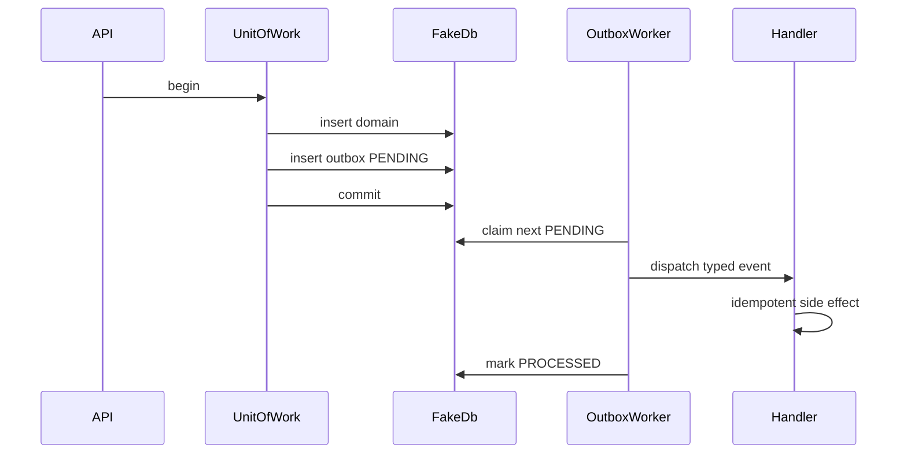

# Architecture — Job Worker and Outbox Lab

## Summary

Application-level reliability pattern lab. Source: [[07-Backend/code/src/outbox-worker.ts|outbox-worker.ts]]. Fake transaction wraps in-memory stores to teach atomicity without database engine internals.

## Data Flow

## Components

| Component | Responsibility |
| --- | --- |
| `UnitOfWork` | begin/commit/rollback across fake stores |
| `OutboxRepository` | CRUD outbox rows with status enum |
| `OutboxWorker` | poll, claim, dispatch, mark, retry |
| `JobRegistry` | maps event type → idempotent handler |
| `SideEffectLog` | test double proving exactly-once semantics |

## Outbox Row Schema

| Column | Purpose |
| --- | --- |
| `id` | uuid |
| `type` | handler key |
| `payload` | JSON reference ids only |
| `status` | PENDING \| PROCESSING \| PROCESSED \| DEAD |
| `attempts` | retry counter |
| `availableAt` | backoff scheduling |

## Invariants

- No outbox row PROCESSED without successful handler commit marker in SideEffectLog.
- Claim uses lease timeout so crashed worker rows become eligible again.
- Idempotency key in handler dedupes SideEffectLog entries.

## Trade-offs

In-process poller is not horizontally scalable—document handoff to [[07-Backend/07-Caching-Jobs-and-Messaging/Message Queue Client Patterns|Message Queue Client Patterns]] and [[08-Databases/README|Databases]] for real brokers and WAL.

## Related Documents

- [[07-Backend/projects/Job Worker and Outbox Lab/README|README]]
- [[07-Backend/projects/Backend Service Toolkit/ADR/ADR-005 Outbox vs Dual-Write|ADR-005]]
- [[07-Backend/07-Caching-Jobs-and-Messaging/Transactional Outbox and Inbox Patterns|Transactional Outbox and Inbox Patterns]]
