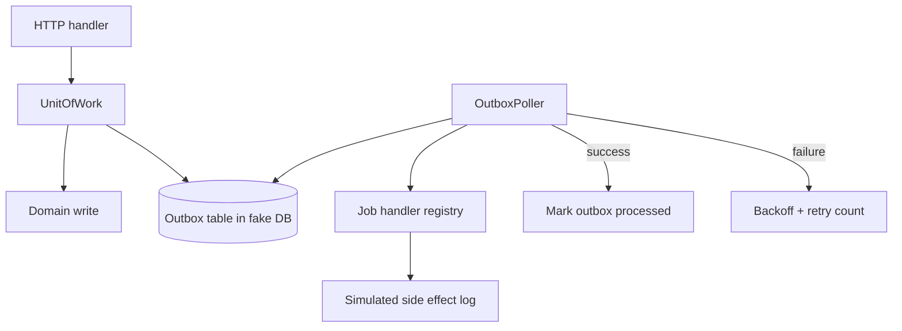

# Job Worker and Outbox Lab

## One-Line Purpose

Implement in-process background jobs with a transactional outbox sketch: write domain state and outbox row in one unit-of-work, poll/dispatch worker, at-least-once delivery with idempotent handlers—without building Kafka or Redis engines.

## Status

**Active.** The learning surface targets [[07-Backend/code/src/outbox-worker.ts|outbox-worker.ts]] and executable checks in [[07-Backend/code/tests/labs.test.ts|labs.test.ts]].

## Prerequisites

- [[07-Backend/07-Caching-Jobs-and-Messaging/Background Jobs and Workers|Background Jobs and Workers]]
- [[07-Backend/07-Caching-Jobs-and-Messaging/Transactional Outbox and Inbox Patterns|Transactional Outbox and Inbox Patterns]]
- [[07-Backend/08-Data-Access-and-Persistence-Patterns/Transactions as Used by Services|Transactions as Used by Services]]
- [[07-Backend/08-Data-Access-and-Persistence-Patterns/Repository and Unit of Work|Repository and Unit of Work]]
- [[07-Backend/06-Reliability-and-Abuse-Resistance/Retries Jitter and Idempotent Handlers|Retries Jitter and Idempotent Handlers]]
- [[07-Backend/projects/URL Shortener API/README|URL Shortener API]]

## Architecture



See [[07-Backend/projects/Job Worker and Outbox Lab/Architecture|Architecture]] for dual-write avoidance per [[07-Backend/projects/Backend Service Toolkit/ADR/ADR-005 Outbox vs Dual-Write|ADR-005]].

## Acceptance Criteria

- [ ] HTTP mutation commits domain row and outbox event in single fake transaction—rollback drops both.
- [ ] Worker polls unpublished outbox rows in FIFO order with lease/lock field.
- [ ] Handler idempotency key prevents duplicate side effects on redelivery.
- [ ] Failed handler increments attempt; exceeds max → dead-letter state queryable in tests.
- [ ] Worker respects backoff; does not tight-loop on failure.
- [ ] No message broker client—queue is outbox table + in-process poller only.
- [ ] Tests simulate crash between commit and process without losing consistency goal.

## Run and Test

```bash
cd 07-Backend/code
npm install
npm test -- tests/labs.test.ts -t "OutboxWorker"
```

## Benchmarks

| Workload | Variants | Primary metrics |
| --- | --- | --- |
| 1k outbox inserts + drain | single worker | lag time, throughput |
| Handler failure 50% | retry with jitter | CPU, duplicate side effect count |
| Concurrent API writes | transaction contention | lost updates (must be zero) |

Benchmark entry point (when added): `07-Backend/code/bench/outbox-worker.bench.ts`.

## Security and Failure Constraints

- Outbox payload must not contain secrets in plaintext—reference ids only.
- Job handlers must not execute arbitrary code from payload—typed registry only.
- Dead-letter inspection endpoint admin-only when HTTP surface added.
- Worker stops on process shutdown signal—integrates with graceful drain patterns.

## Exercises and Reflection

1. Add inbox deduplication for external webhook idempotency.
2. Compare dual-write failure modes without outbox using fault injection test.
3. Add cache-aside invalidation job triggered from outbox event.

**Reflection prompts**

- Why is at-least-once delivery the realistic default?
- What breaks if handler is not idempotent?
- When would you hand off to a real broker engine?

## Interview Questions

- Explain outbox pattern vs dual-write.
- How do you implement idempotent consumers?
- Design dead-letter queue operations for on-call.

## Related Notes

- [[07-Backend/projects/Job Worker and Outbox Lab/Architecture|Architecture]]
- [[07-Backend/projects/Job Worker and Outbox Lab/Testing|Testing]]
- [[07-Backend/projects/Job Worker and Outbox Lab/Security|Security]]
- [[07-Backend/README|Backend MOC]]
- [[07-Backend/code/README|Backend Code Labs]]
- [[07-Backend/projects/Backend Service Toolkit/README|Backend Service Toolkit]]
- [[Career/README|Career]]
