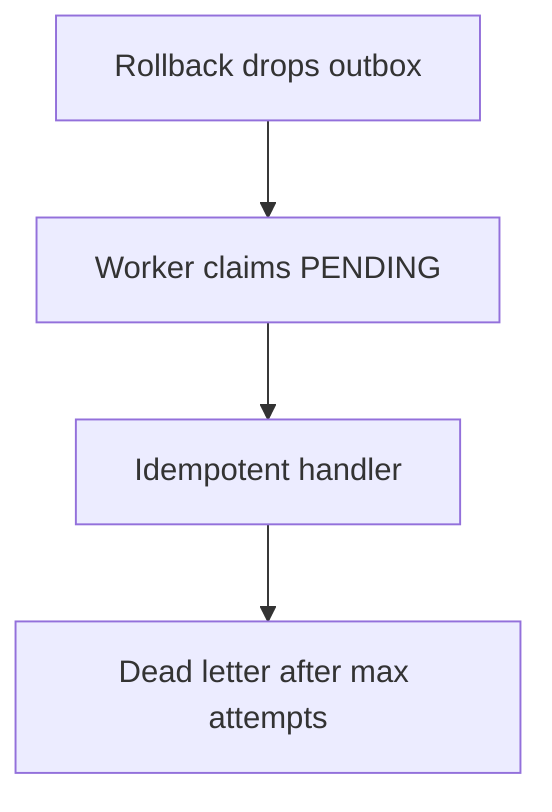

# Testing — Job Worker and Outbox Lab

## Strategy

Transaction tests without HTTP; worker integration with controlled clock for backoff; fault injection for crash-between-commit-and-process scenarios.



## Critical Paths

1. Commit inserts domain + outbox; rollback inserts neither
2. Worker processes all pending in order; marks PROCESSED
3. Handler throws → retry with incremented attempts; backoff delays next claim
4. Duplicate delivery → SideEffectLog count stays 1
5. Max attempts exceeded → DEAD status; no infinite loop
6. Lease expiry → another worker pass can reclaim stuck PROCESSING row (simulated)

## Commands

```bash
cd 07-Backend/code
npm test -- tests/labs.test.ts -t "OutboxWorker"
```

Use fake timers for backoff tests.

## Definition of Done

- [ ] SideEffectLog assertions prove idempotency
- [ ] Backoff tests use Vitest fake timers
- [ ] No busy-loop: worker sleeps/yields between empty polls
- [ ] Transaction isolation test uses separate UoW instances

## Related Documents

- [[07-Backend/projects/Job Worker and Outbox Lab/README|README]]
- [[07-Backend/projects/Backend Service Toolkit/Testing|Backend Service Toolkit Testing]]
