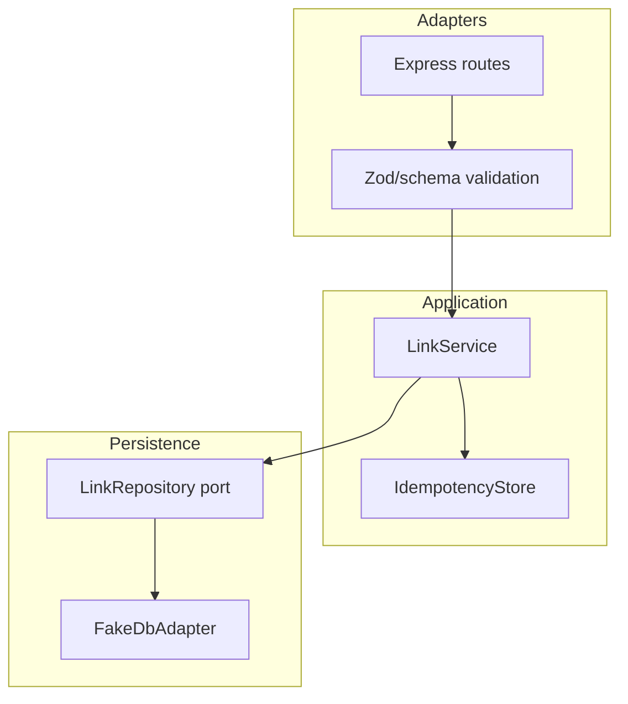

# Architecture — URL Shortener API

## Summary

Hexagonal slice: HTTP adapters → `LinkService` → `LinkRepository` → `FakeDbAdapter`. Source: [[07-Backend/code/src/url-shortener.ts|url-shortener.ts]].

## Layer Diagram

## Entity Model (Application)

| Field | Type | Notes |
| --- | --- | --- |
| `id` | string (uuid) | Stable resource id |
| `shortCode` | string | Unique, opaque |
| `targetUrl` | string (URL) | Validated http/https |
| `ownerId` | string optional | For auth stretch |
| `createdAt` | ISO datetime | Sort key for pagination |

## Idempotency

`Idempotency-Key` header maps to stored response fingerprint in `IdempotencyStore` with TTL. On replay within TTL, return stored result without second insert—see [[07-Backend/projects/Backend Service Toolkit/ADR/ADR-004 Idempotency and Retry Policy|ADR-004]].

## Redirect Path

Lookup by `shortCode` is hot path; optional cache-aside hook documented but not required for mini project pass.

## Handoff Boundary

Repository SQL, indexes, and isolation → [[07-Backend/08-Data-Access-and-Persistence-Patterns/Handing Off to Database Engines|Handing Off to Database Engines]] and [[08-Databases/README|Databases]]. Lab uses fake adapter only.

## Related Documents

- [[07-Backend/projects/URL Shortener API/README|README]]
- [[07-Backend/08-Data-Access-and-Persistence-Patterns/Repository and Unit of Work|Repository and Unit of Work]]
- [[07-Backend/projects/Backend Service Toolkit/Database|Toolkit Database]]
