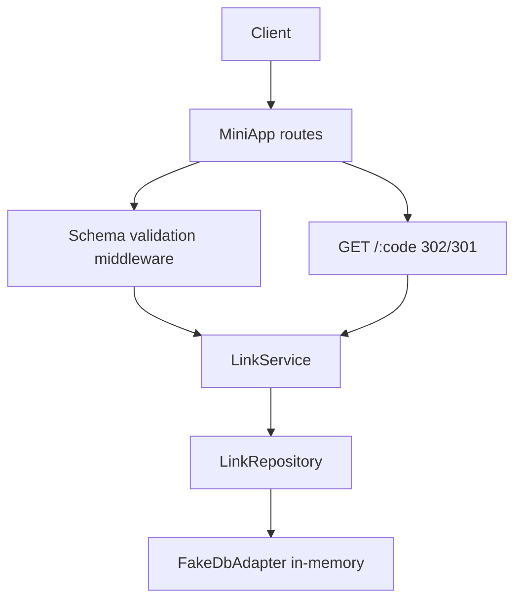

# URL Shortener API

## One-Line Purpose

Design and implement a REST-style URL shortener: resource modeling, schema validation at the edge, repository + fake adapter persistence, pagination, idempotent creates, and redirect semantics—composed on the Express Clone stack.

## Status

**Active.** The learning surface targets [[07-Backend/code/src/url-shortener.ts|url-shortener.ts]] and executable checks in [[07-Backend/code/tests/labs.test.ts|labs.test.ts]].

## Prerequisites

- [[07-Backend/01-HTTP-APIs-and-Contracts/Resource Modeling and REST Semantics|Resource Modeling and REST Semantics]]
- [[07-Backend/01-HTTP-APIs-and-Contracts/Status Codes as Product Policy|Status Codes as Product Policy]]
- [[07-Backend/01-HTTP-APIs-and-Contracts/Pagination Filtering and Sorting Contracts|Pagination Filtering and Sorting Contracts]]
- [[07-Backend/01-HTTP-APIs-and-Contracts/Idempotency Keys and Safe Retries|Idempotency Keys and Safe Retries]]
- [[07-Backend/03-Validation-Errors-and-Versioning/Schema Validation at the Edge|Schema Validation at the Edge]]
- [[07-Backend/03-Validation-Errors-and-Versioning/Problem Details and Error Envelopes|Problem Details and Error Envelopes]]
- [[07-Backend/08-Data-Access-and-Persistence-Patterns/Repository and Unit of Work|Repository and Unit of Work]]
- [[07-Backend/projects/Express Clone/README|Express Clone]]

## Architecture



See [[07-Backend/projects/URL Shortener API/Architecture|Architecture]] for entity model and idempotency storage.

## Acceptance Criteria

- [ ] `POST /v1/links` validates URL schema; returns `201` with `{ id, shortCode, targetUrl, createdAt }`.
- [ ] Duplicate idempotency key returns same resource with `200` or `201` per documented policy—no double insert.
- [ ] `GET /v1/links` supports cursor pagination with stable ordering.
- [ ] `GET /:shortCode` redirects with `302` (or configured `301`) to stored target; unknown code → `404`.
- [ ] Validation failures return `422` problem+json with field errors.
- [ ] Repository interface swappable: tests run against fake adapter without real database engine.
- [ ] No SQL or ORM engine internals in lab—handoff to [[08-Databases/README|Databases]].

## Run and Test

```bash
cd 07-Backend/code
npm install
npm test -- tests/labs.test.ts -t "UrlShortener"
```

## Benchmarks

| Workload | Variants | Primary metrics |
| --- | --- | --- |
| Create 10k links | with idempotency key | inserts/sec, duplicate hit rate |
| Redirect hot code | cache off vs cache-aside | p99 redirect latency |
| List page size 50 | cursor vs offset if contrasted | query shape, memory |

Benchmark entry point (when added): `07-Backend/code/bench/url-shortener.bench.ts`.

## Security and Failure Constraints

- Reject `javascript:` and other dangerous URL schemes at validation.
- Short code generation must be unguessable enough for lab (≥ 8 chars from CSPRNG).
- Do not open redirect to internal metadata URLs without allowlist.
- Owner-scoped deletes when auth middleware attached (optional stretch).
- Rate limit create endpoint to prevent abuse.

## Exercises and Reflection

1. Add soft-delete with tombstone and `410 Gone` on redirect.
2. Implement If-None-Match on list endpoint.
3. Swap fake adapter for SQLite file DB as stretch—still via repository interface.

**Reflection prompts**

- Why is idempotency key storage separate from natural unique constraints?
- When is `301` vs `302` a product decision?
- What breaks if redirect handler bypasses repository?

## Interview Questions

- Model URL shortener tables and indexes at app level (hand engines to Databases).
- Design pagination for high-churn link lists.
- How do you prevent open redirect vulnerabilities?

## Related Notes

- [[07-Backend/projects/URL Shortener API/Architecture|Architecture]]
- [[07-Backend/projects/URL Shortener API/Testing|Testing]]
- [[07-Backend/projects/URL Shortener API/Security|Security]]
- [[07-Backend/README|Backend MOC]]
- [[07-Backend/code/README|Backend Code Labs]]
- [[07-Backend/projects/Backend Service Toolkit/README|Backend Service Toolkit]]
- [[Career/README|Career]]
