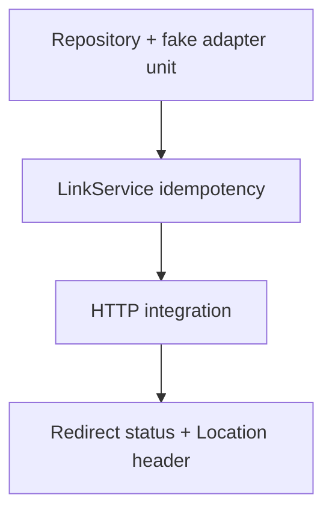

# Testing — URL Shortener API

## Strategy

Repository unit tests with fake adapter; HTTP integration for full request cycle; contract tests for problem+json and pagination cursors.



## Critical Paths

1. Valid create → `201` + body shape
2. Invalid URL → `422` field errors in problem+json
3. Same idempotency key twice → single row in fake store
4. Pagination: create 3 pages; cursor forward and backward stable
5. Redirect known code → `302` + correct `Location`
6. Unknown code → `404` problem+json
7. Repository swap test: second fake instance isolated per test

## Commands

```bash
cd 07-Backend/code
npm test -- tests/labs.test.ts -t "UrlShortener"
```

## Definition of Done

- [ ] Fake adapter reset in `beforeEach` for isolation
- [ ] Idempotency tests assert store size does not grow on replay
- [ ] Redirect tests follow zero redirects manually—assert status and header only
- [ ] Pagination tests fail if ordering unstable across equal timestamps

## Related Documents

- [[07-Backend/projects/URL Shortener API/README|README]]
- [[07-Backend/01-HTTP-APIs-and-Contracts/OpenAPI as Executable Contract|OpenAPI as Executable Contract]]
- [[07-Backend/projects/Backend Service Toolkit/Testing|Backend Service Toolkit Testing]]
