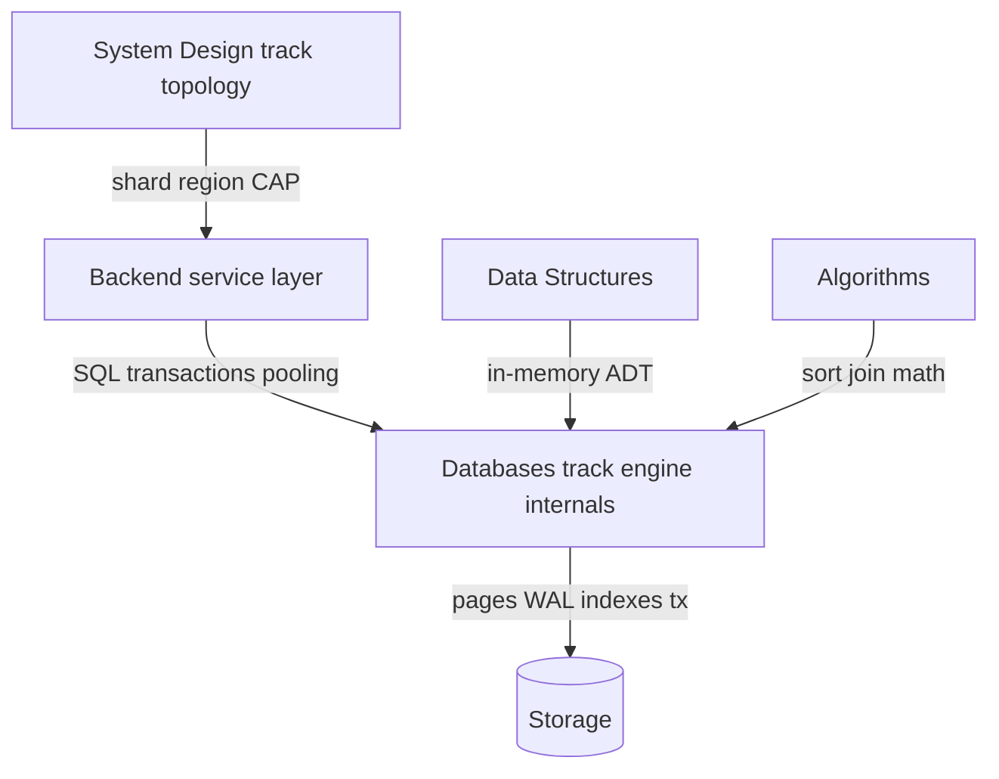
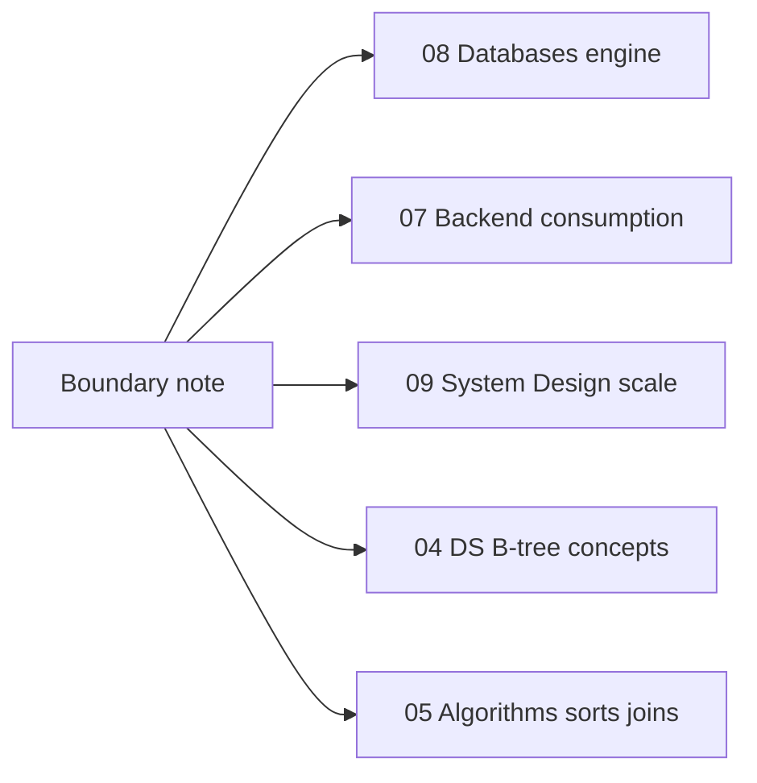
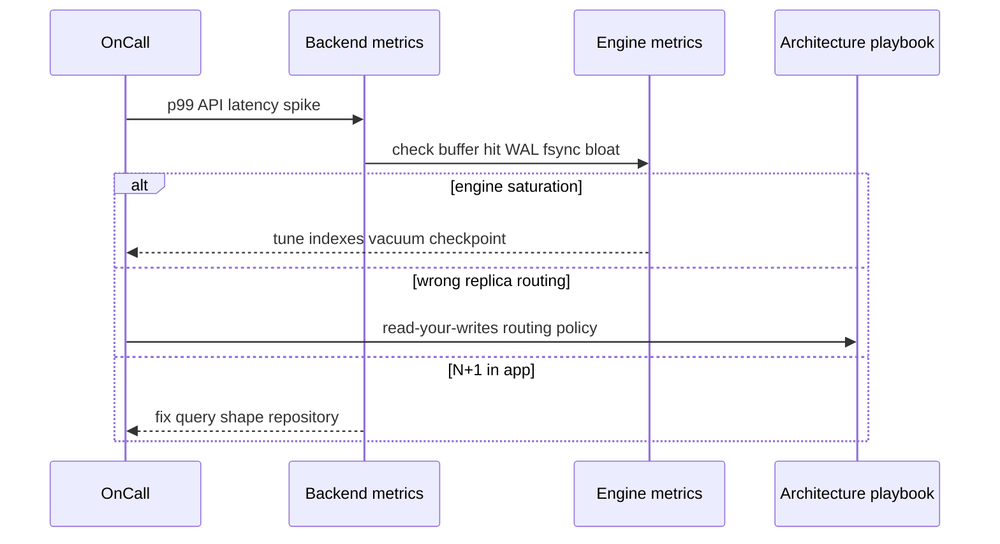

# Backend Databases and System Design Boundaries

## Overview

Three tracks meet at the database boundary: **Databases** (engine internals), **Backend** (how services use engines), and **System Design** (how systems scale across regions and failure domains). Blurring these produces ORM tutorials in engine notes, or CAP lectures where buffer pool mechanics belong.

This note defines **explicit handoffs** so you know where to read next and what this track will not pretend to own.

## Learning Objectives

- Map topics to Databases vs Backend vs System Design vs Data Structures vs Algorithms
- Explain why repositories and outbox patterns live in Backend, not here
- Explain why multi-region active-active product design lives in System Design
- Identify when engine replication mechanics (module 07) end and SD CAP trade-offs begin
- Use cross-links correctly when writing ADRs and incident postmortems

## Prerequisites

- [[08-Databases/00-Orientation/Why Databases Exist|Why Databases Exist]]
- [[07-Backend/08-Data-Access-and-Persistence-Patterns/Handing Off to Database Engines|Handing Off to Database Engines]]

## Difficulty

`beginner`

## Estimated Time

- Reading: 45 minutes
- Exercises: 30 minutes
- Mini project: 1 hour

## History

Training materials often teach "SQL + REST" as one blob. Production separates **storage engine teams**, **application platform teams**, and **infrastructure/architecture** because failure modes differ: torn pages vs. N+1 queries vs. split-brain failover. This repository mirrors that separation pedagogically.

## Problem It Solves

| Misplaced topic | Correct home |
| --- | --- |
| Repository / Unit of Work | [[07-Backend/08-Data-Access-and-Persistence-Patterns/Repository and Unit of Work|Repository and Unit of Work]] |
| Cache-aside, stampede | [[07-Backend/07-Caching-Jobs-and-Messaging/Cache-Aside and TTL Strategies|Cache-Aside and TTL Strategies]] |
| B-tree fanout proofs | [[04-Data-Structures/05-Trees-and-Ordered-Maps/B-Trees and B-Plus Trees Concepts|B-Trees and B-Plus Trees Concepts]] |
| External sort complexity | [[05-Algorithms/README|Algorithms]] |
| Global table design for 9 regions | [[09-System-Design/README|System Design]] |
| WAL redo, buffer pool | **This track** |

## Internal Implementation

### Boundary map



**Databases owns**: what happens between `COMMIT` and durable bytes; how indexes are stored on pages; how recovery replays WAL; how isolation is implemented.

**Backend owns**: transaction boundaries per request, idempotency, ORM mapping, connection pool sizing in app tier, outbox.

**System Design owns**: when to shard, read replicas vs. CRDTs, RPO/RTO product requirements across regions, queue vs. DB for workflow.

## Mermaid Diagrams

### Structure



### Sequence / Lifecycle — incident routing



## Examples

### Minimal Example — responsibility labels

```typescript
// BACKEND owns: request-scoped unit of work
export async function createOrder(uow: UnitOfWork, dto: CreateOrderDto) {
  return uow.transaction(async (tx) => {
    const order = await tx.orders.insert(dto);
    await tx.outbox.insert({ type: "OrderCreated", id: order.id });
    return order;
  });
}

// DATABASES track explains what tx.transaction() triggers:
// BEGIN, row locks/MVCC, WAL insert, commit record, visibility rules
```

```sql
-- DATABASES track: why this needs an index on orders(user_id)
-- BACKEND track: why you should not call this inside a loop per user
SELECT * FROM orders WHERE user_id = $1 ORDER BY created_at DESC LIMIT 20;
```

### Production-Shaped Example — handoff checklist in ADR

```typescript
type StorageDecision = {
  question: string;
  owner: "Databases" | "Backend" | "SystemDesign" | "Algorithms" | "DataStructures";
  note: string;
};

export const ORDER_STORAGE_ADR: StorageDecision[] = [
  {
    question: "B+ tree page splits under UUID PK?",
    owner: "Databases",
    note: "See clustering vs random PK — module 01/03",
  },
  {
    question: "Repository vs active record?",
    owner: "Backend",
    note: "Repository and Unit of Work",
  },
  {
    question: "Read replica in EU for GDPR latency?",
    owner: "SystemDesign",
    note: "Multi-region read path — not WAL tutorial",
  },
  {
    question: "Merge join vs hash join cost?",
    owner: "Algorithms",
    note: "Join algorithm big-O; EXPLAIN in module 04",
  },
];
```

## Trade-offs

| Dimension | Clear boundaries | Blended tutorials |
| --- | --- | --- |
| Learning depth | Engine mechanics get room | Everything stays shallow |
| On-call | Faster incident routing | Misdiagnosis across layers |
| Maintenance | Modules update independently | Duplicate/conflicting advice |
| Interview prep | Right depth per role | "Full stack" vagueness |

### When to Use

- Starting any Databases module—skim this note first
- Writing ADRs that touch storage
- Deciding which track answers an interview follow-up

### When Not to Use

- As substitute for reading Backend or System Design when building APIs or global architecture

## Exercises

1. Classify ten topics from [[08-Databases/README|Databases README]] into Databases vs Backend vs SD.
2. A replica lag alert fires: list three engine causes and two SD routing causes.
3. Where does "idempotency key" live? Where does "duplicate key on unique index" live?
4. Draw a request path: API → pool → planner → buffer pool → WAL.
5. Write one sentence handoff for B-tree fanout to Data Structures.

## Mini Project

Pick [[07-Backend/projects/URL Shortener API/README|URL Shortener API]] or similar Backend project. Annotate its Architecture.md with links: which concerns are Backend vs Databases vs System Design.

## Portfolio Project

[[08-Databases/projects/Database Engines Workbench/README|Database Engines Workbench]] — add a `BOUNDARIES.md` citing this note for every external dependency.

## Interview Questions

1. What does the Databases track teach that Backend does not?
2. Who owns connection pooling—the app or the engine? (Both—explain split.)
3. Is "split brain" purely System Design? (No—engine failover mechanics in module 07.)
4. Where do you learn ORM N+1 fixes?
5. Where do you learn partial index design?

### Stretch / Staff-Level

1. Design a global inventory system: list three decisions per track (DB/BE/SD).
2. How would you teach junior engineers to triage "database is slow" tickets?

## Common Mistakes

- Teaching Hibernate in a WAL note
- Claiming System Design expertise from knowing streaming replication
- Optimizing queries in app without EXPLAIN (module 04)
- Re-deriving B-tree balance proofs in engine notes instead of linking DS

## Best Practices

- Link outward aggressively; duplicate only engine-specific nuance
- In incidents, separate app query shape from engine resource saturation
- ADRs name owner track per decision
- Learn consumption (Backend) after or in parallel with engine basics (modules 00–03)

## Summary

**Databases** explains pages, WAL, indexes, transactions, replication mechanics, and engine-specific ops. **Backend** explains services, repositories, pooling at the app, caches, outbox, and API-level transactions. **System Design** explains multi-region topology, sharding products, and CAP-facing choices. **Data Structures** and **Algorithms** supply in-memory and complexity foundations without replacing engine-on-disk content. Keep boundaries crisp to go deep where depth matters.

## Further Reading

- [[08-Databases/README|Databases README]] — Scope Boundaries table
- [[07-Backend/08-Data-Access-and-Persistence-Patterns/Handing Off to Database Engines|Handing Off to Database Engines]]
- [[09-System-Design/README|System Design]]

## Related Notes

- [[08-Databases/00-Orientation/Files vs Engines vs Services|Files vs Engines vs Services]]
- [[08-Databases/07-Replication-Mechanics/Replica Lag and Read-Your-Writes at Connection Level|Replica Lag and Read-Your-Writes at Connection Level]]
- [[08-Databases/11-Modeling-and-Engine-Selection/Handoff Back to Backend Repositories|Handoff Back to Backend Repositories]]
- [[07-Backend/README|Backend]]
- [[04-Data-Structures/README|Data Structures]]
- [[05-Algorithms/README|Algorithms]]
- [[09-System-Design/README|System Design]]

## Progress Checklist

- [ ] Explained from first principles
- [ ] Drew at least one Mermaid diagram
- [ ] Implemented a minimal version
- [ ] Documented trade-offs and non-goals
- [ ] Completed exercises
- [ ] Practiced interview questions aloud
- [ ] Linked prerequisites and dependents
