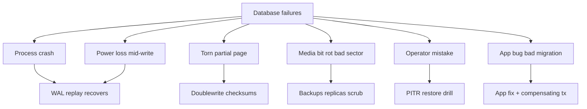
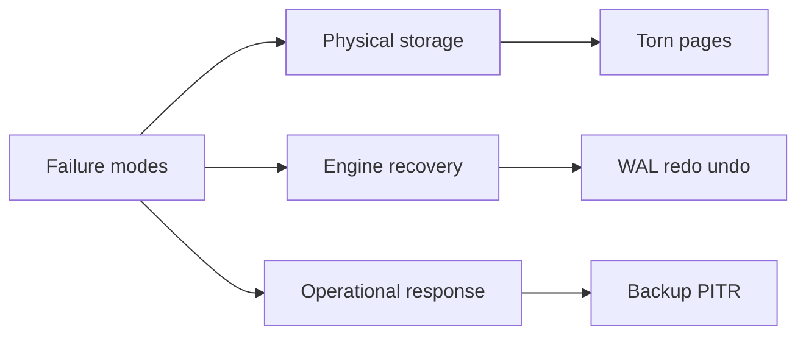
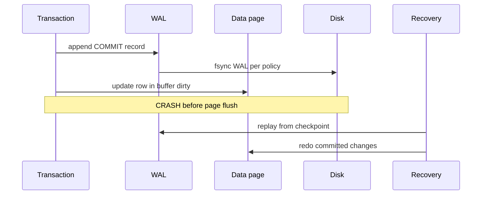

# Database Failure Modes Corruption and Durability

## Overview

Production databases fail in predictable families: **process crash**, **power loss**, **torn pages**, **disk/bit rot**, **operator error**, and **logical bugs**. **Durability** is a contract about which failures leave committed work recoverable—not a guarantee that nothing ever breaks.

This orientation note catalogs failure modes so modules 01–02 (pages, WAL, recovery) and module 12 (ops) have a shared vocabulary. It connects engine mechanics to incident response without duplicating full recovery algorithms.

## Learning Objectives

- Classify failures as logical vs. physical vs. operational
- Explain durability levels (fsync policy, group commit, async replica)
- Describe torn pages and why doublewrite exists (preview module 02)
- Distinguish corruption detection from prevention
- Map failures to monitoring and runbook hooks (PITR, restore drills)

## Prerequisites

- [[08-Databases/00-Orientation/Why Databases Exist|Why Databases Exist]]
- [[01-Computer-Science/06-IO-and-Persistence/Files Blocks and Directories|Files Blocks and Directories]]

## Difficulty

`beginner`

## Estimated Time

- Reading: 1.5 hours
- Exercises: 1 hour
- Mini project: 2 hours

## History

Early systems lost data on every crash until **logging** (IMS, System R) separated **commit intent** (log record) from **data page** arrival. Disk interfaces exposed **partial sector writes** (torn pages). Operators learned backups without restore drills are vanity metrics. Cloud volumes improved redundancy but not application-level `fsync` misunderstandings.

## Problem It Solves

Engineers treat "Postgres is ACID" as immunity. Incidents show:

- `synchronous_commit=off` + power loss = lost commits
- Copying live data directory = corruption
- Filling disk = WAL cannot append → panic
- Replica promoted without timeline check → divergent histories

Naming modes enables correct design and on-call response.

## Internal Implementation

### Failure taxonomy



**Durability** = committed transactions survive listed failures *per configured policy*. **Consistency** (no corruption) may require checksums + recovery tools even after durability.

## Mermaid Diagrams

### Structure



### Sequence / Lifecycle — crash during commit



## Examples

### Minimal Example — durability policy matters

```sql
-- Postgres session knobs — not defaults for all deployments
SET synchronous_commit = on;  -- wait for WAL flush before COMMIT returns
-- off: faster commits; recent commits may vanish on crash

SHOW full_page_writes;  -- on: protects against torn pages via WAL full page images
```

```typescript
// Application must not assume "commit" means "on disk everywhere"
// if DBA changed policy or async replica ack is used
async function persistCritical(client: pg.PoolClient, row: Row) {
  await client.query("SET LOCAL synchronous_commit = on");
  await client.query("INSERT INTO ledger (...) VALUES (...)", [...]);
}
```

### Production-Shaped Example — failure mode runbook table

```typescript
type FailureMode = {
  name: string;
  symptom: string;
  engineMitigation: string;
  opsResponse: string;
};

export const RUNBOOK: FailureMode[] = [
  {
    name: "WAL disk full",
    symptom: "cannot extend file, transactions hang",
    engineMitigation: "checkpoint + archive; size wal_keep",
    opsResponse: "free space; never delete WAL manually without procedure",
  },
  {
    name: "Torn data page",
    symptom: "checksum error on read",
    engineMitigation: "full_page_writes / doublewrite replay",
    opsResponse: "restore from base backup + WAL; do not pg_resetwal blindly",
  },
  {
    name: "Split-brain two primaries",
    symptom: "divergent writes",
    engineMitigation: "timeline IDs fencing",
    opsResponse: "System Design failover playbook + module 07",
  },
];
```

Deep dives: [[08-Databases/02-WAL-Durability-and-Recovery/Torn Pages and Doublewrite Concepts|Torn Pages and Doublewrite Concepts]], [[08-Databases/12-Production-Database-Ops/Backups PITR and Restore Drills|Backups PITR and Restore Drills]].

## Trade-offs

| Dimension | Strong durability | Relaxed durability |
| --- | --- | --- |
| Commit latency | Higher (fsync) | Lower |
| Data loss window | Minimal on crash | Seconds of commits |
| Throughput | Limited by disk | Better batch/group commit |
| Use case | Money, inventory | Metrics, idempotent retries |

### When to Use

- Strong fsync + sync replica for financial/identity writes
- Checksums + PITR everywhere you claim RPO < 24h
- Failure mode table in service runbooks

### When Not to Use

- Disabling durability for convenience without product sign-off
- `pg_resetwal` or `--force` recovery as first resort

## Exercises

1. Draw crash timelines: before WAL fsync, after WAL fsync, before page flush.
2. Explain difference between **lost commit** and **corrupted page**.
3. Why is copying `PGDATA` while running unsafe? What breaks?
4. List three metrics predicting WAL disk exhaustion.
5. Match failure to module: torn page → ? ; phantom read → ?

## Mini Project

In Docker Postgres, set `synchronous_commit=off`, run commits, kill container (`docker kill`). Count survived rows vs. `on`. Document in [[08-Databases/_exercises/README|Databases Exercises]] journal.

## Portfolio Project

Add a "Failure modes" section to [[08-Databases/projects/Toy Page and WAL Store/README|Toy Page and WAL Store]] README with simulated crash tests.

## Interview Questions

1. What is a torn page? How do engines mitigate it?
2. Does COMMIT returning mean data is on disk in all configs?
3. Difference between redo and undo in recovery?
4. How is corruption different from losing unreplicated commits?
5. What is RPO vs RTO in database ops?

### Stretch / Staff-Level

1. Walk through Aurora crash recovery vs. single-instance Postgres—what fails independently?
2. When would you accept `synchronous_commit=off` with business approval?

## Common Mistakes

- Assuming replicas fix durability without sync policy
- Restoring without testing WAL continuity
- Ignoring checksum failures as "maybe glitch"
- Using `--force` promote without fencing old primary ([[09-System-Design/07-Multi-Region-and-Geo/Failover RPO RTO and Split-Brain Product Policy|Failover RPO RTO and Split-Brain Product Policy]])

## Best Practices

- Document durability policy per table/workload
- Monitor WAL size, disk free, checkpoint frequency, replication lag
- Quarterly restore drills to real isolated instance
- Separate logical app bugs from physical corruption in postmortems

## Summary

Database failures cluster into crashes recoverable by WAL, physical page damage needing doublewrite/checksums, media errors needing backups, and human or logical errors needing process. Durability is configurable: commit acknowledgment tracks how much fsync and replication you pay for. Module 02 implements recovery mechanics; module 12 operationalizes backups and monitoring—this note names the enemies.

## Further Reading

- [[00-References/Databases/README|Databases References]]
- Postgres wiki: WAL, corruption, backup
- [[08-Databases/02-WAL-Durability-and-Recovery/Crash Recovery Redo and Undo Concepts|Crash Recovery Redo and Undo Concepts]]

## Related Notes

- [[08-Databases/02-WAL-Durability-and-Recovery/Write-Ahead Logging Protocol|Write-Ahead Logging Protocol]]
- [[08-Databases/02-WAL-Durability-and-Recovery/fsync Group Commit and Durability Levels|fsync Group Commit and Durability Levels]]
- [[08-Databases/12-Production-Database-Ops/Monitoring Checkpoints Lag Bloat Cache Hit|Monitoring Checkpoints Lag Bloat Cache Hit]]
- [[07-Backend/08-Data-Access-and-Persistence-Patterns/Transactions as Used by Services|Transactions as Used by Services]]
- [[04-Data-Structures/README|Data Structures]]
- [[09-System-Design/README|System Design]]

## Progress Checklist

- [ ] Explained from first principles
- [ ] Drew at least one Mermaid diagram
- [ ] Implemented a minimal version
- [ ] Documented trade-offs and non-goals
- [ ] Completed exercises
- [ ] Practiced interview questions aloud
- [ ] Linked prerequisites and dependents
