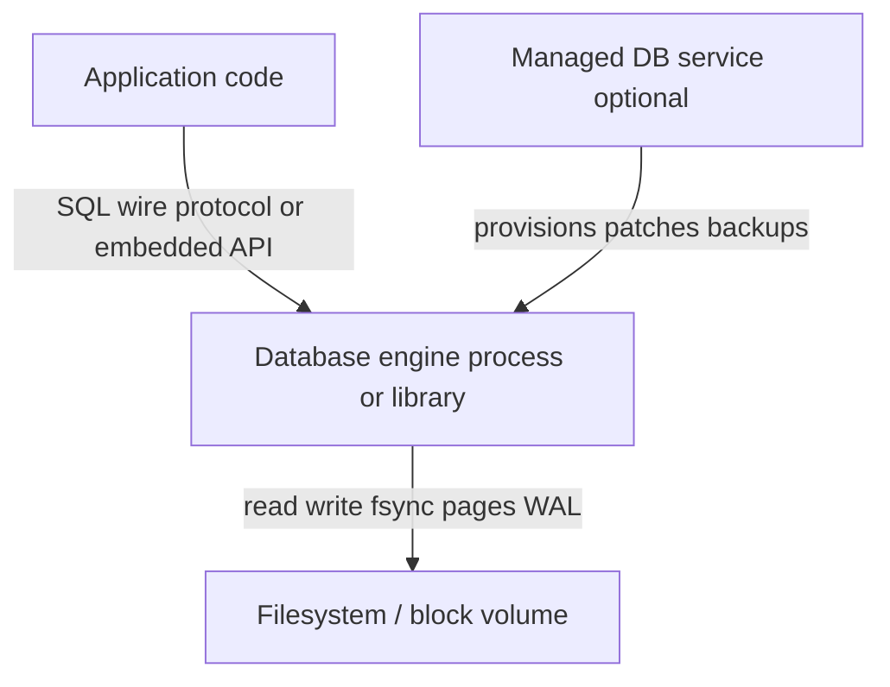
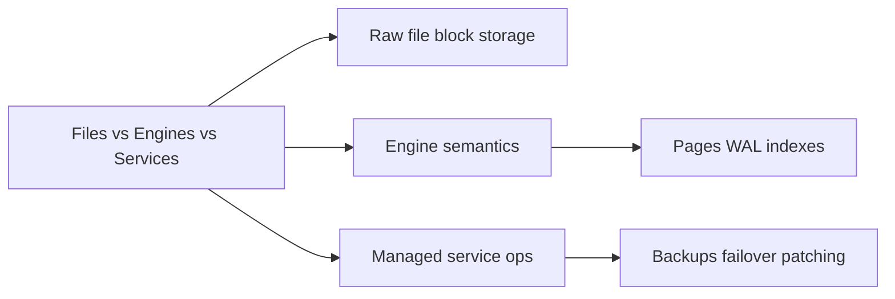
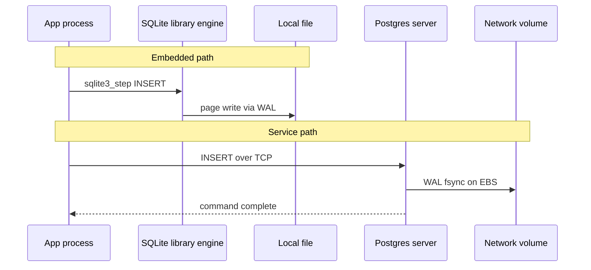

# Files vs Engines vs Services

## Overview

Persistence stacks in three layers: **raw files** on block storage, **database engines** that interpret pages/WAL/indexes, and **managed database services** (RDS, Atlas, Cloud SQL) that operate engines for you. Confusing these layers causes wrong durability assumptions, missing backups, and "we use Postgres" claims that actually mean "we SSH to a VM."

This note maps responsibilities at each layer so later modules can focus on **engine mechanics** while clearly handing off deployment topology to DevOps and product scaling to System Design.

## Learning Objectives

- Distinguish block/file storage, engine process, and managed service control plane
- Identify which failures each layer prevents vs. exposes
- Explain when embedding SQLite beats running a remote Postgres service
- Describe what you still own when using RDS/Aurora (schema, queries, RPO/RTO)
- Connect layer choice to operational and cost trade-offs

## Prerequisites

- [[08-Databases/00-Orientation/Why Databases Exist|Why Databases Exist]]
- [[01-Computer-Science/06-IO-and-Persistence/Files Blocks and Directories|Files Blocks and Directories]]

## Difficulty

`beginner`

## Estimated Time

- Reading: 1 hour
- Exercises: 45 minutes
- Mini project: 2 hours

## History

Applications originally wrote **directly to files** (`fopen`, `write`). Database **engines** emerged as specialized processes (or libraries) mediating access. The **service** layer arrived when cloud vendors packaged engines with automated backups, failover, patching, and metering—shifting ops labor without changing on-disk fundamentals.

SQLite (2000) blurred lines: a **library engine** in-process, still page/WAL-based, not a network service. Understanding all three shapes prevents category errors in architecture reviews.

## Problem It Solves

| Confusion | Clarification |
| --- | --- |
| "S3 is our database" | Object store = files; no transactions/indexes unless you build them |
| "RDS handles durability" | RDS operates the engine; `synchronous_commit` and app bugs remain yours |
| "We don't need indexes, SSD is fast" | Sequential scan cost is algorithmic, not only rotational latency |
| "ORM = database" | ORM is app-layer; engine still does paging and WAL |

## Internal Implementation

### Three-layer model



**Files**: bytes, directories, `O_DIRECT`, EBS volumes, object keys.

**Engine**: buffer pool, lock/MVCC, WAL, heap/index files, background workers (checkpointer, autovacuum).

**Service**: multi-AZ, read replicas, PITR UI, IAM, connection limits—see [[09-System-Design/07-Multi-Region-and-Geo/Multi-Region Active-Passive Active-Active Patterns|Multi-Region Active-Passive Active-Active Patterns]] for when multi-region *product* design needs more than one replica.

## Mermaid Diagrams

### Structure



### Sequence / Lifecycle — embedded vs remote engine



## Examples

### Minimal Example — three persistence shapes

```typescript
// Node 20+ / TypeScript 5+
import { writeFileSync } from "node:fs";
import Database from "better-sqlite3";
import pg from "pg";

// 1) File — no engine semantics
writeFileSync("state.json", JSON.stringify({ count: 1 }));

// 2) Embedded engine — library in-process
const sqlite = new Database("app.db");
sqlite.prepare("INSERT INTO counters (n) VALUES (?)").run(1);

// 3) Remote engine — separate process (often behind managed service)
const pool = new pg.Pool({ connectionString: process.env.DATABASE_URL });
await pool.query("INSERT INTO counters (n) VALUES ($1)", [1]);
```

### Production-Shaped Example — choosing layer by contract

```typescript
// Decision helper — not a library, documentation as code
type PersistenceNeed = {
  concurrentWriters: number;
  remoteOps: boolean;
  rpoMinutes: number;
};

export function recommendLayer(need: PersistenceNeed): string {
  if (need.concurrentWriters <= 1 && !need.remoteOps) {
    return "embedded engine (SQLite) on local volume";
  }
  if (need.remoteOps && need.rpoMinutes <= 5) {
    return "managed Postgres + PITR; you own schema and query shape";
  }
  return "remote engine cluster; coordinate with System Design for read scaling";
}
```

```sql
-- Same SQL dialect; different deployment envelope
-- SQLite: single file, WAL mode PRAGMA journal_mode=WAL;
-- Postgres: shared_buffers, checkpoint_timeout, managed parameter groups
```

Connection pooling at the proxy vs. engine: [[08-Databases/12-Production-Database-Ops/Connection Pooling at Engine and Proxy|Connection Pooling at Engine and Proxy]].

## Trade-offs

| Dimension | Files | Embedded engine | Remote engine / service |
| --- | --- | --- | --- |
| Durability | Manual | WAL/checkpoint | WAL + vendor backups |
| Concurrency | OS locks / none | DB locks, single writer typical | Full MVCC, many clients |
| Ops burden | Lowest | Low | Medium–high (lower if managed) |
| Latency | Lowest | Low (no network) | Network + pool queue |
| Scale-out | N/A | Limited | Replicas, sharding (SD) |

### When to Use

- **Files**: immutable assets, build artifacts, append-only logs you own end-to-end
- **Embedded engine**: edge, mobile, tests, single-node tools with SQL needs
- **Remote/service**: multi-instance apps, shared state, team ops for backups/failover

### When Not to Use

- Files for multi-row transactional updates
- Embedded SQLite for many concurrent writers across hosts
- Managed service without understanding engine flags you can still misconfigure

## Exercises

1. For your last project, label each datastore as file, embedded engine, or remote service.
2. Draw where WAL bytes land for SQLite vs. RDS Postgres (include EBS).
3. List five responsibilities RDS does **not** remove from your team.
4. Explain why `COPY` to CSV is not a substitute for PITR.
5. When would you choose local SQLite over Aurora Serverless v2?

## Mini Project

Deploy the same schema to SQLite (file) and Docker Postgres (engine). Run parallel writers against each; document corruption or lock errors. Document in [[08-Databases/projects/Toy Page and WAL Store/README|Toy Page and WAL Store]] journal.

## Portfolio Project

Document deployment layer choices in [[08-Databases/projects/Database Engines Workbench/README|Database Engines Workbench]] ADR: embedded lab store vs. optional Postgres fixture runner.

## Interview Questions

1. What is the difference between a database engine and a managed database service?
2. Can SQLite satisfy ACID? What concurrency limits remain?
3. Who is responsible for RPO when using RDS?
4. Why is object storage not a replacement for Postgres for order tables?
5. What crosses the network boundary when an app uses `pg.Pool`?

### Stretch / Staff-Level

1. Compare Aurora storage layer vs. vanilla Postgres on EBS—what problem does disaggregated storage solve?
2. When does "serverless database" still expose engine semantics you must tune?

## Common Mistakes

- Storing authoritative transactional state only in S3 JSON without engine
- Assuming managed service eliminates need for index and query design
- Using embedded DB on NFS for multi-host writes
- Conflating read replica lag (engine) with global consistency (System Design)

## Best Practices

- Name the layer explicitly in architecture diagrams (file / engine / service)
- Match engine deployment to writer concurrency and DR requirements
- Keep business logic in services; keep durability in engines ([[07-Backend/README|Backend]])
- Run restore drills on managed backups—you still validate RTO

## Summary

**Files** provide bytes; **engines** provide transactional, indexed semantics over pages and WAL; **services** operate engines with backups, failover, and patching. Application code still owns schema, queries, isolation expectations, and failure handling. This track teaches engine internals; Backend teaches consumption patterns; System Design teaches multi-region product topology.

## Further Reading

- [[00-References/Databases/README|Databases References]]
- SQLite WAL documentation
- [[16-DevOps/README|DevOps]] — provisioning and CI for database services

## Related Notes

- [[08-Databases/00-Orientation/Why Databases Exist|Why Databases Exist]]
- [[08-Databases/00-Orientation/Relational Document and KV Contracts|Relational Document and KV Contracts]]
- [[08-Databases/01-Storage-and-Buffer-Pool/Buffer Pool vs OS Page Cache|Buffer Pool vs OS Page Cache]]
- [[07-Backend/08-Data-Access-and-Persistence-Patterns/Handing Off to Database Engines|Handing Off to Database Engines]]
- [[04-Data-Structures/README|Data Structures]]
- [[09-System-Design/README|System Design]]

## Progress Checklist

- [ ] Explained from first principles
- [ ] Drew at least one Mermaid diagram
- [ ] Implemented a minimal version
- [ ] Documented trade-offs and non-goals
- [ ] Completed exercises
- [ ] Practiced interview questions aloud
- [ ] Linked prerequisites and dependents
