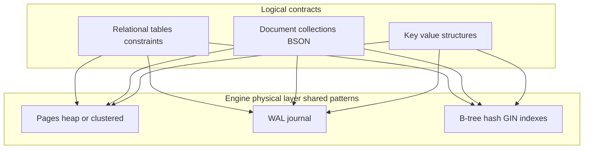
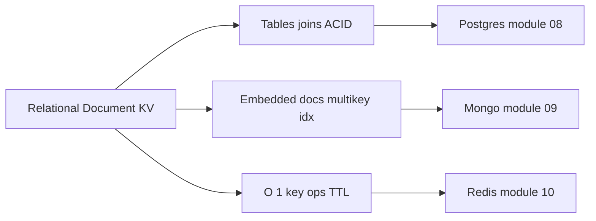
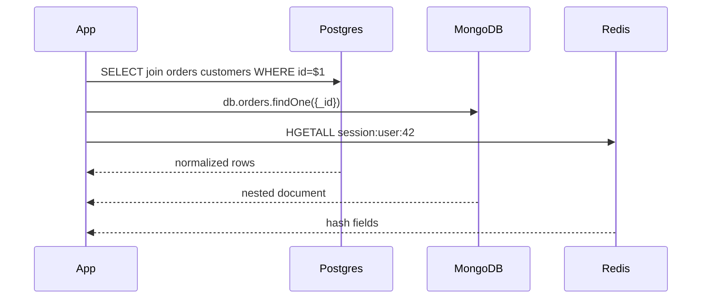

# Relational Document and KV Contracts

## Overview

Database products expose different **logical contracts**: **relational** (typed tables, joins, constraints), **document** (nested JSON/BSON documents, flexible schema), and **key-value** (opaque blob or typed structure per key). Underneath, most still use pages, WAL, and indexes—but the **access path** you design against differs sharply.

This note compares contracts at the engine boundary so you can select Postgres vs. MongoDB vs. Redis for the right *storage semantics*, not hype. Deep engine chapters live in modules 08–10; B-tree fanout math lives in [[04-Data-Structures/05-Trees-and-Ordered-Maps/B-Trees and B-Plus Trees Concepts|B-Trees and B-Plus Trees Concepts]].

## Learning Objectives

- State the logical model and typical indexing for relational, document, and KV engines
- Predict which contract fits a workload from query shape and consistency needs
- Explain that different APIs can share similar page/WAL foundations
- Identify handoffs: ORM/repos to Backend, cache patterns to Backend, multi-region to System Design
- Avoid using Redis persistence as default primary store without explicit durability trade acceptance

## Prerequisites

- [[08-Databases/00-Orientation/Why Databases Exist|Why Databases Exist]]
- [[04-Data-Structures/04-Hash-Tables-and-Sets/Separate Chaining|Separate Chaining]]

## Difficulty

`beginner`

## Estimated Time

- Reading: 1.5 hours
- Exercises: 1 hour
- Mini project: 3 hours

## History

**Hierarchical/network DBMS** (1960s–70s) tied records to physical pointers. **Relational** systems (System R, Postgres lineage) decoupled logical tables from B-tree pages. **Document** stores (MongoDB, 2009) targeted JSON-heavy web apps with flexible schema and horizontal sharding stories. **Redis** (2009) exposed in-memory structures with optional RDB/AOF persistence—often cache, sometimes primary with eyes open.

The industry cycles between "schema-first" and "schema-less," but engines always enforce *some* invariants (unique indexes, document size limits, TTL).

## Problem It Solves

| Workload signal | Strong contract fit |
| --- | --- |
| Many join paths, FK integrity, reporting | Relational (Postgres) |
| Nested aggregates, evolving fields, document-centric reads | Document (MongoDB) |
| Session, rate limit, leaderboard by key | KV / structures (Redis) |
| Full-text + JSON + ACID together | Relational + extensions (Postgres GIN) |

Wrong fit examples: storing graph traversals only in KV; using Mongo for ledger double-entry without transactions discipline; Redis as sole source of financial truth without fsync/AOF policy review.

## Internal Implementation

### Logical vs physical



MongoDB WiredTiger, Postgres heap, and Redis RDB all persist bytes—but **your query vocabulary** determines design.

## Mermaid Diagrams

### Structure



### Sequence / Lifecycle — same entity, three APIs



## Examples

### Minimal Example — equivalent user record

```sql
-- Relational: normalized, constraint-enforced
CREATE TABLE users (
  id    UUID PRIMARY KEY,
  email TEXT UNIQUE NOT NULL,
  name  TEXT NOT NULL
);
INSERT INTO users VALUES ('550e8400-e29b-41d4-a716-446655440000', 'a@b.co', 'Ada');
```

```typescript
// Document: nested, schema flexible at collection level
// MongoDB shell shape — driver similar
await db.collection("users").insertOne({
  _id: "550e8400-e29b-41d4-a716-446655440000",
  email: "a@b.co",
  profile: { name: "Ada", tags: ["staff"] },
});
```

```typescript
// KV: denormalized session blob
import Redis from "ioredis";
const redis = new Redis(process.env.REDIS_URL);
await redis.hset("session:550e8400", { email: "a@b.co", name: "Ada" });
await redis.expire("session:550e8400", 3600);
```

### Production-Shaped Example — contract-aware repository boundary

```typescript
// Backend layer — engine choice encapsulated; see Backend track
export interface UserStore {
  findByEmail(email: string): Promise<User | null>;
}

// Postgres implementation — index on email drives access path
export class PgUserStore implements UserStore {
  constructor(private pool: pg.Pool) {}
  async findByEmail(email: string) {
    const { rows } = await this.pool.query(
      "SELECT id, email, name FROM users WHERE email = $1",
      [email],
    );
    return rows[0] ?? null;
  }
}
```

ORM/query-builder details: [[07-Backend/08-Data-Access-and-Persistence-Patterns/Mini ORM Concepts and Query Builders|Mini ORM Concepts and Query Builders]].

## Trade-offs

| Dimension | Relational | Document | KV (Redis) |
| --- | --- | --- | --- |
| Schema evolution | Migrations, ALTER | Flexible fields | Opaque or fixed structures |
| Joins | Native, optimizer | $lookup or app-side | Manual denormalization |
| Durability default | Strong WAL | Configurable journal | Memory-first; AOF/RDB optional |
| Index richness | B-tree, GIN, partial | Multikey, text | Per-type (ZSET, etc.) |
| Ops maturity | Decades | Good | Cache-first mindset |

### When to Use

- **Relational**: ledgers, inventory, auth, anything needing FK + complex queries
- **Document**: content catalogs, event payloads, rapid schema iteration with document access
- **KV**: cache, sessions, rate limits, pub/sub—not default system of record

### When Not to Use

- Relational when every read is a whole document by `_id` only and no cross-doc queries ever
- Document when you need strict multi-table invariants without application discipline
- Redis primary store without explicit durability/eviction policy sign-off

## Exercises

1. Model an e-commerce order (header + line items) in SQL and BSON; list three query types each handles best.
2. Design indexes for `find({ "profile.tags": "staff" })` in Mongo—preview multikey behavior (module 09).
3. Explain why `HGETALL` session data should not be your only user record.
4. Fill rows in [[08-Databases/11-Modeling-and-Engine-Selection/PostgreSQL vs MongoDB vs Redis Decision Matrix|PostgreSQL vs MongoDB vs Redis Decision Matrix]] for a notification inbox.
5. Map each contract to a chapter in this track (08, 09, 10).

## Mini Project

Implement the same CRUD for a `Product` entity against Postgres and Mongo local instances. Compare EXPLAIN vs. `explain()` for SKU lookup. Log in [[08-Databases/projects/EXPLAIN Literacy Workbench/README|EXPLAIN Literacy Workbench]] notes.

## Portfolio Project

Write an ADR choosing Postgres + Redis vs. Mongo-only for a fictional SaaS—cite **engine** durability, not vendor marketing.

## Interview Questions

1. What problem does a document model solve that wide SQL tables handle poorly?
2. When is Redis appropriate as primary storage?
3. How can Postgres store JSON and still be relational?
4. What is a multikey index in MongoDB?
5. Name one invariant relational engines enforce that document stores defer to apps.

### Stretch / Staff-Level

1. Compare Dynamo-style partition key design to Mongo shard key—hand off CAP framing to System Design.
2. How would you migrate from Mongo embedded arrays to normalized Postgres without dual-write forever?

## Common Mistakes

- "Schema-less" interpreted as "no design"—indexes and shard keys still matter
- Storing large blobs in Redis without memory limits
- Using document DB to avoid migrations then suffering unindexed ad-hoc queries
- Ignoring transaction boundaries across services ([[07-Backend/07-Caching-Jobs-and-Messaging/Transactional Outbox and Inbox Patterns|Transactional Outbox and Inbox Patterns]])

## Best Practices

- Choose contract from **access paths**, not developer preference
- Co-locate aggregates that read together; normalize what updates independently
- Use Redis with explicit TTL and cache-aside from authoritative relational store
- Deep-dive engines in modules 08–10 after mastering pages and WAL (modules 01–02)

## Summary

Relational, document, and KV contracts differ in **logical shape and query vocabulary**, not necessarily in low-level durability machinery. Postgres excels at constrained, join-heavy state; Mongo at nested documents and flexible fields; Redis at fast keyed structures with bounded durability. Pick the contract that matches how data is written, queried, and recovered—then learn that engine's page, WAL, and index behavior in later modules.

## Further Reading

- [[00-References/Databases/README|Databases References]]
- [[08-Databases/11-Modeling-and-Engine-Selection/PostgreSQL vs MongoDB vs Redis Decision Matrix|PostgreSQL vs MongoDB vs Redis Decision Matrix]]
- MongoDB multikey index docs; Redis persistence docs

## Related Notes

- [[08-Databases/08-PostgreSQL-Engine/Catalogs System Tables and Types|Catalogs System Tables and Types]]
- [[08-Databases/09-Document-Engines-MongoDB/Document Model and Storage Engines|Document Model and Storage Engines]]
- [[08-Databases/10-Redis-and-In-Memory-Engines/Redis as Cache vs Primary Store|Redis as Cache vs Primary Store]]
- [[07-Backend/08-Data-Access-and-Persistence-Patterns/Repository and Unit of Work|Repository and Unit of Work]]
- [[04-Data-Structures/05-Trees-and-Ordered-Maps/B-Trees and B-Plus Trees Concepts|B-Trees and B-Plus Trees Concepts]]
- [[09-System-Design/README|System Design]]

## Progress Checklist

- [ ] Explained from first principles
- [ ] Drew at least one Mermaid diagram
- [ ] Implemented a minimal version
- [ ] Documented trade-offs and non-goals
- [ ] Completed exercises
- [ ] Practiced interview questions aloud
- [ ] Linked prerequisites and dependents
