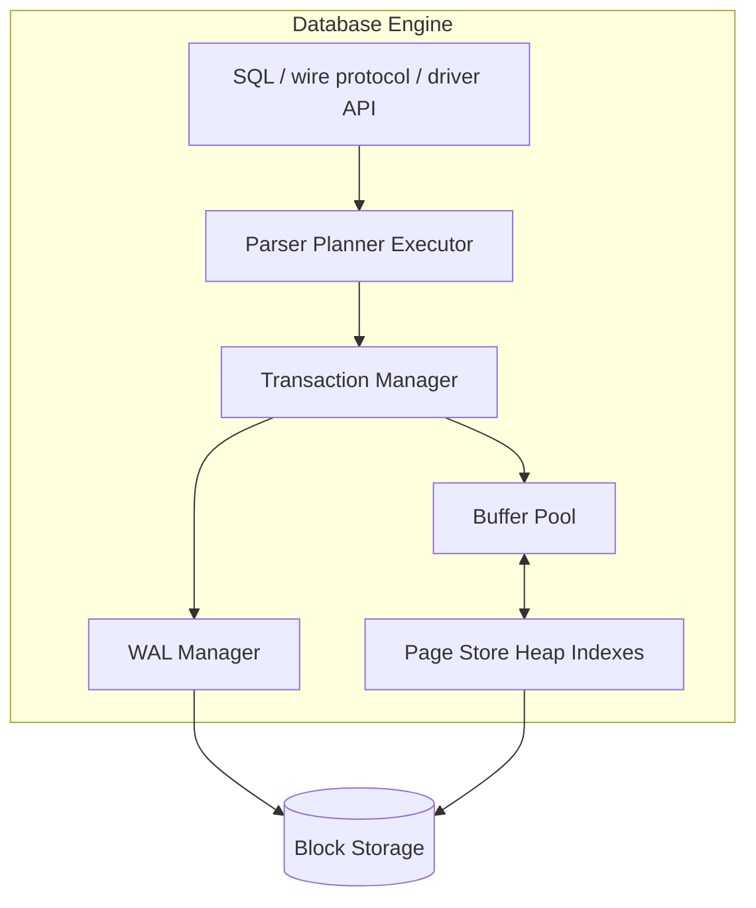
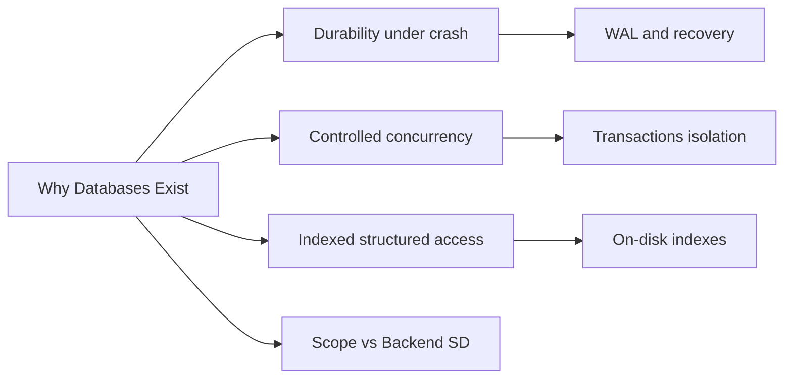
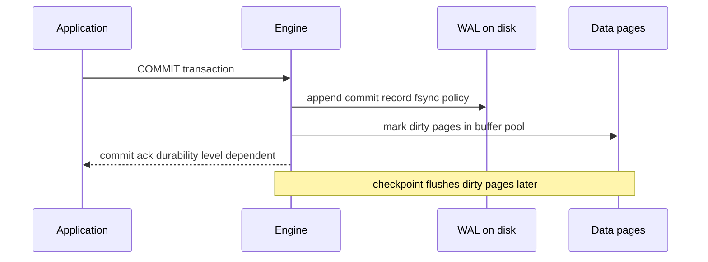

# Why Databases Exist

## Overview

A **database engine** is software that turns raw block storage into a **durable, concurrent, queryable data contract**. Applications could persist state in flat files, but files alone do not provide atomic multi-record updates, crash-safe recovery, indexed lookups at scale, or coordinated concurrent access without reinventing decades of storage research.

This note establishes the **storage contract** every later Databases topic assumes: pages on disk, buffer pools in memory, write-ahead logging, indexes, transactions, and planners. Backend teaches how services *use* data; this track teaches how engines *keep* it.

## Learning Objectives

- Explain why flat files and ad-hoc serialization fail under concurrency and crash
- Articulate the core promises engines make: durability, structured access, and controlled sharing
- Distinguish what a database engine owns vs. what application code and Backend patterns own
- Map historical constraints (disk latency, limited RAM, multi-user systems) to modern engine design
- Recognize when a purpose-built engine beats general-purpose storage—and when it does not

## Prerequisites

- [[01-Computer-Science/06-IO-and-Persistence/Files Blocks and Directories|Files Blocks and Directories]]
- [[01-Computer-Science/05-Concurrency-Fundamentals/Races Locks and Atomicity|Races Locks and Atomicity]]
- [[01-Computer-Science/02-Machine-Model/Cache Hierarchy and Locality|Cache Hierarchy and Locality]]

## Difficulty

`beginner`

## Estimated Time

- Reading: 1.5 hours
- Exercises: 1 hour
- Mini project: 2 hours

## History

Early business systems stored ledgers on tape and card files. As multi-user OSes matured (1960s E970s), three pressures converged:

1. **Durability under crash**: a power loss mid-write must not corrupt the ledger permanently.
2. **Concurrent readers and writers**: many clerks (later, many app servers) touch the same records.
3. **Structured retrieval**: keyed lookup and range scans beat full-file linear search as data grew.

**IMS** (IBM, 1960s) and later **System R** / **Ingres** (1970s) formalized **transactions**, **B-tree indexes**, and **query optimizers**. The relational model (Codd, 1970) separated *logical* tables from *physical* storage—a separation engines still honor via pages, WAL, and planners.

Modern engines (PostgreSQL, MongoDB WiredTiger, Redis with AOF) inherit the same first principles even when the surface API is SQL, documents, or key-value.

## Problem It Solves

| Failure mode (files / DIY persistence) | Engine approach |
| --- | --- |
| Partial write corrupts JSON file | WAL + atomic commit records (see [[08-Databases/02-WAL-Durability-and-Recovery/Write-Ahead Logging Protocol|Write-Ahead Logging Protocol]]) |
| Two processes overwrite each other | Lock manager / MVCC (see [[08-Databases/05-Transactions-and-Isolation/Locking vs MVCC|Locking vs MVCC]]) |
| Full-file scan for one row | On-disk indexes (see [[08-Databases/03-Indexing-on-Disk/B-Plus Trees as Page Structures|B-Plus Trees as Page Structures]]) |
| No crash recovery story | Redo/undo from WAL (see [[08-Databases/02-WAL-Durability-and-Recovery/Crash Recovery Redo and Undo Concepts|Crash Recovery Redo and Undo Concepts]]) |
| Unbounded memory for large datasets | Buffer pool + page-oriented I/O (see [[08-Databases/01-Storage-and-Buffer-Pool/Pages Blocks and IO Units|Pages Blocks and I/O Units]]) |

Engines do **not** replace product design: idempotency keys, cache-aside, and multi-region failover live in [[07-Backend/README|Backend]] and [[09-System-Design/README|System Design]].

## Internal Implementation

### The engine contract (high level)



An engine is not "a folder of files." It is a **state machine** over fixed-size **pages**, with **log-first durability** and **access paths** chosen by cost models (planner topics in module 04).

## Mermaid Diagrams

### Structure



### Sequence / Lifecycle  Ecommit path sketch



## Examples

### Minimal Example  Ewhy a file is not enough

```typescript
// Node 20+ / TypeScript 5+  Eeducational anti-pattern
import { readFileSync, writeFileSync } from "node:fs";

interface Account {
  id: string;
  balance: number;
}

function transfer(accountsPath: string, from: string, to: string, amount: number) {
  const raw = readFileSync(accountsPath, "utf8");
  const accounts: Account[] = JSON.parse(raw);
  const a = accounts.find((x) => x.id === from)!;
  const b = accounts.find((x) => x.id === to)!;
  a.balance -= amount;
  b.balance += amount;
  // Crash here => torn write, lost money, or corrupt JSON
  writeFileSync(accountsPath, JSON.stringify(accounts));
}
```

No atomicity, no concurrent writers, no index on `id`, no recovery after partial write.

### Production-Shaped Example  Eengine-backed transfer

```typescript
// Node 20+ / TypeScript 5+ with `pg`  Edurability/isolation delegated to engine
import pg from "pg";

export async function transfer(
  pool: pg.Pool,
  fromId: string,
  toId: string,
  cents: number,
): Promise<void> {
  const client = await pool.connect();
  try {
    await client.query("BEGIN");
    await client.query(
      "UPDATE accounts SET balance = balance - $1 WHERE id = $2 AND balance >= $1",
      [cents, fromId],
    );
    await client.query("UPDATE accounts SET balance = balance + $1 WHERE id = $2", [
      cents,
      toId,
    ]);
    await client.query("COMMIT"); // engine writes WAL, enforces isolation
  } catch (err) {
    await client.query("ROLLBACK");
    throw err;
  } finally {
    client.release();
  }
}
```

```sql
-- Schema the engine indexes and recovers
CREATE TABLE accounts (
  id         TEXT PRIMARY KEY,
  balance    BIGINT NOT NULL CHECK (balance >= 0)
);
CREATE INDEX accounts_balance_idx ON accounts (balance);
```

Repository patterns and ORM mapping belong to [[07-Backend/08-Data-Access-and-Persistence-Patterns/Repository and Unit of Work|Repository and Unit of Work]].

## Trade-offs

| Dimension | Upside | Downside | When it matters |
| --- | --- | --- | --- |
| Engine vs files | ACID, indexes, ops tooling | Operational complexity, tuning | Any shared mutable state |
| General-purpose RDBMS | Mature WAL, planner, ecosystem | Schema migration cost | Financial, inventory, auth |
| Embedded / file DB | Simple deploy | Weaker multi-writer story | Edge, mobile, tests |
| DIY on object storage | Cheap blob storage | You rebuild WAL, indexes, tx | Usually never in production |

### When to Use

- Multiple writers or readers on shared state
- Need for crash-safe updates and point-in-time recovery
- Query patterns require indexes, joins, or aggregations at scale

### When Not to Use

- Immutable append-only logs where you only replay (specialized log stores)
- Ephemeral cache data with explicit loss tolerance (Redis as cache  Esee module 10)
- Single-writer, replace-whole-file snapshots with acceptable RPO/RTO (some config)

## Exercises

1. List three ways a process crash during `writeFileSync` can corrupt a JSON ledger file.
2. Sketch a timeline: two app instances read-modify-write the same file without locking. Where does money disappear?
3. Write the same `transfer` in SQL with `BEGIN`/`COMMIT` and explain which engine subsystems activate.
4. Compare storing user profiles in PostgreSQL vs. S3 JSON objects for 10M users with email lookup.
5. Read [[08-Databases/00-Orientation/Files vs Engines vs Services|Files vs Engines vs Services]] and diagram where your current project sits.

## Mini Project

**Crashy file store lab.** Implement the JSON file transfer above. Kill the process mid-write (`kill -9`) and document corruption modes. Repeat with SQLite or PostgreSQL and compare recovery behavior. Artifacts under [[08-Databases/code/README|Databases code labs]].

## Portfolio Project

Add a "Storage contract" section to [[08-Databases/projects/Database Engines Workbench/README|Database Engines Workbench]] explaining why the workbench implements pages + WAL instead of serializing objects to one file.

## Interview Questions

1. Why can't you rely on the filesystem alone for ACID transactions?
2. What problems did early relational systems solve that COBOL flat files did not?
3. Name engine subsystems involved in a single `INSERT` that returns success.
4. When is a database overkill compared to object storage or an embedded KV?
5. How does "durable" differ from "replicated"?

### Stretch / Staff-Level

1. Compare LSM-tree engines (RocksDB-style) vs. B-tree page stores for write-heavy OLTP—preview trade-offs without full LSM module.
2. How would you justify Postgres vs. Dynamo-style KV for a payments ledger to a product team?

## Common Mistakes

- Treating `INSERT` as magic without understanding WAL and buffer pool
- Using Redis as primary store because "it's fast" without durability contract
- Reimplementing WAL/paging in application code poorly
- Confusing database replication with multi-region product design ([[09-System-Design/README|System Design]])

## Best Practices

- State explicit durability and isolation requirements before choosing an engine
- Prefer engines with proven crash recovery over bespoke file formats
- Measure end-to-end latency including fsync policy, not just query text
- Hand off service-level transaction boundaries to [[07-Backend/08-Data-Access-and-Persistence-Patterns/Transactions as Used by Services|Transactions as Used by Services]]

## Summary

Databases exist because applications need **shared, durable, structured state** under crash and concurrency—constraints flat files satisfy poorly. Engines implement pages, WAL, indexes, and transaction managers so applications express intent in SQL or API calls while the storage layer guarantees recovery and controlled access. Everything in this track builds on that contract: first storage layout, then durability, then indexes, then planning and production operations.

## Further Reading

- [[00-References/Databases/README|Databases References]]
- Gray & Reuter  E*Transaction Processing: Concepts and Techniques*
- [[01-Computer-Science/06-IO-and-Persistence/Files Blocks and Directories|Files Blocks and Directories]]

## Related Notes

- [[08-Databases/00-Orientation/Files vs Engines vs Services|Files vs Engines vs Services]]
- [[08-Databases/00-Orientation/Database Failure Modes Corruption and Durability|Database Failure Modes Corruption and Durability]]
- [[08-Databases/01-Storage-and-Buffer-Pool/Pages Blocks and IO Units|Pages Blocks and I/O Units]]
- [[07-Backend/08-Data-Access-and-Persistence-Patterns/Handing Off to Database Engines|Handing Off to Database Engines]]
- [[04-Data-Structures/README|Data Structures]]  Ein-memory structures vs on-disk pages
- [[09-System-Design/README|System Design]]  Emulti-region and CAP product choices

## Progress Checklist

- [ ] Explained from first principles
- [ ] Drew at least one Mermaid diagram
- [ ] Implemented a minimal version
- [ ] Documented trade-offs and non-goals
- [ ] Completed exercises
- [ ] Practiced interview questions aloud
- [ ] Linked prerequisites and dependents
