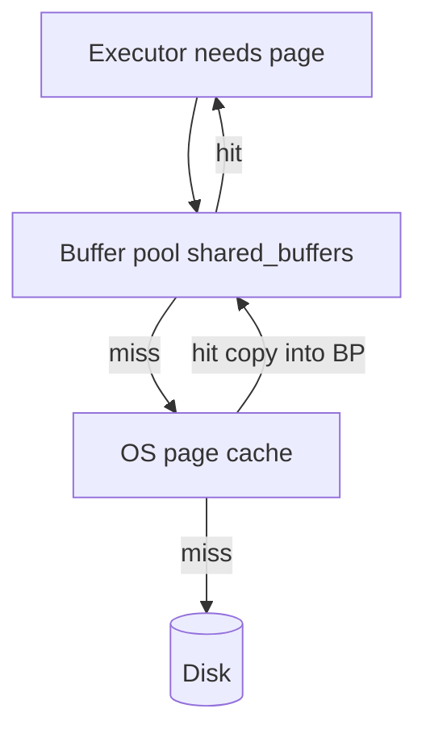
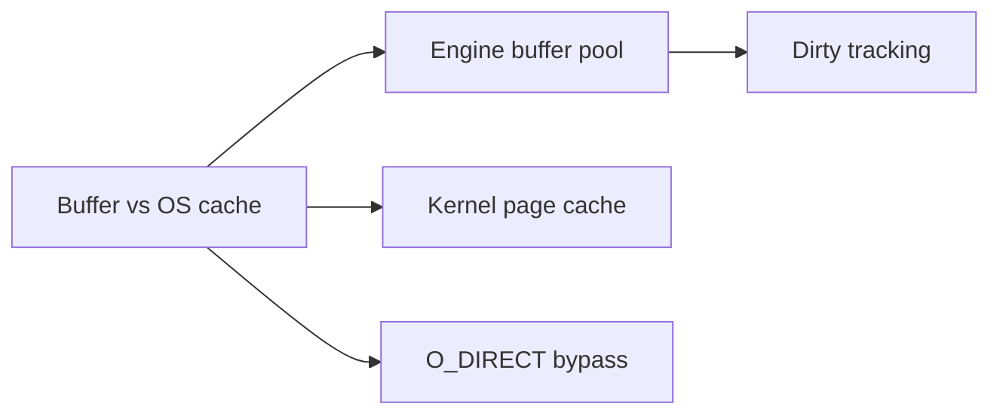
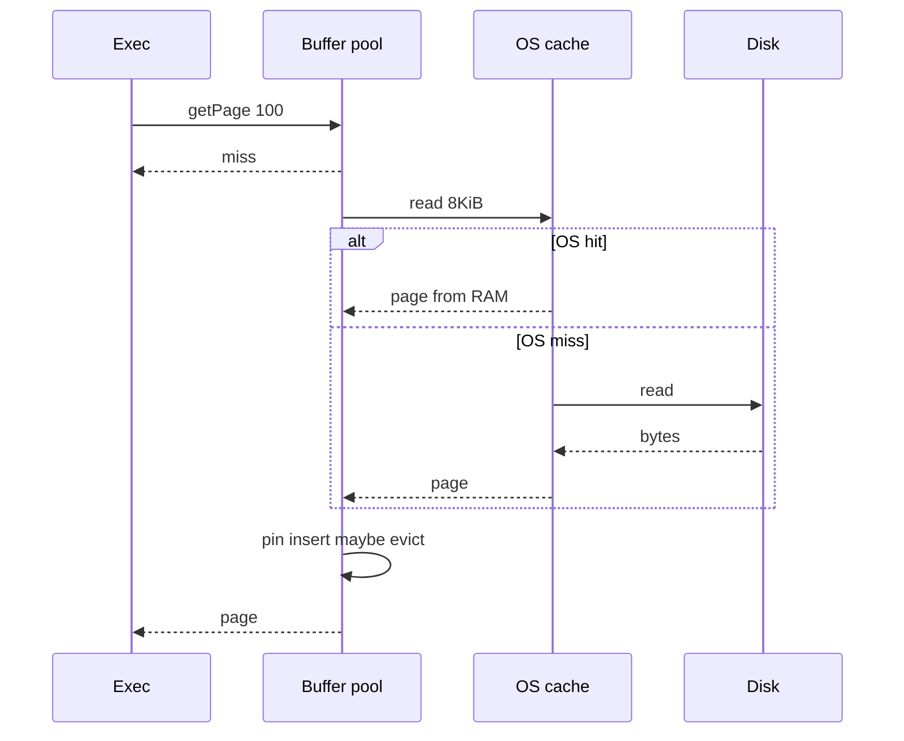

# Buffer Pool vs OS Page Cache

## Overview

Database engines maintain a **buffer pool** (PostgreSQL `shared_buffers`): pinned copies of **database pages** with LRU/Clock eviction and checksum validation. The OS also caches file blocks in the **page cache**. Both cache the same bytes unless the engine uses **direct I/O** (`O_DIRECT`)—creating **double caching** risk and confusing memory accounting.

This note explains why engines insist on their own cache, how hits are measured, and how to size memory in production.

## Learning Objectives

- Contrast buffer pool semantics (pin, dirty, clock sweep) with OS page cache
- Explain double caching and when direct I/O avoids it
- Read Postgres buffer hit ratio vs OS cache ambiguity
- Describe read path: buffer miss may still be OS cache hit (no disk)
- Tune `shared_buffers` vs `effective_cache_size` coherently

## Prerequisites

- [[08-Databases/01-Storage-and-Buffer-Pool/Pages Blocks and I/O Units|Pages Blocks and I/O Units]]
- [[01-Computer-Science/02-Machine-Model/Cache Hierarchy and Locality|Cache Hierarchy and Locality]]
- [[04-Data-Structures/11-Caches-and-Eviction/LRU via Hash Map and Doubly Linked List|LRU via Hash Map and Doubly Linked List]]

## Difficulty

`intermediate`

## Estimated Time

- Reading: 1.5 hours
- Exercises: 1 hour
- Mini project: 2 hours

## History

Early Postgres relied heavily on OS buffer cache; `shared_buffers` was small. As RAM grew and checksums/WAL integration tightened, engines kept more pages in-process for **predictable eviction** and **avoiding extra copies**. MySQL InnoDB buffer pool; Oracle SGA—same pattern. Linux page cache remains partner or competitor depending on I/O mode.

## Problem It Solves

| Confusion | Clarification |
| --- | --- |
| "100% buffer hit" | May hide cold OS cache effects on restart |
| "Free RAM wasted" | `effective_cache_size` informs planner, not allocation |
| "Add RAM = faster" | Wrong pool sizing duplicates cache |
| Dirty pages | Engine knows dirty; OS may not flush order for crash alone |

Buffer pool integrates with **checkpoint** and **WAL**—OS cache does not understand database recovery semantics.

## Internal Implementation

### Two-layer cache



**Pin**: prevent eviction while reading tuple.**Dirty**: page differs from disk; flush at checkpoint.**Clock sweep**: Postgres approximates LRU under pressure.

Eviction ADT patterns: [[04-Data-Structures/11-Caches-and-Eviction/LRU via Hash Map and Doubly Linked List|LRU via Hash Map and Doubly Linked List]].

## Mermaid Diagrams

### Structure



### Sequence / Lifecycle — buffer miss



## Examples

### Minimal Example — educational buffer pool

```typescript
type Frame = { pageId: string; dirty: boolean; pinCount: number; bytes: Buffer };

export class BufferPool {
  private frames = new Map<string, Frame>();
  constructor(private capacity: number) {}

  getPage(pageId: string, read: (id: string) => Buffer): Buffer {
    let f = this.frames.get(pageId);
    if (!f) {
      if (this.frames.size >= this.capacity) this.evict();
      f = { pageId, dirty: false, pinCount: 1, bytes: read(pageId) };
      this.frames.set(pageId, f);
    } else {
      f.pinCount++;
    }
    return f.bytes;
  }

  markDirty(pageId: string) {
    this.frames.get(pageId)!.dirty = true;
  }

  private evict() {
    // clock/LRU stub — see DS cache modules
    const victim = [...this.frames.values()].find((x) => x.pinCount === 0 && !x.dirty);
    if (!victim) throw new Error("no evictable frame");
    this.frames.delete(victim.pageId);
  }
}
```

### Production-Shaped Example — Postgres memory knobs

```sql
SHOW shared_buffers;        -- engine buffer pool
SHOW effective_cache_size;  -- planner hint: OS + shared estimate

SELECT
  sum(heap_blks_hit) / nullif(sum(heap_blks_hit + heap_blks_read), 0) AS heap_hit_ratio
FROM pg_statio_user_tables;
```

```typescript
// Monitoring wrapper — interpret cautiously after restart
export function interpretHitRatio(ratio: number, uptimeSec: number): string {
  if (uptimeSec < 3600) return "warmup: hit ratio not stable yet";
  if (ratio < 0.99) return "investigate missing indexes or small shared_buffers";
  return "healthy for OLTP if corroborated by latency";
}
```

Ops detail: [[08-Databases/12-Production-Database-Ops/Monitoring Checkpoints Lag Bloat Cache Hit|Monitoring Checkpoints Lag Bloat Cache Hit]].

## Trade-offs

| Dimension | Larger shared_buffers | Rely on OS cache |
| --- | --- | --- |
| Predictability | Engine-controlled | OS heuristics |
| Memory use | Dedicated | Shared with other processes |
| Copy overhead | May duplicate with OS | Single copy in OS |
| Checksums | Verified on read into pool | Depends on path |
| Tuning | Needs explicit size | "Obvious" but opaque |

Rule of thumb: Postgres often 25% RAM up to ~8–16 GB `shared_buffers`; set `effective_cache_size` ~50–75% RAM for planner.

### When to Use

- Size buffer pool from working set of hot pages
- Use `pg_statio_*` + OS metrics together
- Direct I/O when double cache proven wasteful (advanced)

### When Not to Use

- Do not set `shared_buffers` > RAM
- Do not trust hit ratio alone during benchmark cold start

## Exercises

1. Explain double caching with a diagram including two copies of page 42.
2. After DB restart, why do first queries read "from disk" in stats but feel fast?
3. Implement clock eviction in the educational buffer pool.
4. What does `effective_cache_size` affect if not allocated?
5. Compare buffer pool to [[04-Data-Structures/11-Caches-and-Eviction/LRU via Hash Map and Doubly Linked List|LRU cache ADT]].

## Mini Project

Simulate buffer pool + optional OS cache layer in TypeScript; measure hit rates under skewed Zipf access. Compare to DS cache exercises.

## Portfolio Project

Integrate buffer pool into [[08-Databases/projects/Toy Page and WAL Store/README|Toy Page and WAL Store]] with metrics export.

## Interview Questions

1. Why do databases have their own buffer cache?
2. What is double caching?
3. Difference between shared_buffers and effective_cache_size?
4. Does buffer miss always mean disk I/O?
5. What is a pinned page?

### Stretch / Staff-Level

1. When does Postgres use `O_DIRECT` / `posix_fadvise`?
2. Size buffer pool for 500 GB dataset, 64 GB RAM, known 20 GB hot set.

## Common Mistakes

- Setting shared_buffers to entire RAM
- Ignoring OS page cache in capacity planning
- Using hit ratio as sole SLO
- Forgetting dirty pages need checkpoint flush ([[08-Databases/02-WAL-Durability-and-Recovery/Checkpoints and Dirty Page Flushing|Checkpoints and Dirty Page Flushing]])

## Best Practices

- Monitor `heap_blks_read` trend, not ratio alone
- Warm caches before load tests or measure cold explicitly
- Align pool size with working set; archive cold data
- Connection pooling reduces duplicate memory across processes ([[08-Databases/12-Production-Database-Ops/Connection Pooling at Engine and Proxy|Connection Pooling at Engine and Proxy]])

## Summary

The **buffer pool** is the engine's authoritative in-memory copy of pages with dirty/pin semantics tied to WAL and checkpoints. The **OS page cache** accelerates reads but obscures accounting and can duplicate RAM. Size and interpret caches together; understand that buffer miss ≠ disk miss. This layer bridges page I/O and durable recovery.

## Further Reading

- [[00-References/Databases/README|Databases References]]
- PostgreSQL: Resource Consumption, shared_buffers wiki
- [[04-Data-Structures/11-Caches-and-Eviction/LRU via Hash Map and Doubly Linked List|LRU via Hash Map and Doubly Linked List]]

## Related Notes

- [[08-Databases/01-Storage-and-Buffer-Pool/Pages Blocks and I/O Units|Pages Blocks and I/O Units]]
- [[08-Databases/02-WAL-Durability-and-Recovery/Checkpoints and Dirty Page Flushing|Checkpoints and Dirty Page Flushing]]
- [[08-Databases/12-Production-Database-Ops/Monitoring Checkpoints Lag Bloat Cache Hit|Monitoring Checkpoints Lag Bloat Cache Hit]]
- [[04-Data-Structures/11-Caches-and-Eviction/LRU via Hash Map and Doubly Linked List|LRU via Hash Map and Doubly Linked List]]
- [[07-Backend/README|Backend]]
- [[05-Algorithms/README|Algorithms]]

## Progress Checklist

- [ ] Explained from first principles
- [ ] Drew at least one Mermaid diagram
- [ ] Implemented a minimal version
- [ ] Documented trade-offs and non-goals
- [ ] Completed exercises
- [ ] Practiced interview questions aloud
- [ ] Linked prerequisites and dependents
