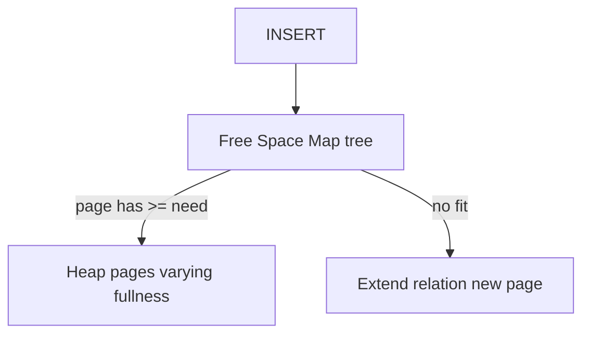
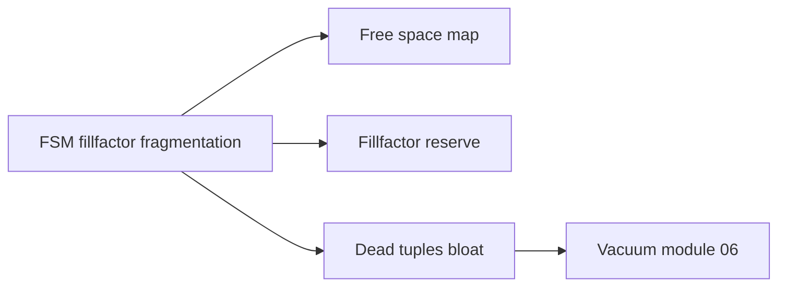
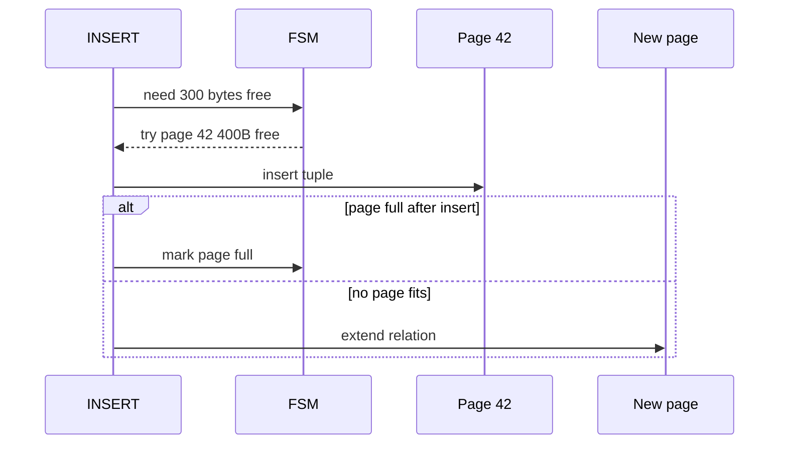

# Free Space Maps Fillfactor and Fragmentation

## Overview

Heap pages rarely stay perfectly full. **Deletes** leave holes; **updates** create new row versions; **inserts** need target pages with space. Engines track **free space** per page (PostgreSQL **FSM**—Free Space Map) and honor **fillfactor** to reserve room for HOT updates. **Fragmentation** and **bloat** increase I/O and vacuum cost.

This note connects physical space management to insert/update performance and autovacuum operations.

## Learning Objectives

- Explain FSM purpose and multi-level free space map (Postgres)
- Configure `fillfactor` for update-heavy vs append-only tables
- Distinguish logical bloat from OS file sparseness
- Predict when inserts allocate new pages vs reuse partial pages
- Relate fragmentation to seq scan cost and vacuum urgency

## Prerequisites

- [[08-Databases/01-Storage-and-Buffer-Pool/Pages Blocks and I/O Units|Pages Blocks and I/O Units]]
- [[08-Databases/01-Storage-and-Buffer-Pool/Tuple Layout and Oversized Values|Tuple Layout and Oversized Values]]

## Difficulty

`intermediate`

## Estimated Time

- Reading: 1.5 hours
- Exercises: 1 hour
- Mini project: 2 hours

## History

Early heaps appended until full. Update-heavy OLTP needed **reserved space** to keep modified rows on the same page (**HOT**). Postgres FSM (8 KiB tree of categories) quickly finds pages with ≥ threshold free bytes. Without space management, every update chases new pages → index bloat → scan reads mostly empty blocks.

## Problem It Solves

| Symptom | Space management lever |
| --- | --- |
| Update expands row, page full | fillfactor reserves space |
| Can't find page with 500 B free | FSM guides insert |
| Table 100 GB, 30 GB dead tuples | vacuum + visibility |
| Seq scan slow on "small" table | physical bloat / sparse pages |

## Internal Implementation

### FSM + heap (conceptual)



**fillfactor** 70 = pages filled to ~70% on bulk load/CLUSTER, leaving 30% for updates.

## Mermaid Diagrams

### Structure



### Sequence / Lifecycle — insert targeting



## Examples

### Minimal Example — educational free space tracker

```typescript
type PageInfo = { pageId: number; freeBytes: number };

export class FreeSpaceMap {
  private pages: PageInfo[] = [];

  register(pageId: number, pageSize: number, used: number) {
    this.pages.push({ pageId, freeBytes: pageSize - used });
  }

  findPage(need: number): number | null {
    // real FSM uses bucketing; linear scan for teaching
    const fit = this.pages.filter((p) => p.freeBytes >= need);
    fit.sort((a, b) => a.freeBytes - b.freeBytes); // best fit
    return fit[0]?.pageId ?? null;
  }
}
```

### Production-Shaped Example — fillfactor and bloat check

```sql
-- Update-heavy lookup table: leave room for HOT
CREATE TABLE sessions (
  id         UUID PRIMARY KEY,
  data       JSONB,
  updated_at TIMESTAMPTZ
) WITH (fillfactor = 70);

-- Append-only events: default 100
CREATE TABLE events (
  id BIGSERIAL PRIMARY KEY,
  payload JSONB
) WITH (fillfactor = 100);

-- Bloat estimate (pg_stat views / pgstattuple extension)
SELECT schemaname, relname, n_live_tup, n_dead_tup,
       round(n_dead_tup::numeric / nullif(n_live_tup, 0), 3) AS dead_ratio
FROM pg_stat_user_tables
WHERE relname = 'sessions';
```

```typescript
// Alert hook — ops
export function shouldVacuumAlert(deadRatio: number, threshold = 0.2): boolean {
  return deadRatio > threshold;
}
```

Vacuum depth: [[08-Databases/06-Concurrency-Internals/Vacuum Version GC and Bloat|Vacuum Version GC and Bloat]].

## Trade-offs

| Dimension | Lower fillfactor (70) | High fillfactor (100) |
| --- | --- | --- |
| Updates same page | More HOT opportunities | More page splits/churn |
| Storage | More pages for same rows | Dense packing |
| Seq scan | More pages to read | Fewer pages |
| Index size | Unchanged by fillfactor alone | — |

### When to Use

- fillfactor < 100 on frequently updated narrow rows
- Monitor dead tuple ratio on churn tables
- `CLUSTER` / pg_repack after massive deletes (maintenance)

### When Not to Use

- Low fillfactor on append-only fact tables (wastes space)
- Manual `VACUUM FULL` in production peak without plan

## Exercises

1. Table 8 KiB pages, fillfactor 80—max bytes used on initial load?
2. After many UPDATEs, why does FSM still show free space but seq scan slow?
3. HOT update conditions—list three (Postgres docs).
4. Simulate insert with FSM; when does relation extend?
5. Relate dead_ratio to autovacuum tuning.

## Mini Project

Churn-update benchmark on same table with fillfactor 100 vs 70; compare heap pages (`pg_relation_size`) and HOT stats if available.

## Portfolio Project

Add FSM layer to [[08-Databases/projects/Toy Page and WAL Store/README|Toy Page and WAL Store]] page allocator.

## Interview Questions

1. What is fillfactor?
2. What does Postgres FSM do?
3. Difference between bloat and fragmentation?
4. Why reserve space for updates?
5. How does vacuum interact with free space?

### Stretch / Staff-Level

1. Compare Postgres FSM to InnoDB insert buffer / free list.
2. Plan pg_repack vs VACUUM FULL for 2 TB table with 40% bloat.

## Common Mistakes

- fillfactor 50 on warehouse fact table
- Ignoring n_dead_tup until autovacuum can't keep up
- Confusing table bloat with index bloat
- Long transactions blocking vacuum ([[08-Databases/06-Concurrency-Internals/Long Transactions and Snapshot Horizons|Long Transactions and Snapshot Horizons]])

## Best Practices

- Set fillfactor at CREATE for known update patterns
- Alert on dead tuple ratio and wraparound age
- Bulk load then index; use separate staging fillfactor 100
- Schema design reduces update width ([[08-Databases/01-Storage-and-Buffer-Pool/Tuple Layout and Oversized Values|Tuple Layout and Oversized Values]])

## Summary

Pages are not uniformly full: FSM finds insert targets, fillfactor reserves update headroom, and dead tuples fragment effective density. Space management is performance—more pages means more I/O for scans and vacuum work. Tune at CREATE time and monitor dead tuple metrics in production.

## Further Reading

- [[00-References/Databases/README|Databases References]]
- PostgreSQL: FSM, fillfactor, bloat monitoring
- [[08-Databases/06-Concurrency-Internals/Vacuum Version GC and Bloat|Vacuum Version GC and Bloat]]

## Related Notes

- [[08-Databases/01-Storage-and-Buffer-Pool/Pages Blocks and I/O Units|Pages Blocks and I/O Units]]
- [[08-Databases/01-Storage-and-Buffer-Pool/Heap Tables vs Clustered Layouts|Heap Tables vs Clustered Layouts]]
- [[08-Databases/01-Storage-and-Buffer-Pool/Buffer Pool vs OS Page Cache|Buffer Pool vs OS Page Cache]]
- [[08-Databases/06-Concurrency-Internals/Vacuum Version GC and Bloat|Vacuum Version GC and Bloat]]
- [[07-Backend/README|Backend]]
- [[09-System-Design/README|System Design]]

## Progress Checklist

- [ ] Explained from first principles
- [ ] Drew at least one Mermaid diagram
- [ ] Implemented a minimal version
- [ ] Documented trade-offs and non-goals
- [ ] Completed exercises
- [ ] Practiced interview questions aloud
- [ ] Linked prerequisites and dependents
