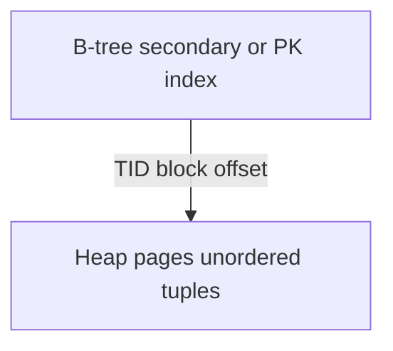
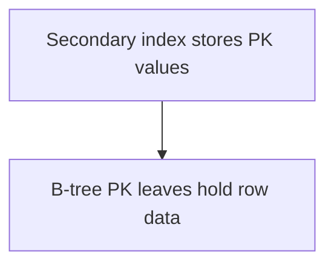
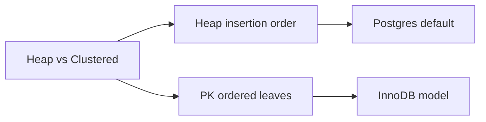
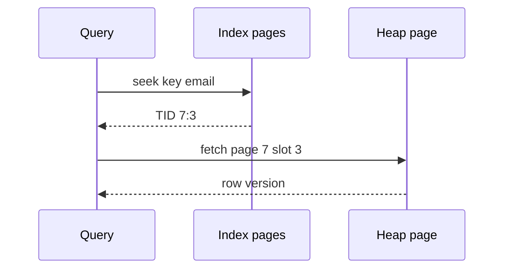

# Heap Tables vs Clustered Layouts

## Overview

A **heap table** stores rows in insertion order (or free-space reuse order) with no inherent sort. A **clustered** (index-organized) layout stores row data in **primary key order** within the index structure itself (SQL Server clustered index, MySQL InnoDB PK, Oracle IOT) or via **cluster** hinting (Postgres `CLUSTER`—one-time reorder, not maintained).

Layout choice determines whether primary-key lookup is one index hop or index-plus-heap fetch—core to access-path design in module 04.

## Learning Objectives

- Contrast heap + secondary index vs clustered/index-organized storage
- Predict I/O for PK lookup and range scan under each layout
- Explain Postgres heap + separate indexes vs InnoDB clustered PK
- Relate clustering to insert pattern and page splits (module 03)
- Choose PK type (sequential vs random UUID) with layout in mind

## Prerequisites

- [[08-Databases/01-Storage-and-Buffer-Pool/Pages Blocks and IO Units|Pages Blocks and I/O Units]]

## Difficulty

`intermediate`

## Estimated Time

- Reading: 1.5 hours
- Exercises: 1 hour
- Mini project: 3 hours

## History

Early relational heaps matched file-of-records simplicity. OLTP workloads with PK-heavy access pushed **clustered indexes** (Sybase/SQL Server terminology). InnoDB made the PK **the** table. Postgres kept heap canonical with optional `CLUSTER` for maintenance windows—philosophical trade: flexibility vs locality.

## Problem It Solves

| Access pattern | Heap disadvantage | Clustered advantage |
| --- | --- | --- |
| PK point read | Index ↁEheap TID fetch (2 hops) | Row in leaf (often 1 hop) |
| PK range scan | Random heap pages | Sequential leaf pages |
| Secondary index read | Always heap fetch | May still need PK lookup |
| Random UUID inserts | Heap OK; index bloat | Leaf page splits scattered |

## Internal Implementation

### Postgres heap + index (simplified)



### Clustered / IOT (simplified)



Postgres **does not** maintain clustered order on insert; `CLUSTER` rewrites table once. InnoDB **always** clusters by PK.

## Mermaid Diagrams

### Structure



### Sequence / Lifecycle  Esecondary index lookup on heap



## Examples

### Minimal Example  Etwo-hop vs one-hop mental model

```typescript
type Tid = { pageId: number; slot: number };

// Heap model: index entry points to tuple location
type IndexEntry = { key: string; tid: Tid };

function lookupHeap(index: IndexEntry[], key: string, heap: Map<number, Page>): Row {
  const e = index.find((x) => x.key === key)!;
  return readTuple(heap.get(e.tid.pageId)!, e.tid.slot);
}

// Clustered model: leaf IS row (by key)
type ClusteredLeaf = { key: string; row: Row };

function lookupClustered(leaves: ClusteredLeaf[], key: string): Row {
  return leaves.find((x) => x.key === key)!.row;
}
```

### Production-Shaped Example  Eschema choices

```sql
-- Postgres: heap table; PK creates B-tree index to TID
CREATE TABLE events (
  id          BIGSERIAL PRIMARY KEY,
  user_id     BIGINT NOT NULL,
  payload     JSONB
);
CREATE INDEX events_user_ts ON events (user_id, created_at);

-- Range scan by user may touch many heap pages unless CLUSTER run manually
-- CLUSTER events USING events_user_ts;  -- maintenance window rewrite
```

```sql
-- Sequential PK friendly to clustered engines (InnoDB-style products)
-- Prefer time-ordered IDs or BIGSERIAL over random UUID v4 for insert locality
CREATE TABLE events_inno (
  id CHAR(26) PRIMARY KEY,  -- ULID example for sequential-ish inserts
  user_id BIGINT NOT NULL
);
```

UUID vs sequential key trade-offs tie to [[08-Databases/03-Indexing-on-Disk/B-Plus Trees as Page Structures|B-Plus Trees as Page Structures]] and DS fanout note.

## Trade-offs

| Dimension | Heap (Postgres) | Clustered (InnoDB-like) |
| --- | --- | --- |
| PK lookup I/O | Index + heap | Often leaf only |
| Insert pattern | Heap append; index separate | Leaf splits on PK order |
| Secondary indexes | Store TID | Store PK (lookup again) |
| HOT updates | Same-page heap only (Postgres) | PK change = row move |
| Flexibility | Multiple indexes equal | PK choice is physical |

### When to Use

- Heap + good indexes when updates shift non-indexed columns heavily (Postgres HOT)
- Clustered when PK range scans dominate and PK is sequential
- `CLUSTER` for read-heavy historical partitions after bulk load

### When Not to Use

- Random UUID PK on write-heavy clustered engine without mitigation (shard, sequential UUID)
- Assuming `CLUSTER` stays sorted without re-run

## Exercises

1. Draw I/O for `SELECT * FROM t WHERE id = $1` on heap vs clustered.
2. Why do secondary indexes in InnoDB store PK not TID?
3. Explain Postgres HOT update eligibility in one paragraph.
4. Benchmark insert rate: BIGSERIAL vs UUID v4 on Postgres index size.
5. When is heap **better** than clustered for update-heavy wide rows?

## Mini Project

Compare `EXPLAIN (ANALYZE, BUFFERS)` for PK lookup on Postgres table before/after `CLUSTER`. Log shared hits vs reads in [[08-Databases/projects/EXPLAIN Literacy Workbench/README|EXPLAIN Literacy Workbench]].

## Portfolio Project

ADR in [[08-Databases/projects/Database Engines Workbench/README|Database Engines Workbench]]: heap page store + separate index file vs clustered leaf rows.

## Interview Questions

1. What is a heap table in Postgres?
2. Difference between SQL Server clustered index and Postgres CLUSTER?
3. Why does PK choice affect write amplification?
4. What is a TID?
5. How does clustering affect secondary index size?

### Stretch / Staff-Level

1. Design time-series table: BRIN + heap vs partitioned clustered PK.
2. Compare Postgres heap-only tuples (HOT) to InnoDB MVCC row versions physically.

## Common Mistakes

- Using UUID v4 PK on billion-row write-heavy table without index bloat plan
- Expecting Postgres PK to physically order heap
- Ignoring secondary index heap fetches in covering index design (module 03)

## Best Practices

- Match PK to dominant access path and engine layout
- Use `EXPLAIN BUFFERS` to count heap fetches
- Partition large tables by time for sequential scans
- ORM entity IDs: coordinate with [[07-Backend/08-Data-Access-and-Persistence-Patterns/Repository and Unit of Work|Repository and Unit of Work]]

## Summary

**Heap** tables decouple row storage from index order—flexible, two-hop PK reads in Postgres.**Clustered** layouts embed rows in PK index leaves—better PK locality, PK choice becomes physical. Neither is universally superior; insert patterns, update shape, and secondary index workload decide. Layout sits between page mechanics and index access paths.

## Further Reading

- [[00-References/Databases/README|Databases References]]
- Postgres: Heap-Only Tuples (HOT)
- InnoDB clustered index documentation

## Related Notes

- [[08-Databases/01-Storage-and-Buffer-Pool/Pages Blocks and IO Units|Pages Blocks and I/O Units]]
- [[08-Databases/03-Indexing-on-Disk/Secondary Covering and Partial Indexes|Secondary Covering and Partial Indexes]]
- [[08-Databases/04-Query-Processing-and-Planning/Access Paths Seq Scan vs Index|Access Paths Seq Scan vs Index]]
- [[04-Data-Structures/05-Trees-and-Ordered-Maps/B-Trees and B-Plus Trees Concepts|B-Trees and B-Plus Trees Concepts]]
- [[07-Backend/README|Backend]]
- [[09-System-Design/README|System Design]]

## Progress Checklist

- [ ] Explained from first principles
- [ ] Drew at least one Mermaid diagram
- [ ] Implemented a minimal version
- [ ] Documented trade-offs and non-goals
- [ ] Completed exercises
- [ ] Practiced interview questions aloud
- [ ] Linked prerequisites and dependents
