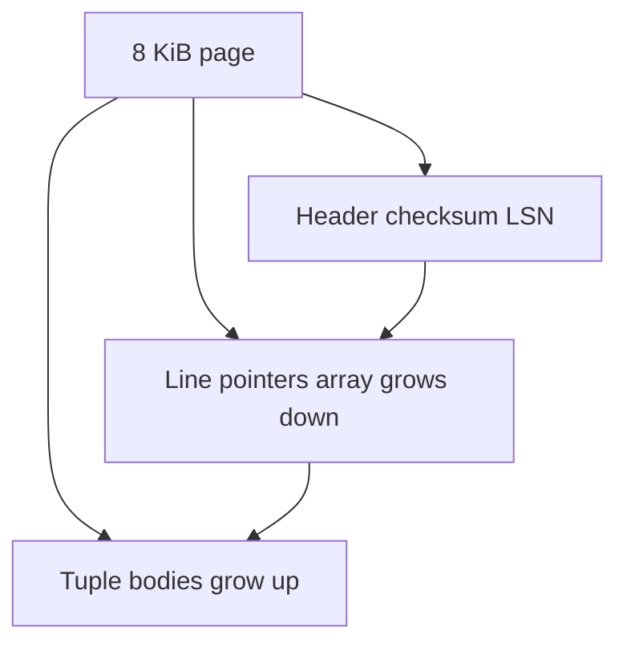
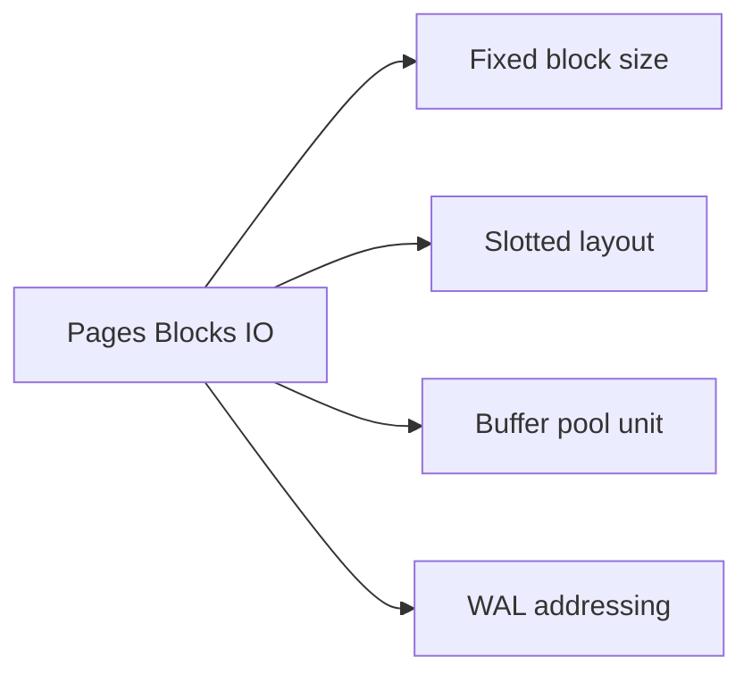
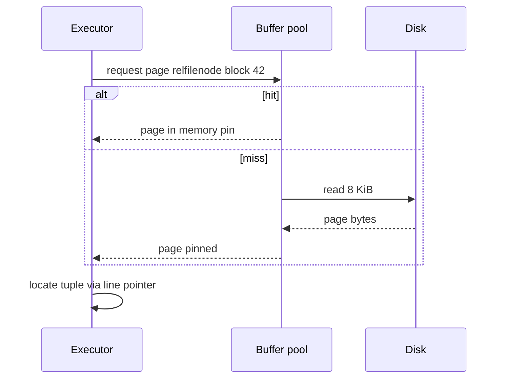

# Pages Blocks and I/O Units

## Overview

Database engines read and write **fixed-size pages** (also **blocks**), typically 8 KiB in PostgreSQL, rather than individual rows. The **page** is the atomic unit of buffer pool caching, WAL logging (often), and sequential scan I/O. Understanding page granularity explains why small row updates still touch whole blocks and why index depth stays logarithmic in *pages*, not rows.

This note starts the **storage contract** thread: logical tuples map to slotted pages on disk, cached in the buffer pool, flushed via checkpoints.

## Learning Objectives

- Define page, block, extent, and segment in engine terms
- Explain why engines align to OS/page size and SSD erase blocks indirectly
- Calculate rough I/O for seq scan vs index lookup in pages
- Describe page headers, line pointers, and slotted page layout at a high level
- Connect page size to B+ tree fanout (engine view; math in Data Structures)

## Prerequisites

- [[08-Databases/00-Orientation/Why Databases Exist|Why Databases Exist]]
- [[01-Computer-Science/02-Machine-Model/Cache Hierarchy and Locality|Cache Hierarchy and Locality]]
- [[04-Data-Structures/00-Orientation-and-Contracts/Memory Layout Locality and Allocation Patterns|Memory Layout Locality and Allocation Patterns]]

## Difficulty

`beginner`

## Estimated Time

- Reading: 1.5 hours
- Exercises: 1 hour
- Mini project: 3 hours

## History

Early systems used fixed **records** on tape; random update was painful. Disk databases adopted **slotted pages** (Gray, System R) so variable-length rows fit in fixed blocks with indirection. Page sizes settled around 4–16 KiB balancing **fanout**, **wasted space**, and **I/O amplification**.

## Problem It Solves

| Without page abstraction | With pages |
| --- | --- |
| Row-sized random I/O impractical | Amortize disk latency over 8 KiB |
| No standard cache unit | Buffer pool keyed by `(file, blockno)` |
| WAL describes arbitrary byte ranges | Log records reference page IDs |

## Internal Implementation

### Slotted page (conceptual)



- **Line pointer**: `{offset, length, flags}` to tuple version
- **Heap page**: many tuples; **index page**: many keys + child pointers (module 03)
- **LSN** on page: last WAL byte affecting this page—recovery uses it

B-tree **balance and fanout** proofs: [[04-Data-Structures/05-Trees-and-Ordered-Maps/B-Trees and B-Plus Trees Concepts|B-Trees and B-Plus Trees Concepts]]. Here: keys live **inside pages**.

## Mermaid Diagrams

### Structure



### Sequence / Lifecycle — read path



## Examples

### Minimal Example — educational page struct

```typescript
// TypeScript educational model — not Postgres wire format
const PAGE_SIZE = 8192;

type LinePointer = { offset: number; length: number; alive: boolean };

type Page = {
  pageId: string;
  lsn: bigint;
  linePointers: LinePointer[];
  bytes: Buffer; // PAGE_SIZE
};

export function readTuple(page: Page, slot: number): Buffer {
  const lp = page.linePointers[slot];
  if (!lp?.alive) throw new Error("dead slot");
  return page.bytes.subarray(lp.offset, lp.offset + lp.length);
}
```

### Production-Shaped Example — page-oriented cost estimate

```typescript
/** Rough seq scan I/O: table pages, not rows */
export function estimateSeqScanPages(rowCount: number, avgRowBytes: number): number {
  const headerOverhead = 100; // line ptrs + header fudge
  const usable = PAGE_SIZE - headerOverhead;
  const rowsPerPage = Math.max(1, Math.floor(usable / avgRowBytes));
  return Math.ceil(rowCount / rowsPerPage);
}

// 10M rows × 200 B ≈ 50 rows/page → ~200k pages → ~1.6 GB read cold cache
const pages = estimateSeqScanPages(10_000_000, 200);
console.log({ pages, coldReadMiB: (pages * PAGE_SIZE) / (1024 * 1024) });
```

```sql
-- Postgres: relation size in pages
SELECT relpages, reltuples FROM pg_class WHERE relname = 'orders';

-- Block-level stats extension (if installed)
SELECT * FROM pg_statio_user_tables WHERE relname = 'orders';
```

Lab: [[08-Databases/projects/Toy Page and WAL Store/README|Toy Page and WAL Store]].

## Trade-offs

| Dimension | Larger pages (16 KiB) | Smaller pages (4 KiB) |
| --- | --- | --- |
| B+ tree fanout | Higher, shallower tree | Lower, deeper tree |
| I/O amplification | Read more bytes per touch | Less waste for tiny rows |
| Cache efficiency | Fewer metadata entries | More pages for same data |
| Torn write risk | Larger blast radius | Smaller |

### When to Use

- Always think in pages for capacity and EXPLAIN I/O
- Match sequential read patterns to page boundaries for bulk load

### When Not to Use

- Do not tune page size casually in Postgres (compile-time constant)
- Do not assume row update = one disk seek (dirty whole page)

## Exercises

1. Given 8 KiB pages and 400 B rows, estimate rows/page and pages for 1M rows.
2. Draw slotted page before/after deleting a row (hint: line ptr dead, space not reclaimed until vacuum).
3. Why does index depth depend on key size in bytes per page?
4. Compare page cache unit to [[08-Databases/01-Storage-and-Buffer-Pool/Buffer Pool vs OS Page Cache|Buffer Pool vs OS Page Cache]].
5. Implement `estimateSeqScanPages` in the code lab and validate against `pg_class.relpages`.

## Mini Project

Build a slotted page allocator in TypeScript: insert variable-length blobs, delete slots, scan live tuples. No split yet—that is [[08-Databases/projects/Toy Page and WAL Store/README|Toy Page and WAL Store]].

## Portfolio Project

Document page layout in [[08-Databases/projects/Mini B-Plus Index Lab/README|Mini B-Plus Index Lab]]—distinguish heap page vs index page header fields.

## Interview Questions

1. Why do databases use fixed-size pages?
2. What is a line pointer?
3. How does page orientation affect WAL volume?
4. What is `relpages` vs `reltuples`?
5. Why might updating one byte dirty a whole page?

### Stretch / Staff-Level

1. How does PostgreSQL TOAST relate to page size limits?
2. Compare InnoDB 16 KiB pages to Postgres 8 KiB for OLTP write amplification.

## Common Mistakes

- Sizing RAM for row count without page math
- Ignoring heap fetches in index plans (module 03)
- Assuming OS file cache replaces buffer pool design

## Best Practices

- Use `pg_relation_size` / page stats for capacity planning
- Design row width consciously—wide rows reduce rows/page
- Pin/unpin discipline in custom engines (educational labs)
- Link fanout math to Data Structures; link I/O to this note

## Summary

Pages are the currency of database storage: tuples live in slotted blocks, cached as wholes, logged and flushed as units. Row-level thinking is for SQL; engine-level thinking is for pages, buffer hits, and WAL. Every subsequent storage, WAL, and index topic assumes this 8 KiB (typical) contract.

## Further Reading

- [[00-References/Databases/README|Databases References]]
- Postgres docs: database page layout
- [[04-Data-Structures/05-Trees-and-Ordered-Maps/B-Trees and B-Plus Trees Concepts|B-Trees and B-Plus Trees Concepts]]

## Related Notes

- [[08-Databases/01-Storage-and-Buffer-Pool/Heap Tables vs Clustered Layouts|Heap Tables vs Clustered Layouts]]
- [[08-Databases/01-Storage-and-Buffer-Pool/Tuple Layout and Oversized Values|Tuple Layout and Oversized Values]]
- [[08-Databases/01-Storage-and-Buffer-Pool/Buffer Pool vs OS Page Cache|Buffer Pool vs OS Page Cache]]
- [[08-Databases/03-Indexing-on-Disk/B-Plus Trees as Page Structures|B-Plus Trees as Page Structures]]
- [[07-Backend/README|Backend]]
- [[05-Algorithms/README|Algorithms]]

## Progress Checklist

- [ ] Explained from first principles
- [ ] Drew at least one Mermaid diagram
- [ ] Implemented a minimal version
- [ ] Documented trade-offs and non-goals
- [ ] Completed exercises
- [ ] Practiced interview questions aloud
- [ ] Linked prerequisites and dependents
