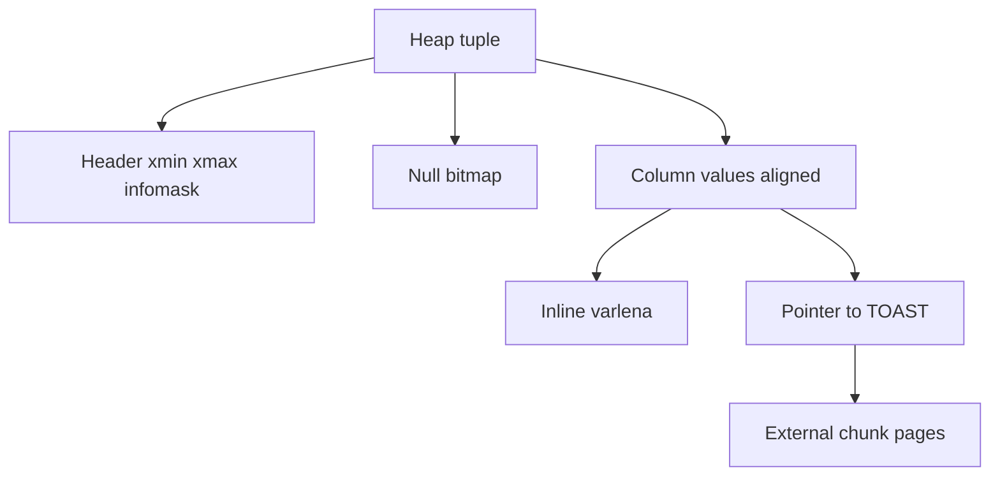
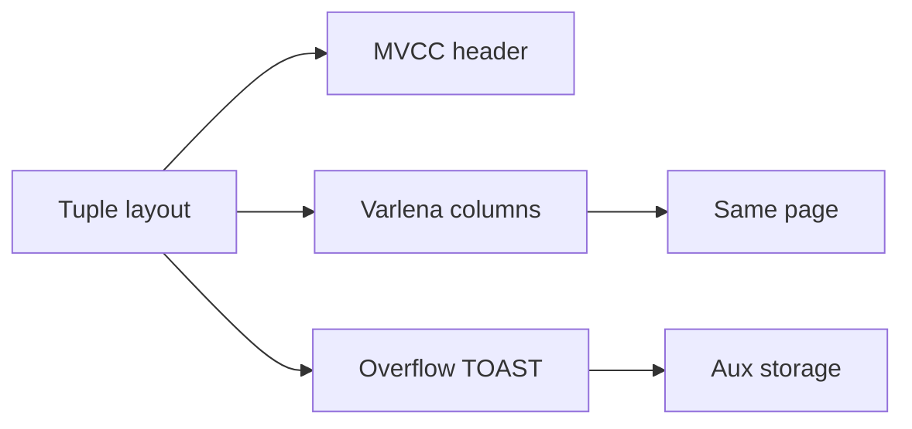
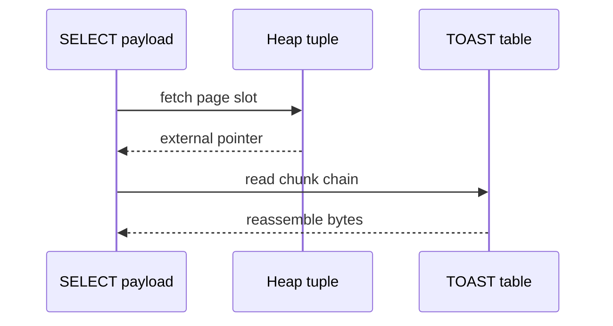

# Tuple Layout and Oversized Values

## Overview

A **tuple** (row version) is a binary structure stored in a page slot: header metadata, null bitmap, fixed and variable columns. Values larger than a page fraction **overflow** to external storage (PostgreSQL **TOAST**, InnoDB off-page columns)—transparent to SQL but critical for I/O and vacuum behavior.

Understanding tuple layout explains update amplification, index-only scan limits, and why `SELECT big_column` costs more than `SELECT id`.

## Learning Objectives

- Describe tuple header fields: xmin/xmax, null bitmap, alignment (Postgres-oriented)
- Explain when values inline vs overflow (TOAST EXTERNAL/EXTENDED)
- Predict impact of wide rows on pages/tuple density and index size
- Relate oversized TEXT/JSONB to heap fetches and vacuum
- Read `pg_column_size` and page density for schema design

## Prerequisites

- [[08-Databases/01-Storage-and-Buffer-Pool/Pages Blocks and IO Units|Pages Blocks and I/O Units]]
- [[08-Databases/01-Storage-and-Buffer-Pool/Heap Tables vs Clustered Layouts|Heap Tables vs Clustered Layouts]]

## Difficulty

`intermediate`

## Estimated Time

- Reading: 1.5 hours
- Exercises: 1 hour
- Mini project: 2 hours

## History

Fixed-length rows simplified 1970s systems. Variable-length types (VARCHAR, BLOB) required **slotted pages** and **overflow pointers**. Postgres TOAST (The Oversized-Attribute Storage Technique, ~2000s) stores compressed chunks in auxiliary tables. ORMs hiding column width led to accidental TOAST storms on JSON blobs.

## Problem It Solves

| Issue | Tuple/TOAST mechanism |
| --- | --- |
| 1 MB JSON in 8 KiB page | Store pointer + external chunks |
| Update one small column | New row version; dead tuple until vacuum |
| Index on expression only | Keep base column off hot index paths |
| Compression trade | TOAST strategies PLAIN/EXTENDED/EXTERNAL/MAIN |

## Internal Implementation

### Tuple in page



**Varlena**: length-tagged variable fields; first bits encode inline vs compressed vs external.

## Mermaid Diagrams

### Structure



### Sequence / Lifecycle  Eread wide column



## Examples

### Minimal Example  Eeducational tuple size

```typescript
type Varlena = { tag: "inline"; bytes: Buffer } | { tag: "external"; toastId: bigint };

type Tuple = {
  xmin: number;
  xmax: number;
  nulls: boolean[];
  cols: (number | string | Varlena)[];
};

export function tupleDiskBytes(t: Tuple): number {
  // Simplified: header + sum column encodings
  const header = 23;
  const cols = t.cols.reduce((n, c) => {
    if (typeof c === "number") return n + 8;
    if (typeof c === "string") return n + 4 + Buffer.byteLength(c);
    return n + 18; // external pointer footprint
  }, 0);
  return header + cols;
}
```

### Production-Shaped Example  Eschema and TOAST policy

```sql
CREATE TABLE articles (
  id      BIGSERIAL PRIMARY KEY,
  slug    TEXT NOT NULL,
  title   TEXT NOT NULL,
  body    TEXT,           -- likely TOAST
  meta    JSONB           -- often large
);

-- Measure on-disk column contribution
SELECT id, pg_column_size(body), pg_column_size(meta) FROM articles LIMIT 5;

ALTER TABLE articles ALTER COLUMN body SET STORAGE EXTENDED;  -- compress + inline if fits
-- EXTERNAL: never compress inline; good for already-compressed blobs
```

```typescript
// API layer: avoid SELECT * on wide tables  EBackend query shape
const { rows } = await pool.query(
  "SELECT id, slug, title FROM articles WHERE slug = $1",
  [slug],
);
// body fetched only when needed  Efewer TOAST trips
```

N+1 and projection discipline: [[07-Backend/08-Data-Access-and-Persistence-Patterns/N-plus-1 and Query Shape Discipline|N-plus-1 and Query Shape Discipline]].

## Trade-offs

| Dimension | Inline wide columns | TOAST external |
| --- | --- | --- |
| Single-row read | One page if fits | Extra I/O chunks |
| Index-only scans | Harder (wide in heap) | Narrow index + heap fetch |
| Updates to small cols | New version; dead wide cols | May rewrite TOAST |
| Compression CPU | On access | At insert/toast time |

### When to Use

- TOAST/external for large text, JSON blobs, bytea
- Narrow indexes on keys; fetch payloads separately
- `pg_column_size` during schema reviews

### When Not to Use

- Store multi-MB objects in row without archival strategy (use object store + FK)
- Index huge JSON blobs without expression/partial strategy (module 03)

## Exercises

1. Estimate tuples/page for 100 B fixed rows vs 2 KB JSON average.
2. What happens to TOAST on UPDATE that changes only `title`?
3. Run `pg_column_size` on a JSONB column before/after compaction.
4. Why can index-only scans skip heap for narrow indexes? (preview module 03)
5. Compare TOAST to MongoDB document size limits conceptually.

## Mini Project

Create Postgres table with 10 KiB TEXT rows; verify TOAST via `pgstattuple` or chunk table inspection. Document in storage exercises.

## Portfolio Project

Extend [[08-Databases/projects/Toy Page and WAL Store/README|Toy Page and WAL Store]] with overflow pages when tuple exceeds page free space.

## Interview Questions

1. What is TOAST in PostgreSQL?
2. How does row width affect buffer pool efficiency?
3. Why does UPDATE create a new row version in MVCC?
4. What is varlena?
5. When should large blobs leave the database?

### Stretch / Staff-Level

1. Explain how HOT updates avoid index maintenance when conditions met.
2. Design attachment storage: Postgres BYTEA vs S3 + metadata row.

## Common Mistakes

- `SELECT *` on TOAST-heavy tables in list endpoints
- JSONB columns indexed and fetched on every query
- Ignoring dead tuple bloat from wide row churn ([[08-Databases/06-Concurrency-Internals/Vacuum Version GC and Bloat|Vacuum Version GC and Bloat]])

## Best Practices

- Project only needed columns in hot queries
- Separate cold archival columns to another table/partition
- Monitor table bloat and autovacuum on wide-row tables
- Align ORM defaults with projection discipline (Backend)

## Summary

Tuples pack MVCC metadata and column bytes into page slots; oversized attributes spill to auxiliary storage with pointer indirection. Row width drives pages/tuple count, index size, vacuum cost, and heap fetch volume. Schema and SELECT lists are physical design decisions—not cosmetic SQL.

## Further Reading

- [[00-References/Databases/README|Databases References]]
- PostgreSQL TOAST documentation
- [[08-Databases/01-Storage-and-Buffer-Pool/Free Space Maps Fillfactor and Fragmentation|Free Space Maps Fillfactor and Fragmentation]]

## Related Notes

- [[08-Databases/01-Storage-and-Buffer-Pool/Pages Blocks and IO Units|Pages Blocks and I/O Units]]
- [[08-Databases/03-Indexing-on-Disk/Index-Only Scans and Visibility Map Hooks|Index-Only Scans and Visibility Map Hooks]]
- [[08-Databases/06-Concurrency-Internals/Vacuum Version GC and Bloat|Vacuum Version GC and Bloat]]
- [[07-Backend/08-Data-Access-and-Persistence-Patterns/N-plus-1 and Query Shape Discipline|N-plus-1 and Query Shape Discipline]]
- [[04-Data-Structures/00-Orientation-and-Contracts/Memory Layout Locality and Allocation Patterns|Memory Layout Locality and Allocation Patterns]]

## Progress Checklist

- [ ] Explained from first principles
- [ ] Drew at least one Mermaid diagram
- [ ] Implemented a minimal version
- [ ] Documented trade-offs and non-goals
- [ ] Completed exercises
- [ ] Practiced interview questions aloud
- [ ] Linked prerequisites and dependents
