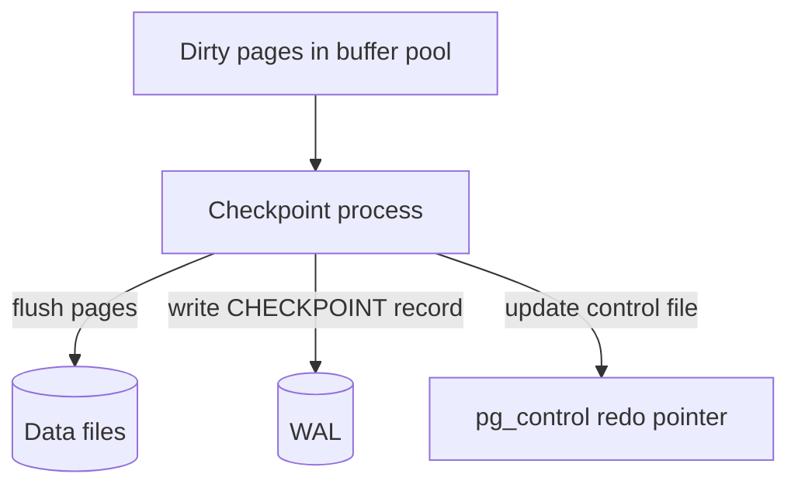
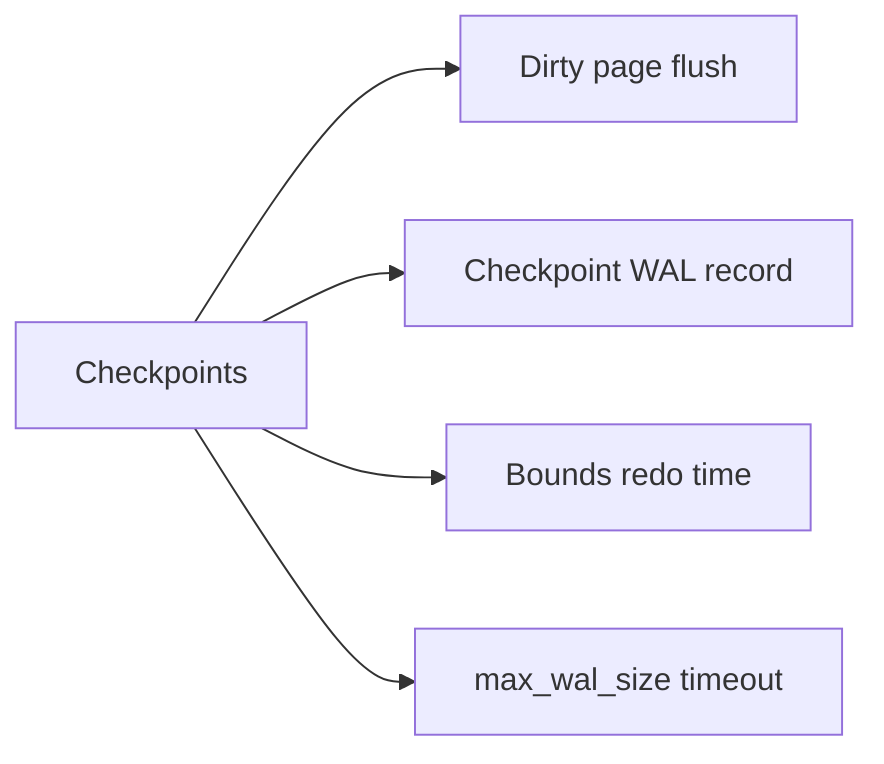
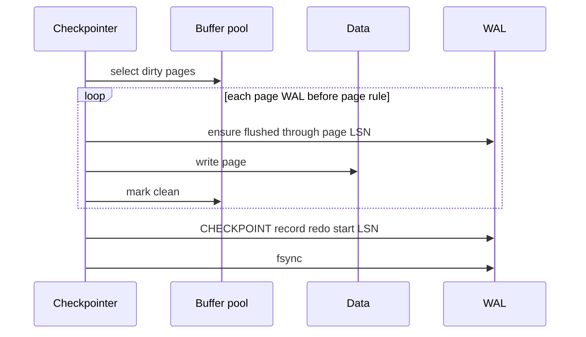

# Checkpoints and Dirty Page Flushing

## Overview

After commit, **data pages** in the buffer pool may remain **dirty** while WAL is durable. **Checkpoints** flush dirty pages to data files and write a **checkpoint record** so crash recovery replays only recent WAL. **Background writers** spread flushing to avoid I/O spikes.

This note bridges WAL durability with on-disk data file convergence—critical for recovery time, WAL disk sizing, and tuning `checkpoint_timeout` / `max_wal_size`.

## Learning Objectives

- Explain why checkpoints exist given WAL already durable
- Describe checkpoint record contents and redo start LSN
- Contrast checkpoint spike vs spread flushing (bgwriter/checkpointer)
- Tune Postgres checkpoint parameters for steady I/O
- Predict WAL retention and recovery duration vs checkpoint frequency

## Prerequisites

- [[08-Databases/02-WAL-Durability-and-Recovery/Write-Ahead Logging Protocol|Write-Ahead Logging Protocol]]
- [[08-Databases/01-Storage-and-Buffer-Pool/Buffer Pool vs OS Page Cache|Buffer Pool vs OS Page Cache]]

## Difficulty

`intermediate`

## Estimated Time

- Reading: 1.5 hours
- Exercises: 1 hour
- Mini project: 3 hours

## History

Unbounded WAL replay would lengthen every crash recovery. Checkpoints periodically **materialize** dirty pages so redo begins near recent history. Early systems paused traffic; modern engines throttle flush rates—yet mis-tuned checkpoints still cause latency spikes ("checkpoint storm").

## Problem It Solves

| Without checkpoints | With checkpoints |
| --- | --- |
| WAL grows forever | Recyclable segments after checkpoint |
| Recovery replays entire history | Redo from checkpoint LSN |
| All dirty pages flush at once | Spread over time |
| Backup consistency unclear | Checkpoint + WAL range for PITR |

## Internal Implementation

### Checkpoint flow



**WAL rule preserved**: flush dirty page only if WAL through page LSN is durable.

## Mermaid Diagrams

### Structure



### Sequence / Lifecycle — checkpoint



## Examples

### Minimal Example — educational checkpoint

```typescript
type Page = { id: string; lsn: bigint; dirty: boolean; bytes: Buffer };

export function checkpoint(pages: Page[], walFlushedLsn: bigint, writeData: (p: Page) => void) {
  for (const p of pages) {
    if (!p.dirty) continue;
    if (p.lsn > walFlushedLsn) throw new Error("WAL must precede page flush");
    writeData(p);
    p.dirty = false;
  }
  return { redoStartLsn: walFlushedLsn };
}
```

### Production-Shaped Example — Postgres tuning

```sql
SHOW checkpoint_timeout;   -- default 5min
SHOW max_wal_size;         -- trigger checkpoint when WAL volume high
SHOW checkpoint_completion_target;  -- spread flush 0.9 of interval

SELECT checkpoints_timed, checkpoints_req, checkpoint_write_time, buffers_checkpoint
FROM pg_stat_bgwriter;

-- Manual checkpoint (maintenance)
CHECKPOINT;
```

```typescript
// Alert: checkpoint storm heuristic
export function checkpointStormRisk(reqRatio: number, writeTimeMs: number): boolean {
  return reqRatio > 0.5 && writeTimeMs > 30_000;
}
```

Monitoring: [[08-Databases/12-Production-Database-Ops/Monitoring Checkpoints Lag Bloat Cache Hit|Monitoring Checkpoints Lag Bloat Cache Hit]].

## Trade-offs

| Dimension | Frequent checkpoints | Infrequent checkpoints |
| --- | --- | --- |
| Recovery time | Shorter redo | Longer redo |
| WAL disk | Less retention | More WAL before recycle |
| Write I/O | Steady if spread | Bursts |
| Cache | Evicts dirty work | Fewer flush cycles |

### When to Use

- Increase `max_wal_size` on write-heavy systems to reduce req checkpoints
- Monitor `checkpoints_req` vs `checkpoints_timed`
- Spread with `checkpoint_completion_target`

### When Not to Use

- Disable checkpoints (impossible)— tune instead
- `CHECKPOINT` during peak without ops window

## Exercises

1. Why flush dirty pages if WAL already has changes?
2. Plot WAL size over time with sparse vs frequent checkpoints.
3. Explain checkpoint_write_time spikes in `pg_stat_bgwriter`.
4. Relate redo start LSN to recovery first phase.
5. Implement checkpoint in toy page store lab.

## Mini Project

Add checkpoint + redo pointer to [[08-Databases/projects/Toy Page and WAL Store/README|Toy Page and WAL Store]]; measure recovery time vs dirty page count.

## Portfolio Project

Document checkpoint tuning ADR for [[08-Databases/projects/Database Engines Workbench/README|Database Engines Workbench]] load profile.

## Interview Questions

1. What does a checkpoint accomplish?
2. Why must WAL through page LSN be flushed before page write?
3. What is checkpoint storm?
4. Difference between bgwriter and checkpointer?
5. How does checkpoint affect WAL recycling?

### Stretch / Staff-Level

1. Size max_wal_size for 20k TPS write workload.
2. Compare Postgres checkpoint to InnoDB fuzzy checkpoint.

## Common Mistakes

- Tiny `max_wal_size` causing constant req checkpoints
- Ignoring checkpoint I/O on latency SLO graphs
- Confusing checkpoint with COMMIT fsync
- Full disk from WAL because checkpoints not keeping pace

## Best Practices

- Graph checkpoint metrics alongside p99 latency
- Separate WAL volume on fast disk
- Test recovery time after controlled crash
- PITR still needs WAL archive independent of checkpoint ([[08-Databases/12-Production-Database-Ops/Backups PITR and Restore Drills|Backups PITR and Restore Drills]])

## Summary

Checkpoints **persist dirty buffer pages** and **bound crash recovery** by recording where redo must begin. WAL makes commits durable; checkpoints converge data files and cap WAL retention. Tuning spreads flush I/O and prevents storms—operational as much as theoretical.

## Further Reading

- [[00-References/Databases/README|Databases References]]
- PostgreSQL: Checkpointer, bgwriter, WAL recycling
- [[08-Databases/02-WAL-Durability-and-Recovery/Crash Recovery Redo and Undo Concepts|Crash Recovery Redo and Undo Concepts]]

## Related Notes

- [[08-Databases/02-WAL-Durability-and-Recovery/Write-Ahead Logging Protocol|Write-Ahead Logging Protocol]]
- [[08-Databases/02-WAL-Durability-and-Recovery/fsync Group Commit and Durability Levels|fsync Group Commit and Durability Levels]]
- [[08-Databases/01-Storage-and-Buffer-Pool/Buffer Pool vs OS Page Cache|Buffer Pool vs OS Page Cache]]
- [[08-Databases/12-Production-Database-Ops/Monitoring Checkpoints Lag Bloat Cache Hit|Monitoring Checkpoints Lag Bloat Cache Hit]]
- [[05-Algorithms/README|Algorithms]]
- [[07-Backend/README|Backend]]

## Progress Checklist

- [ ] Explained from first principles
- [ ] Drew at least one Mermaid diagram
- [ ] Implemented a minimal version
- [ ] Documented trade-offs and non-goals
- [ ] Completed exercises
- [ ] Practiced interview questions aloud
- [ ] Linked prerequisites and dependents
