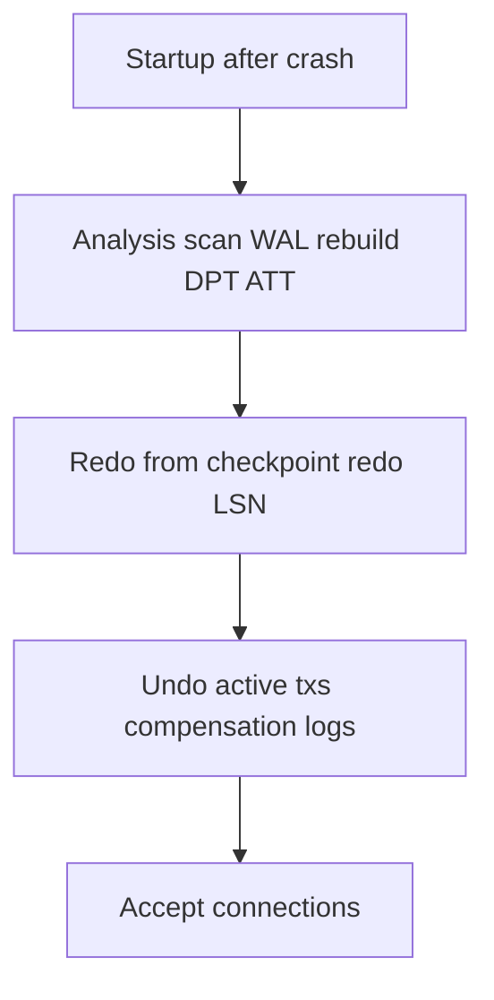
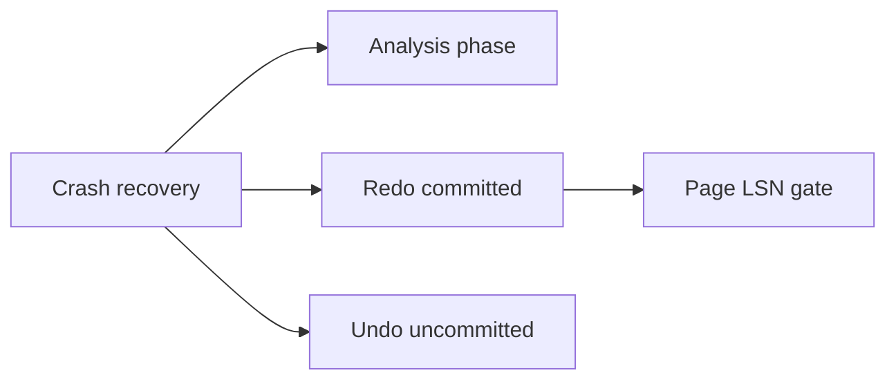
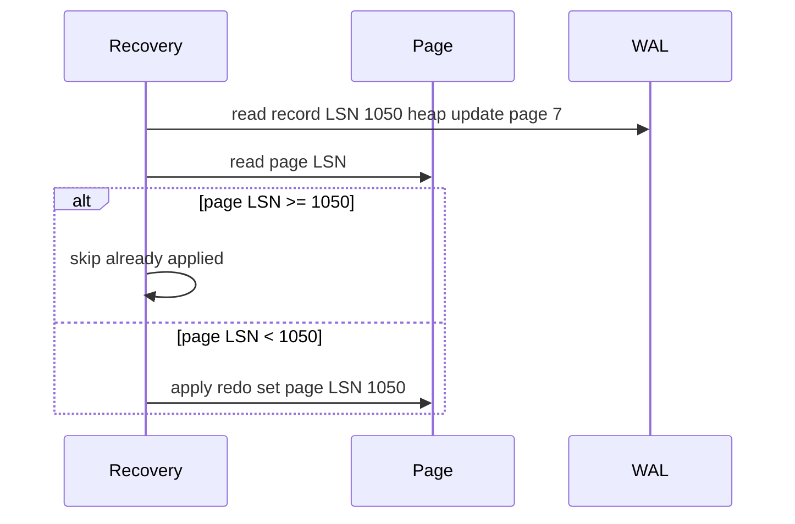

# Crash Recovery Redo and Undo Concepts

## Overview

After crash, the engine runs **recovery**: **redo** reapplies committed changes from WAL (idempotent page-level apply); **undo** rolls back transactions that were in-flight at crash. ARIES formalized **analysis → redo → undo** using **LSN** ordering, **dirty page table**, and **active transaction table**.

This note explains recovery phases conceptually—enough to read Postgres startup logs and design educational labs—not to reimplement ARIES from scratch.

## Learning Objectives

- Distinguish redo (repeat history) vs undo (compensation)
- Describe analysis phase reconstruction of dirty/active sets
- Explain why redo must be idempotent (page LSN comparison)
- Identify committed vs aborted transactions at crash from WAL
- Connect recovery to MVCC visibility (undo may be logical later)

## Prerequisites

- [[08-Databases/02-WAL-Durability-and-Recovery/Write-Ahead Logging Protocol|Write-Ahead Logging Protocol]]
- [[08-Databases/02-WAL-Durability-and-Recovery/Checkpoints and Dirty Page Flushing|Checkpoints and Dirty Page Flushing]]

## Difficulty

`advanced`

## Estimated Time

- Reading: 2 hours
- Exercises: 1.5 hours
- Mini project: 4 hours

## History

Pre-ARIES recovery was ad hoc. **ARIES** (1992) unified logging for concurrency and recovery. Postgres implements WAL redo with **startup process**; abort cleanup interacts with **clog** and MVCC rather than classic physical undo for all systems. Concepts remain portable across engines.

## Problem It Solves

| Crash state | Recovery action |
| --- | --- |
| Committed tx, page not flushed | **Redo** apply WAL |
| Uncommitted tx, partial changes | **Undo** or mark aborted |
| Unknown page on disk | Redo from last checkpoint LSN |
| Duplicate redo on page | Skip if page LSN ≥ record LSN |

## Internal Implementation

### ARIES phases



**DPT**: dirty page table — page → recLSN.**ATT**: active transaction table.

## Mermaid Diagrams

### Structure



### Sequence / Lifecycle — redo idempotency



## Examples

### Minimal Example — redo with LSN gate

```typescript
type Page = { id: string; lsn: bigint; bytes: Buffer };

type WalRedo = { pageId: string; lsn: bigint; apply: (p: Page) => void };

export function redoPage(page: Page, records: WalRedo[]) {
  for (const r of records.sort((a, b) => Number(a.lsn - b.lsn))) {
    if (r.pageId !== page.id) continue;
    if (page.lsn >= r.lsn) continue; // idempotent
    r.apply(page);
    page.lsn = r.lsn;
  }
}
```

### Production-Shaped Example — Postgres recovery signals

```sql
-- After crash, logs show:
-- "database system was not properly shut down; automatic recovery in progress"
-- "redo starts at 0/XXXX"
-- "consistent recovery state reached"

SELECT pg_is_in_recovery();  -- false after primary recovery completes
```

```typescript
// Educational undo stub — compensation record
type UndoRecord = { xid: number; undo: () => void };

export function undoPhase(active: Map<number, UndoRecord[]>) {
  for (const [xid, ops] of active) {
    for (const op of ops.reverse()) op.undo();
    console.log(`aborted xid ${xid}`);
  }
}
```

Lab extension: [[08-Databases/projects/Toy Page and WAL Store/README|Toy Page and WAL Store]].

## Trade-offs

| Dimension | More frequent checkpoint | Less frequent |
| --- | --- | --- |
| Redo duration | Shorter | Longer |
| Analysis work | Smaller WAL window | Larger scan |
| Undo work | Same for active tx | Same |
| Availability | Faster startup | Slower startup |

### When to Use

- Understand startup delay after unclean shutdown
- Design tests that kill -9 and verify consistency
- Size HA failover RTO including recovery

### When Not to Use

- `pg_resetwal` as recovery substitute without expert review
- Manual page surgery bypassing redo

## Exercises

1. Timeline: T1 commit, T2 uncommitted, crash—list redo/undo actions.
2. Why is redo idempotent but application replay might not be?
3. What does analysis phase reconstruct?
4. How does Postgres handle uncommitted rows post-recovery (MVCC hint)?
5. Implement analysis pass building ATT from WAL commit/abort records.

## Mini Project

Extend toy WAL store: crash mid-transaction; on restart run analysis + redo + undo; verify invariants.

## Portfolio Project

Recovery test suite in [[08-Databases/projects/Database Engines Workbench/README|Database Engines Workbench]] with scripted kills.

## Interview Questions

1. Difference between redo and undo?
2. Why compare page LSN to record LSN during redo?
3. What is the analysis phase for?
4. Can recovery run while serving reads? (standby: yes with apply)
5. What transactions need undo at crash?

### Stretch / Staff-Level

1. Walk through ARIES CLR (compensation log record) purpose.
2. Compare Postgres recovery to MySQL InnoDB crash recovery phases.

## Common Mistakes

- Assuming crash only loses uncommitted work (durability settings matter)
- Deleting WAL needed for redo
- Confusing logical undo (rollback) with recovery undo phase
- Ignoring recovery time in failover SLO

## Best Practices

- Drill unclean restart on staging
- Monitor recovery duration after incidents
- Keep checkpoint tuning aligned with RTO
- App-level idempotency still required ([[07-Backend/01-HTTP-APIs-and-Contracts/Idempotency Keys and Safe Retries|Idempotency Keys and Safe Retries]])

## Summary

**Recovery** replays history forward (**redo**) for committed work and rolls back losers (**undo**). **LSN** gates idempotent page apply; **checkpoints** shorten redo. Analysis rebuilds crash metadata from WAL. This completes the durability story begun in WAL and checkpoint notes—turning log bytes back into consistent pages.

## Further Reading

- [[00-References/Databases/README|Databases References]]
- ARIES paper (Mohan et al.)
- PostgreSQL startup / recovery source comments overview

## Related Notes

- [[08-Databases/02-WAL-Durability-and-Recovery/Write-Ahead Logging Protocol|Write-Ahead Logging Protocol]]
- [[08-Databases/02-WAL-Durability-and-Recovery/Torn Pages and Doublewrite Concepts|Torn Pages and Doublewrite Concepts]]
- [[08-Databases/05-Transactions-and-Isolation/ACID as Engine Contracts|ACID as Engine Contracts]]
- [[05-Algorithms/README|Algorithms]]
- [[07-Backend/README|Backend]]
- [[09-System-Design/README|System Design]]

## Progress Checklist

- [ ] Explained from first principles
- [ ] Drew at least one Mermaid diagram
- [ ] Implemented a minimal version
- [ ] Documented trade-offs and non-goals
- [ ] Completed exercises
- [ ] Practiced interview questions aloud
- [ ] Linked prerequisites and dependents
