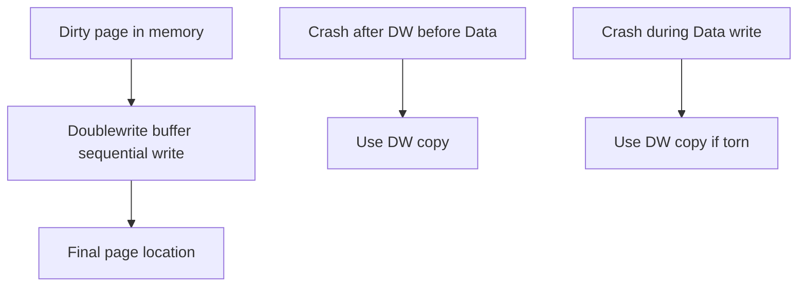
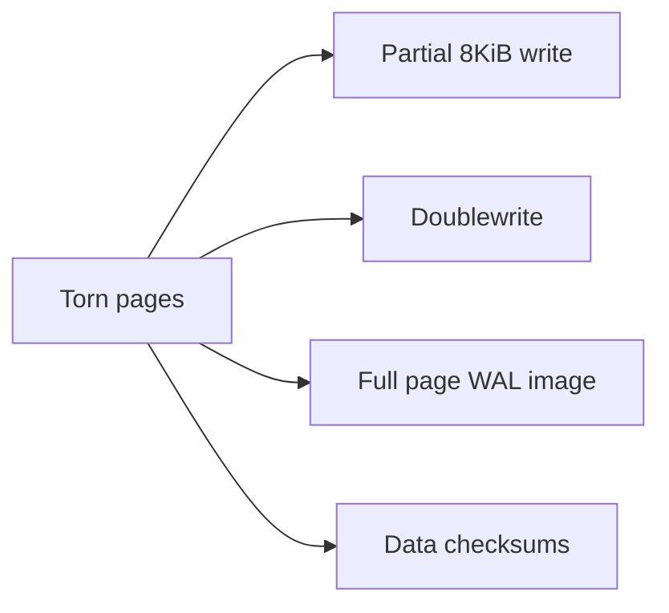
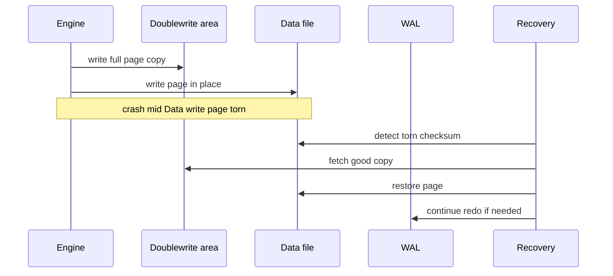

# Torn Pages and Doublewrite Concepts

## Overview

A **torn page** occurs when a power loss or kernel crash writes only part of an 8 KiB page to disk—leaving a ** structurally invalid** block. WAL redo assumes the page is intact or empty; torn pages violate that. Engines mitigate with **full-page writes** (first change after checkpoint logs entire page image to WAL) and/or **doublewrite buffer** (write to staging area then to final location).

This note covers physical corruption prevention—distinct from logical bugs or lost commits.

## Learning Objectives

- Define torn page vs stale page vs checksum failure
- Explain doublewrite two-phase page write (InnoDB-style concept)
- Explain Postgres `full_page_writes` and checkpoint interaction
- Describe recovery behavior when checksum detects corruption
- Choose detection vs prevention trade-offs on modern SSD/NVMe

## Prerequisites

- [[08-Databases/02-WAL-Durability-and-Recovery/Write-Ahead Logging Protocol|Write-Ahead Logging Protocol]]
- [[08-Databases/01-Storage-and-Buffer-Pool/Pages Blocks and I/O Units|Pages Blocks and I/O Units]]

## Difficulty

`advanced`

## Estimated Time

- Reading: 1.5 hours
- Exercises: 1 hour
- Mini project: 2 hours

## History

Rotating disks guaranteed sector atomicity (often 512 B) but not full page. **Doublewrite** in InnoDB (early 2000s) copied pages to contiguous buffer before scatter write. Postgres relies heavily on **full-page WAL images** after checkpoint. Checksums (Postgres data checksums) **detect** corruption; prevention still needs torn-page strategy.

## Problem It Solves

| Failure | Without mitigation | With doublewrite / FPW |
| --- | --- | --- |
| 4 KiB of 8 KiB page written | Redo applies to garbage | Restore full page from stash/WAL |
| Silent bit rot | Wrong query results | Checksum error on read |
| Media partial failure | Unrecoverable page | PITR + backup |

## Internal Implementation

### Doublewrite (conceptual)



### Postgres full-page writes

After checkpoint, first modification to page logs **full page image** in WAL. Recovery can reconstruct entire page even if data file copy torn.

## Mermaid Diagrams

### Structure



### Sequence / Lifecycle — torn write recovery



## Examples

### Minimal Example — simulate torn detection

```typescript
import { createHash } from "node:crypto";

const PAGE_SIZE = 8192;

export function checksumPage(bytes: Buffer): string {
  return createHash("sha256").update(bytes).digest("hex");
}

export function simulateTornWrite(fullPage: Buffer): Buffer {
  const torn = Buffer.alloc(PAGE_SIZE);
  fullPage.copy(torn, 0, 0, PAGE_SIZE / 2); // only half written
  return torn;
}

export function verifyPage(bytes: Buffer, expected: string): boolean {
  return bytes.length === PAGE_SIZE && checksumPage(bytes) === expected;
}
```

### Production-Shaped Example — Postgres settings

```sql
SHOW full_page_writes;     -- on in production typically
SHOW data_checksums;       -- set at initdb time

-- After checksum failure:
-- ERROR: invalid page in block ... of relation ...
-- Recovery: restore from replica or base backup + WAL
```

```typescript
// Runbook snippet
export const CORRUPTION_RESPONSE = [
  "Stop writes; assess scope (single page vs widespread)",
  "Fail over to replica if clean",
  "Restore relation from backup + PITR if isolated",
  "Never continue on suspect hardware without replacement",
];
```

Failure modes catalog: [[08-Databases/00-Orientation/Database Failure Modes Corruption and Durability|Database Failure Modes Corruption and Durability]].

## Trade-offs

| Dimension | full_page_writes on | off (risk) |
| --- | --- | --- |
| WAL volume | Spikes after checkpoint | Lower |
| Torn protection | Strong on single instance | Needs doublewrite alternative |
| Recovery | WAL has page images | Redo to torn page fails |
| SSD assumed atomic | Still not 8 KiB guaranteed everywhere | Dangerous assumption |

### When to Use

- Keep `full_page_writes=on` unless expert review + alternative
- Init `data_checksums` for new clusters when acceptable overhead
- Monitor checksum errors aggressively

### When Not to Use

- Disable FPW to "save WAL" without doublewrite equivalent
- Ignore checksum ERROR as transient glitch

## Exercises

1. Why doesn't WAL redo fix a torn page without full page image?
2. Draw doublewrite timeline with two crash points.
3. Compare detection (checksum) vs prevention (doublewrite).
4. Why does WAL grow after checkpoint when FPW on?
5. Simulate torn page in lab; verify recovery path.

## Mini Project

Add checksum + doublewrite staging file to toy page store; inject torn write fault; verify recovery.

## Portfolio Project

Document corruption runbook section in [[08-Databases/projects/Database Engines Workbench/README|Database Engines Workbench]].

## Interview Questions

1. What is a torn page?
2. How does doublewrite work?
3. What is full_page_writes in Postgres?
4. Difference between checksum error and torn page?
5. Recovery steps for single-page corruption?

### Stretch / Staff-Level

1. Are NVMe 8 KiB writes atomic enough to skip doublewrite?
2. Compare InnoDB doublewrite vs Postgres FPW WAL overhead.

## Common Mistakes

- Disabling FPW on production without understanding
- No checksums on large datasets
- `dd` restore wrong block into PGDATA
- Continuing on failing SSD after first checksum error

## Best Practices

- Enable checksums at cluster creation when possible
- Restore drills include corruption scenario tabletop
- Separate monitoring for `invalid page` errors
- Hardware RAID ≠ torn page immunity

## Summary

**Torn pages** break the assumption that disk pages are all-or-nothing. **Doublewrite** and **full-page WAL images** provide full-page backups for recovery; **checksums** detect silent damage. WAL redo alone cannot fix half-written blocks—physical integrity requires explicit engineering.

## Further Reading

- [[00-References/Databases/README|Databases References]]
- PostgreSQL wiki: checksums, full page writes
- InnoDB doublewrite buffer documentation

## Related Notes

- [[08-Databases/02-WAL-Durability-and-Recovery/Crash Recovery Redo and Undo Concepts|Crash Recovery Redo and Undo Concepts]]
- [[08-Databases/02-WAL-Durability-and-Recovery/Checkpoints and Dirty Page Flushing|Checkpoints and Dirty Page Flushing]]
- [[08-Databases/00-Orientation/Database Failure Modes Corruption and Durability|Database Failure Modes Corruption and Durability]]
- [[08-Databases/12-Production-Database-Ops/Backups PITR and Restore Drills|Backups PITR and Restore Drills]]
- [[01-Computer-Science/06-IO-and-Persistence/Files Blocks and Directories|Files Blocks and Directories]]
- [[09-System-Design/README|System Design]]

## Progress Checklist

- [ ] Explained from first principles
- [ ] Drew at least one Mermaid diagram
- [ ] Implemented a minimal version
- [ ] Documented trade-offs and non-goals
- [ ] Completed exercises
- [ ] Practiced interview questions aloud
- [ ] Linked prerequisites and dependents
