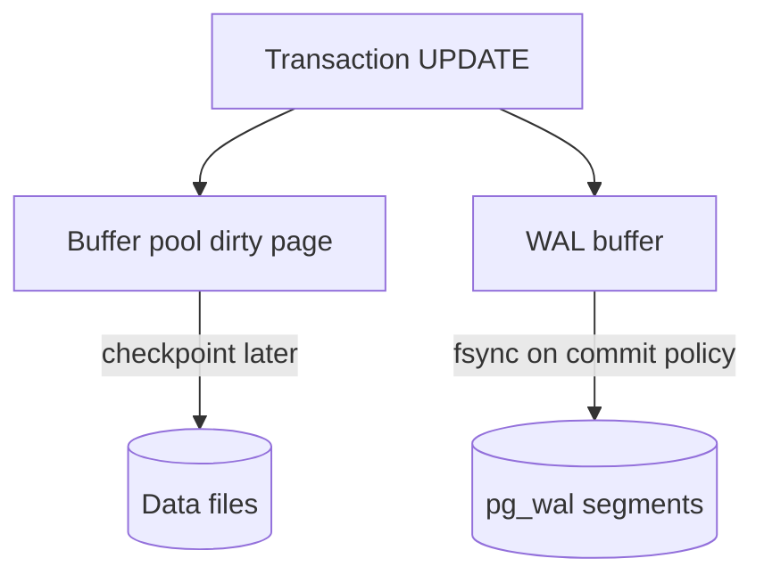
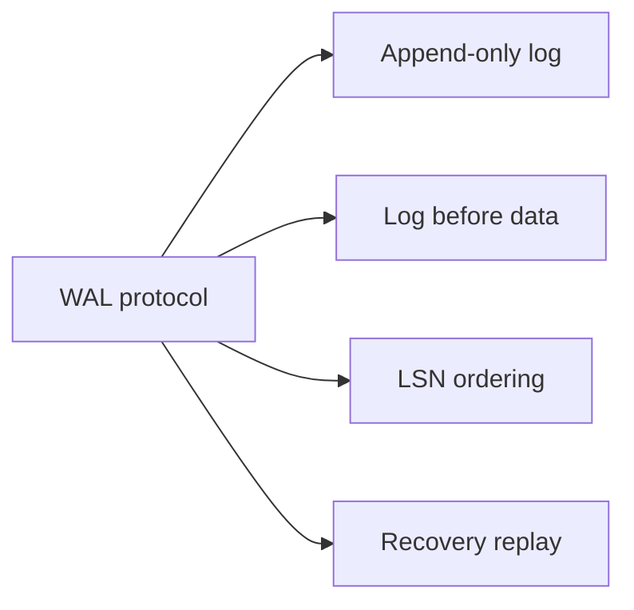
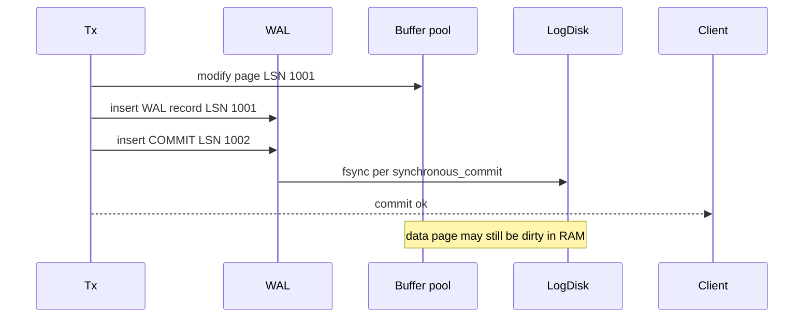

# Write-Ahead Logging Protocol

## Overview

**Write-Ahead Logging (WAL)** is the invariant: **log records describing a change must reach durable storage before the corresponding data pages are considered committed** (exact fsync ordering refined by durability level). WAL turns random page writes into **append-only sequential log I/O** and enables **crash recovery** by replay.

This note defines the protocol connecting transactions, buffer pool dirty pages, and disk—foundation for fsync, checkpoints, and redo/undo modules.

## Learning Objectives

- State the WAL protocol precisely for commit and page flush
- Describe LSN (Log Sequence Number) monotonicity and page-LSN linkage
- Explain why data pages lag the log after commit
- Sketch WAL record types: heap insert, index split, commit
- Connect WAL to replication shipping (preview module 07)

## Prerequisites

- [[08-Databases/01-Storage-and-Buffer-Pool/Pages Blocks and IO Units|Pages Blocks and I/O Units]]
- [[08-Databases/00-Orientation/Database Failure Modes Corruption and Durability|Database Failure Modes Corruption and Durability]]

## Difficulty

`intermediate`

## Estimated Time

- Reading: 2 hours
- Exercises: 1.5 hours
- Mini project: 4 hours

## History

ARIES (Algorithms for Recovery and Isolation Exploiting Semantics, IBM, 1992) systematized WAL with **LSN**, **dirty page table**, and **repeat history / redo / undo**. Postgres, InnoDB, and most OLTP engines are WAL-family. Logging preceded data pages in IMS; relational engines generalized the pattern.

## Problem It Solves

| Without WAL | With WAL |
| --- | --- |
| In-place page write on crash = torn unknown state | Replay log to reconstruct committed work |
| Random write fsync per row | Batch sequential log append |
| No point-in-time recovery | Archive WAL segments |
| Replication ad hoc | Ship same byte stream to standby |

## Internal Implementation

### WAL + buffer pool coupling



**Rule**: page write to disk must not occur before WAL through page's LSN is durable (WAL rule).

## Mermaid Diagrams

### Structure



### Sequence / Lifecycle  Ecommit



## Examples

### Minimal Example  Eeducational WAL append

```typescript
type WalRecord =
  | { kind: "heap_insert"; pageId: string; slot: number; bytes: Buffer; lsn: bigint }
  | { kind: "commit"; xid: number; lsn: bigint };

export class WalLog {
  private nextLsn = 0n;
  private file: WalRecord[] = [];

  append(rec: Omit<WalRecord, "lsn">): bigint {
    const lsn = ++this.nextLsn;
    this.file.push({ ...rec, lsn } as WalRecord);
    return lsn;
  }

  fsync(): void {
    // durable  Ein lab, flush to disk file
  }

  recordsAfter(lsn: bigint): WalRecord[] {
    return this.file.filter((r) => r.lsn > lsn);
  }
}
```

### Production-Shaped Example  EPostgres WAL visibility

```sql
-- Current WAL insert location
SELECT pg_current_wal_insert_lsn();

-- Force checkpoint to flush dirty pages (admin)
CHECKPOINT;

-- WAL level affects volume
SHOW wal_level;  -- replica logical minimal
```

```typescript
// Lab store: commit only after WAL durable
export function commitTx(wal: WalLog, xid: number, sync: boolean) {
  wal.append({ kind: "commit", xid });
  if (sync) wal.fsync();
}
```

Lab: [[08-Databases/projects/Toy Page and WAL Store/README|Toy Page and WAL Store]].

## Trade-offs

| Dimension | WAL on | No WAL (risky) |
| --- | --- | --- |
| Crash recovery | Redo from log | Manual repair |
| Write amplification | Log + page eventually | Page only |
| Disk layout | Separate WAL volume recommended |  E|
| Latency | fsync bound | Lower if unsafe |

### When to Use

- Always for durable OLTP engines
- Separate fast WAL volume (NVMe) in production
- Archive WAL for PITR ([[08-Databases/12-Production-Database-Ops/Backups PITR and Restore Drills|Backups PITR and Restore Drills]])

### When Not to Use

- Ephemeral caches without recovery claims
- `UNLOGGED` tables when acceptable (Postgres)—explicit non-durability

## Exercises

1. Write WAL timeline for INSERT + COMMIT; mark crash points A/B/C and recovery outcome.
2. Why is log append sequential faster than random page writes?
3. What is stored in page LSN field?
4. How does `wal_level=logical` differ from `replica`?
5. Implement redo apply for `heap_insert` records in TypeScript lab.

## Mini Project

Build append-only WAL file + replay into page store on startup. No undo yet—[[08-Databases/02-WAL-Durability-and-Recovery/Crash Recovery Redo and Undo Concepts|Crash Recovery Redo and Undo Concepts]] extends this.

## Portfolio Project

Document WAL invariant in [[08-Databases/projects/Toy Page and WAL Store/README|Toy Page and WAL Store]] Architecture.md with crash test cases.

## Interview Questions

1. State the write-ahead logging rule.
2. Why can COMMIT return before data pages hit disk?
3. What is an LSN?
4. How does WAL enable replication?
5. Difference between WAL and redo log vs undo log?

### Stretch / Staff-Level

1. Sketch ARIES phases: analysis, redo, undo.
2. Compare WAL to LSM memtable + SST flush ordering.

## Common Mistakes

- Deleting WAL files manually while server running
- Same disk volume for WAL and heap under heavy write
- Assuming commit = data file updated
- `wal_level=minimal` then expecting logical decoding

## Best Practices

- Monitor WAL generation rate and disk free
- Size `max_wal_size` to avoid checkpoint storms
- Test recovery from power-loss simulation
- Keep service transaction boundaries in Backend; engine owns log ([[07-Backend/08-Data-Access-and-Persistence-Patterns/Transactions as Used by Services|Transactions as Used by Services]])

## Summary

WAL makes durability and recovery possible: log first (per policy), pages later. LSNs order history; commit records mark transaction outcomes; checkpoints bound recovery time. Every durability knob (fsync, group commit, sync replica) operates on this protocol—not instead of it.

## Further Reading

- [[00-References/Databases/README|Databases References]]
- ARIES paper summary
- PostgreSQL WAL internals documentation

## Related Notes

- [[08-Databases/02-WAL-Durability-and-Recovery/fsync Group Commit and Durability Levels|fsync Group Commit and Durability Levels]]
- [[08-Databases/02-WAL-Durability-and-Recovery/Checkpoints and Dirty Page Flushing|Checkpoints and Dirty Page Flushing]]
- [[08-Databases/02-WAL-Durability-and-Recovery/Crash Recovery Redo and Undo Concepts|Crash Recovery Redo and Undo Concepts]]
- [[08-Databases/07-Replication-Mechanics/WAL Shipping and Streaming Replication|WAL Shipping and Streaming Replication]]
- [[04-Data-Structures/README|Data Structures]]
- [[07-Backend/README|Backend]]

## Progress Checklist

- [ ] Explained from first principles
- [ ] Drew at least one Mermaid diagram
- [ ] Implemented a minimal version
- [ ] Documented trade-offs and non-goals
- [ ] Completed exercises
- [ ] Practiced interview questions aloud
- [ ] Linked prerequisites and dependents
