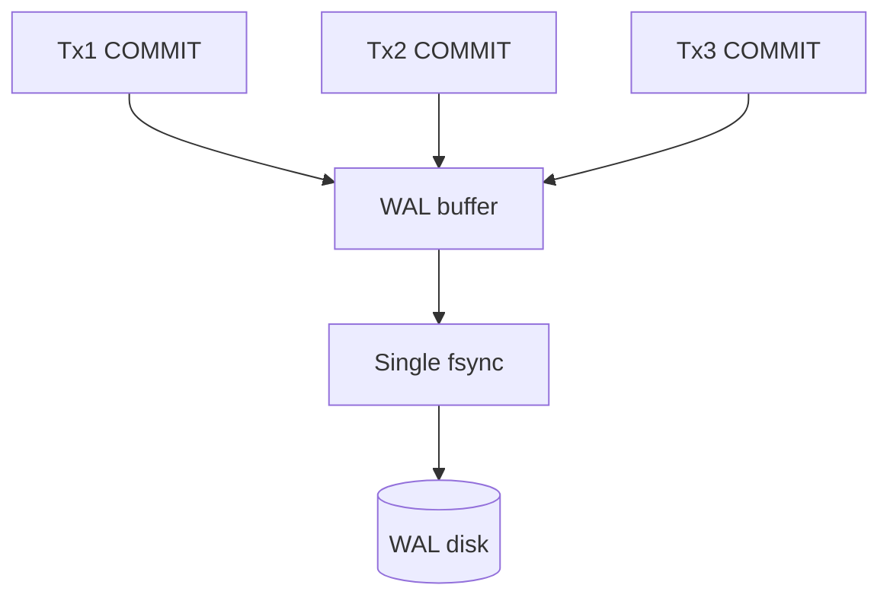
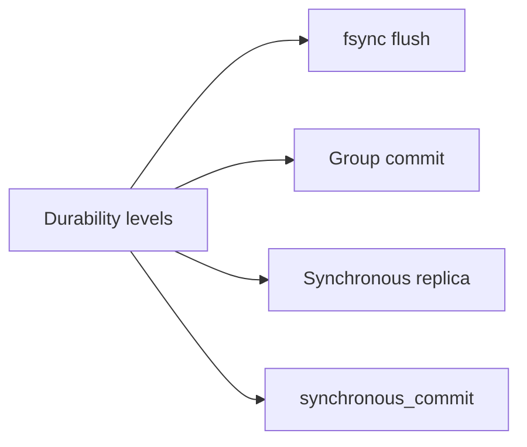
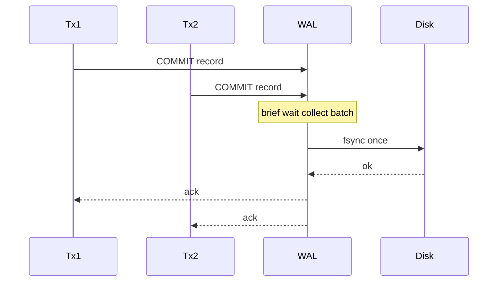

# fsync Group Commit and Durability Levels

## Overview

**Durability level** defines when a commit is safe across crash: typically when WAL records reach disk via **`fsync`** (or equivalent). **Group commit** batches multiple transactions' commit records into one fsync—amortizing disk round-trip latency without breaking WAL ordering.

This note connects the WAL protocol to measurable commit latency and data-loss windows—essential for SLO design and incident postmortems.

## Learning Objectives

- Explain `fsync` role vs buffered write return
- Describe Postgres `synchronous_commit` modes and trade-offs
- Explain group commit batching at high concurrency
- Contrast local durability vs synchronous replica ack
- Choose durability settings per workload with explicit RPO

## Prerequisites

- [[08-Databases/02-WAL-Durability-and-Recovery/Write-Ahead Logging Protocol|Write-Ahead Logging Protocol]]

## Difficulty

`intermediate`

## Estimated Time

- Reading: 1.5 hours
- Exercises: 1 hour
- Mini project: 2 hours

## History

Disk latency dominated OLTP commits until **group commit** (Postgres 8.3+, MySQL InnoDB) let many sessions share one flush. SSDs reduced but did not eliminate fsync cost. Cloud managed services expose durability via **sync replica** and **multi-AZ**—still fsync semantics under the hood.

## Problem It Solves

| Setting | Crash behavior | Latency |
| --- | --- | --- |
| `synchronous_commit=on` | Committed tx survive single-node crash | ~fsync per group |
| `off` / `local` relaxed | Last ~100ms commits may vanish | Lower |
| Sync replica | Survive primary loss if acked | Network + fsync |
| Async replica | Possible loss on failover | Lower commit wait |

## Internal Implementation

### Group commit batching



Leader waits briefly to coalesce commits; all in batch become durable together.

## Mermaid Diagrams

### Structure



### Sequence / Lifecycle — group commit



## Examples

### Minimal Example — fsync vs write

```typescript
import { openSync, writeSync, fsyncSync, closeSync } from "node:fs";

export function appendWalUnsafe(path: string, bytes: Buffer) {
  const fd = openSync(path, "a");
  writeSync(fd, bytes); // may sit in OS buffer
  closeSync(fd);
}

export function appendWalDurable(path: string, bytes: Buffer) {
  const fd = openSync(path, "a");
  writeSync(fd, bytes);
  fsyncSync(fd); // durable on single disk assumptions
  closeSync(fd);
}
```

### Production-Shaped Example — Postgres durability matrix

```sql
-- Per transaction critical path
BEGIN;
INSERT INTO ledger (id, amount) VALUES (1, 100);
COMMIT;  -- waits for WAL flush if synchronous_commit=on

-- Session override for bulk load staging
SET synchronous_commit = off;
COPY staging FROM '/data/rows.csv';
SET synchronous_commit = on;

-- Remote durability (simplified)
-- synchronous_standby_names = 'FIRST 1 (s1,s2)'
```

```typescript
type DurabilityTier = "strict" | "balanced" | "best_effort";

export const TIER_SQL: Record<DurabilityTier, string | null> = {
  strict: "SET LOCAL synchronous_commit = on",
  balanced: "SET LOCAL synchronous_commit = remote_write",
  best_effort: "SET LOCAL synchronous_commit = off",
};
```

Replication ack: [[08-Databases/07-Replication-Mechanics/Synchronous vs Asynchronous Durability|Synchronous vs Asynchronous Durability]].

## Trade-offs

| Dimension | Strict fsync | Relaxed / async |
| --- | --- | --- |
| RPO on crash | ~0 transactions | Bounded window |
| p99 commit latency | Higher | Lower |
| Throughput | fsync-limited | Higher ingest |
| Compliance | Required for money | Metrics/logs only |

### When to Use

- `on` for ledgers, idempotency keys stored as commits, inventory
- Relaxed only with idempotent replay and business acceptance
- Sync replica when RPO requires surviving primary loss

### When Not to Use

- Global `synchronous_commit=off` without documentation
- Assuming ORM "transaction" fixes misconfigured durability

## Exercises

1. Benchmark commits/sec with sync on vs off on local Postgres.
2. Draw lost-commit window when crash happens between write() and fsync().
3. Explain why group commit helps throughput but not single-thread latency much.
4. Map AWS RDS Multi-AZ to fsync/replica semantics conceptually.
5. When is `remote_apply` stricter than `remote_write`?

## Mini Project

Implement group commit in toy WAL: queue commit waiters, flush once, wake all. Measure batch sizes under parallel clients.

## Portfolio Project

Add durability tiers to [[08-Databases/projects/Toy Page and WAL Store/README|Toy Page and WAL Store]] config with crash test matrix.

## Interview Questions

1. What does fsync guarantee?
2. What is group commit?
3. Explain `synchronous_commit=off` data loss scenario.
4. Difference between durable on primary vs on replica?
5. Why do NVMe disks not eliminate fsync discussion?

### Stretch / Staff-Level

1. Design payment API RPO with Postgres + sync standby + app retries.
2. Compare InnoDB `innodb_flush_log_at_trx_commit` values to Postgres modes.

## Common Mistakes

- Measuring INSERT throughput with sync off, deploying with sync on
- Ignoring replica lag as "durability" ([[09-System-Design/07-Multi-Region-and-Geo/Replica Lag as User-Facing Consistency Budget|Replica Lag as User-Facing Consistency Budget]] routing)
- Battery-backed cache mistaken for skipping fsync policy

## Best Practices

- Document durability tier per table/service
- Load test with production durability settings
- Monitor commit latency (`pg_stat_database`, logs)
- Idempotent consumers for relaxed tiers ([[07-Backend/01-HTTP-APIs-and-Contracts/Idempotency Keys and Safe Retries|Idempotency Keys and Safe Retries]])

## Summary

**fsync** (or equivalent) defines the commit barrier to disk; **group commit** shares that cost across transactions. **Durability levels**—session flags, replica sync—trade latency for RPO. WAL protocol stays constant; knobs change how often you pay the flush price and who must acknowledge.

## Further Reading

- [[00-References/Databases/README|Databases References]]
- PostgreSQL: wal_sync_method, synchronous_commit
- [[08-Databases/00-Orientation/Database Failure Modes Corruption and Durability|Database Failure Modes Corruption and Durability]]

## Related Notes

- [[08-Databases/02-WAL-Durability-and-Recovery/Write-Ahead Logging Protocol|Write-Ahead Logging Protocol]]
- [[08-Databases/02-WAL-Durability-and-Recovery/Checkpoints and Dirty Page Flushing|Checkpoints and Dirty Page Flushing]]
- [[08-Databases/07-Replication-Mechanics/Synchronous vs Asynchronous Durability|Synchronous vs Asynchronous Durability]]
- [[07-Backend/08-Data-Access-and-Persistence-Patterns/Transactions as Used by Services|Transactions as Used by Services]]
- [[09-System-Design/README|System Design]]

## Progress Checklist

- [ ] Explained from first principles
- [ ] Drew at least one Mermaid diagram
- [ ] Implemented a minimal version
- [ ] Documented trade-offs and non-goals
- [ ] Completed exercises
- [ ] Practiced interview questions aloud
- [ ] Linked prerequisites and dependents
