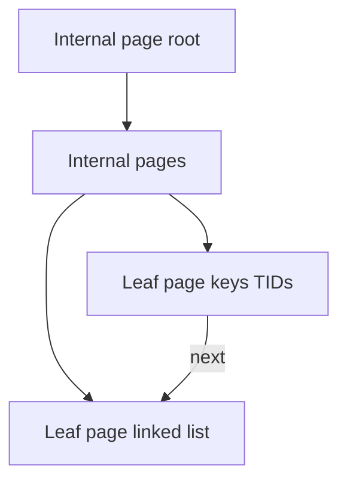
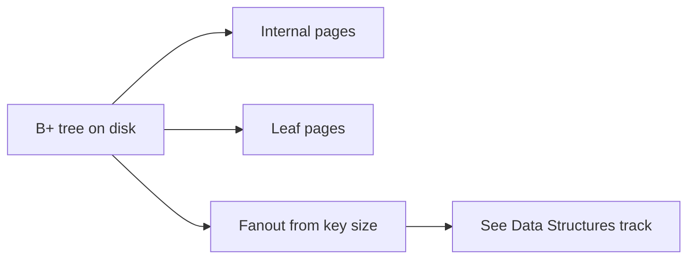
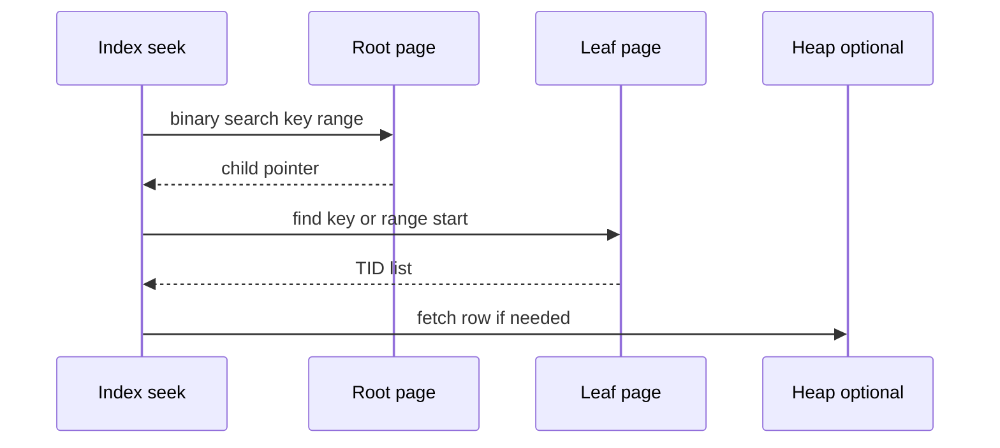

# B-Plus Trees as Page Structures

## Overview

On-disk **B+ trees** store keys in **sorted order** within **index pages**: internal nodes hold separator keys and child pointers; **leaves** hold keys and either **heap TIDs** (Postgres secondary) or **row data** (clustered). Height stays O(log n) in **pages**, giving predictable seek I/O.

**Fanout, balance invariants, and split algorithms** are taught in [[04-Data-Structures/05-Trees-and-Ordered-Maps/B-Trees and B-Plus Trees Concepts|B-Trees and B-Plus Trees Concepts]]. This note covers **how B+ trees map to 8 KiB pages**, WAL logging of splits, and engine-facing trade-offs—not re-deriving CLRS proofs.

## Learning Objectives

- Map DS B+ tree nodes to fixed-size index pages with headers
- Estimate tree height from key width and page size (engine formula)
- Describe leaf vs internal page layout and sibling links
- Explain page split/merge WAL interaction and write amplification
- Relate PK/index choice to insert locality ([[08-Databases/01-Storage-and-Buffer-Pool/Heap Tables vs Clustered Layouts|Heap Tables vs Clustered Layouts]])

## Prerequisites

- [[08-Databases/01-Storage-and-Buffer-Pool/Pages Blocks and IO Units|Pages Blocks and I/O Units]]
- [[04-Data-Structures/05-Trees-and-Ordered-Maps/B-Trees and B-Plus Trees Concepts|B-Trees and B-Plus Trees Concepts]]

## Difficulty

`intermediate`

## Estimated Time

- Reading: 2 hours
- Exercises: 1.5 hours
- Mini project: 5 hours

## History

B-trees (Bayer, McCreight, 1972) optimized disk block I/O. **B+** variant keeps all keys in leaves with linked sibling chain for range scans—standard for SQL indexes since System R. Postgres uses ** Lehman-Yao**-style B-link trees allowing concurrent splits with high-level link pointers.

## Problem It Solves

| Scan all rows | B+ tree index seek |
| --- | --- |
| O(pages) heap | O(tree height) pages |
| Random heap for range | Sequential leaf chain |
| Sort for ORDER BY | Leaf order matches key order |

## Internal Implementation

### Page-mapped B+ tree



Each **page** ≁Eone DS node; fanout = floor(usable_bytes / key_entry_size).

## Mermaid Diagrams

### Structure



### Sequence / Lifecycle  Eindex seek



## Examples

### Minimal Example  Eheight estimate

```typescript
const PAGE_SIZE = 8192;
const INDEX_HEADER = 120;
const KEY_PTR_BYTES = 16; // key + child or TID fudge

export function estimateFanout(avgKeyBytes: number): number {
  const entry = avgKeyBytes + KEY_PTR_BYTES;
  return Math.floor((PAGE_SIZE - INDEX_HEADER) / entry);
}

export function estimateHeight(rowCount: number, fanout: number): number {
  const leafRows = Math.max(1, Math.floor(fanout * 0.7)); // leaves ~70% fill
  const leaves = Math.ceil(rowCount / leafRows);
  return Math.ceil(Math.log(leaves) / Math.log(fanout)) + 1;
}

console.log(estimateHeight(10_000_000, estimateFanout(8))); // ~4 for 8-byte keys
```

### Production-Shaped Example  Eindex DDL and split awareness

```sql
CREATE TABLE users (
  id         BIGSERIAL PRIMARY KEY,  -- sequential inserts: right-edge splits
  email      TEXT NOT NULL,
  created_at TIMESTAMPTZ NOT NULL
);

CREATE INDEX users_email ON users (email);
CREATE INDEX users_created ON users (created_at);

-- Random UUID PK causes scattered leaf splits  Esee heap/cluster note
```

```typescript
// Mini B+ lab: page split when insert overflows
export type IndexPage =
  | { kind: "internal"; keys: string[]; children: string[] }
  | { kind: "leaf"; keys: string[]; tids: string[]; next?: string };

export function insertLeaf(page: Extract<IndexPage, { kind: "leaf" }>, key: string, tid: string, maxKeys: number) {
  if (page.keys.length >= maxKeys) return { split: true as const, page };
  // sorted insert stub
  page.keys.push(key);
  page.tids.push(tid);
  page.keys.sort();
  return { split: false as const, page };
}
```

Lab: [[08-Databases/projects/Mini B-Plus Index Lab/README|Mini B-Plus Index Lab]].

## Trade-offs

| Dimension | Narrow keys | Wide composite keys |
| --- | --- | --- |
| Fanout | High, shallow tree | Low, deeper tree |
| Cache | More keys per page | Fewer |
| Selectivity | Depends on prefix | Left-prefix rules |
| Split cost | Lower tree depth cost | More splits |

### When to Use

- Default ordered index for range + equality on leading columns
- PK/unique constraints backed by B+ tree (Postgres default)

### When Not to Use

- Pure equality on huge cardinal string ↁEconsider hash (module 03)
- Full-text inverted ↁEGIN (module 03)
- Write-only time series append ↁEBRIN/partition (Postgres module 08)

## Exercises

1. Compute fanout for 16-byte keys in 8 KiB pages (hand wave OK).
2. Why are all keys in leaves in B+ trees? (Link DS note.)
3. Draw page split propagating to new root.
4. Compare sequential BIGSERIAL vs UUID v4 insert I/O pattern.
5. Implement one leaf split in [[08-Databases/projects/Mini B-Plus Index Lab/README|Mini B-Plus Index Lab]].

## Mini Project

Build page-based B+ tree with split + WAL log record stub in TypeScript. Fanout math tests reference DS note.

## Portfolio Project

[[08-Databases/projects/Mini B-Plus Index Lab/README|Mini B-Plus Index Lab]]  Edocument page format diagram and DS cross-link.

## Interview Questions

1. How does on-disk B+ tree differ from in-memory binary search tree?
2. What determines index height?
3. Why sequential PK inserts hit right edge?
4. What is stored in leaf pages for secondary indexes in Postgres?
5. Where to learn split invariants? (Data Structures track.)

### Stretch / Staff-Level

1. Explain Postgres B-link concurrent split at high level.
2. Compare B+ tree to LSM memtable + SST for write-heavy index.

## Common Mistakes

- UUID v4 PK on billion-row without plan
- Composite index wrong column order
- Re-proving B-tree balance in engine interviews instead of page I/O story
- Ignoring heap fetch after index seek

## Best Practices

- Match key types to query predicates exactly
- Estimate height/fanout during schema design reviews
- Monitor index bloat and bloat from splits ([[08-Databases/06-Concurrency-Internals/Vacuum Version GC and Bloat|Vacuum Version GC and Bloat]])
- Learn invariants in DS; learn pages/WAL here

## Summary

**B+ trees on disk** are nodes packed into fixed pages with fanout driven by key width. Seek and range scans cost ~height page reads; splits and WAL log maintenance drive write amplification. Algorithmic intuition from **Data Structures**; **this track** owns page layout, heap interaction, and production index choice.

## Further Reading

- [[04-Data-Structures/05-Trees-and-Ordered-Maps/B-Trees and B-Plus Trees Concepts|B-Trees and B-Plus Trees Concepts]]
- [[00-References/Databases/README|Databases References]]
- Postgres index access method (btree) documentation

## Related Notes

- [[08-Databases/03-Indexing-on-Disk/Secondary Covering and Partial Indexes|Secondary Covering and Partial Indexes]]
- [[08-Databases/03-Indexing-on-Disk/Index-Only Scans and Visibility Map Hooks|Index-Only Scans and Visibility Map Hooks]]
- [[08-Databases/04-Query-Processing-and-Planning/Access Paths Seq Scan vs Index|Access Paths Seq Scan vs Index]]
- [[04-Data-Structures/05-Trees-and-Ordered-Maps/B-Trees and B-Plus Trees Concepts|B-Trees and B-Plus Trees Concepts]]
- [[05-Algorithms/README|Algorithms]]
- [[07-Backend/README|Backend]]

## Progress Checklist

- [ ] Explained from first principles
- [ ] Drew at least one Mermaid diagram
- [ ] Implemented a minimal version
- [ ] Documented trade-offs and non-goals
- [ ] Completed exercises
- [ ] Practiced interview questions aloud
- [ ] Linked prerequisites and dependents
