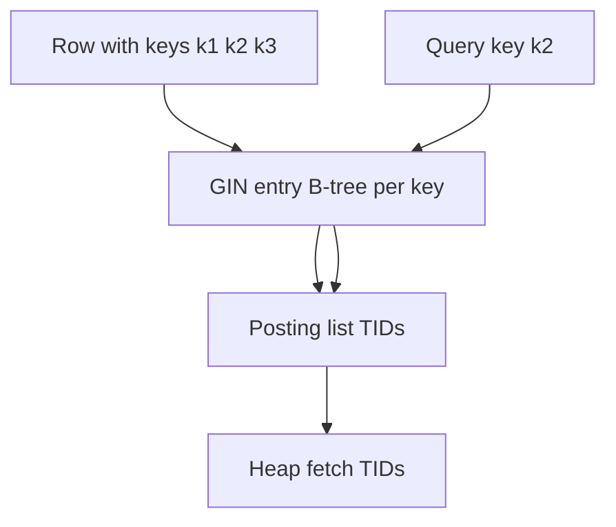
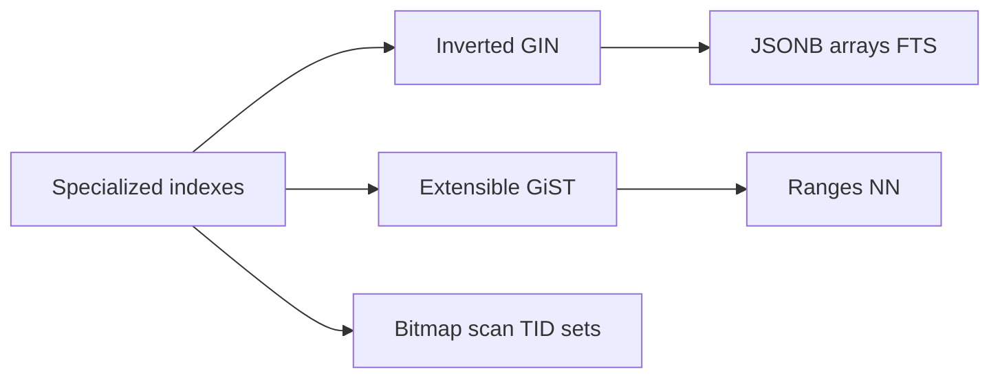
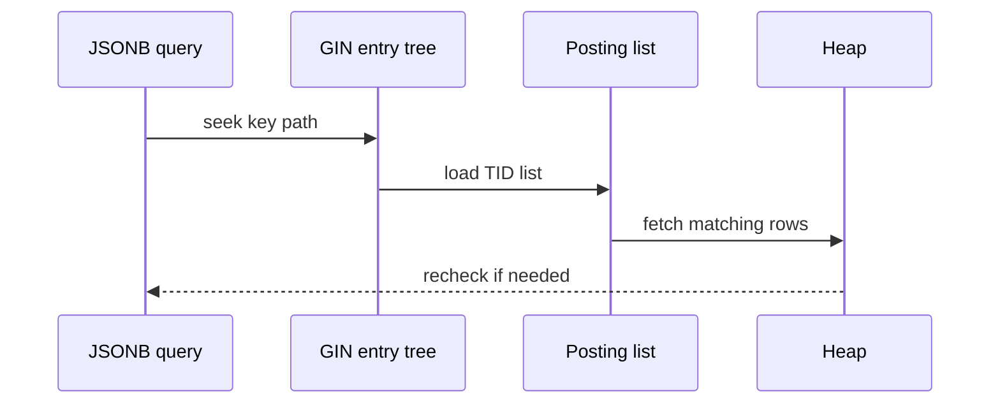

# GIN GiST and Bitmap Index Concepts

## Overview

Not all indexes are B-trees. **GIN** (Generalized Inverted Index) maps **keys → row pointers**—ideal for composite items like JSONB keys, array elements, full-text lexemes. **GiST** (Generalized Search Tree) supports **custom consistent/predicate** logic—geo, ranges, nearest-neighbor. **Bitmap indexes** (Oracle-style concept; Postgres uses **bitmap index scans** combining TID sets) accelerate low-cardinality filters.

These access methods still sit on **pages and WAL**—only the in-page structure and probe algorithm differ.

## Learning Objectives

- Explain inverted index structure for GIN (entry tree + posting lists)
- Contrast GiST extensibility vs fixed B-tree comparators
- Describe Postgres bitmap index **scan** (AND/OR TID sets)—not a separate bitmap index type
- Choose GIN vs B-tree for JSONB, arrays, tsvector
- Anticipate GIN write amplification and fastupdate trade-offs

## Prerequisites

- [[08-Databases/03-Indexing-on-Disk/B-Plus Trees as Page Structures|B-Plus Trees as Page Structures]]
- [[04-Data-Structures/07-Tries-and-Prefix-Structures/Tries|Tries]] (conceptual parallel for prefix keys)

## Difficulty

`advanced`

## Estimated Time

- Reading: 2 hours
- Exercises: 1 hour
- Mini project: 3 hours

## History

**Inverted indexes** powered information retrieval long before SQL. Postgres **GIN** (Teodor Sigaev, 2006) generalized inverted lists for arrays and full-text. **GiST** (same era) abstracted tree search for PostGIS geometry. Warehouse **bitmap indexes** on low-cardinality columns inspired **bitmap heap scans** in Oracle; Postgres builds bitmaps at query time from B-tree.

## Problem It Solves

| Data / query | B-tree alone | Specialized index |
| --- | --- | --- |
| `@>` JSONB containment | Poor | GIN jsonb_ops |
| `WHERE tags && ARRAY[...]` | Poor | GIN array |
| `to_tsvector @@ plainto_tsquery` | Poor | GIN tsvector |
| `ST_DWithin(geom, ...)` | Poor | GiST geometry |
| `WHERE status IN (1,2) AND region=5` low card | Many heap hits | Bitmap AND scan |

## Internal Implementation

### GIN inverted layout (simplified)



**GiST**: internal nodes hold **bounding predicates**; children consistent with parent predicate—supports overlap/NN search.

## Mermaid Diagrams

### Structure



### Sequence / Lifecycle — GIN lookup



## Examples

### Minimal Example — GIN for JSONB and FTS

```sql
CREATE TABLE documents (
  id      BIGSERIAL PRIMARY KEY,
  meta    JSONB NOT NULL,
  body    TEXT NOT NULL,
  tsv     TSVECTOR GENERATED ALWAYS AS (to_tsvector('english', body)) STORED
);

CREATE INDEX documents_meta_gin ON documents USING gin (meta);
CREATE INDEX documents_tsv_gin ON documents USING gin (tsv);

-- Containment
SELECT id FROM documents WHERE meta @> '{"tag": "security"}';

-- Full text
SELECT id FROM documents WHERE tsv @@ plainto_tsquery('english', 'write ahead logging');
```

### Production-Shaped Example — GiST range + bitmap scan note

```sql
CREATE TABLE reservations (
  id     BIGSERIAL PRIMARY KEY,
  room   INT NOT NULL,
  status TEXT NOT NULL DEFAULT 'held',
  during TSRANGE NOT NULL
);

CREATE INDEX reservations_during ON reservations USING gist (during);

-- Overlap query
SELECT * FROM reservations
WHERE during && tsrange('2026-07-22', '2026-07-23');

-- Low-cardinality: planner may Bitmap Index Scan on status + BitmapAnd
CREATE INDEX reservations_status ON reservations (status);
EXPLAIN SELECT * FROM reservations WHERE status = 'held' AND room = 12;
```

```typescript
// Educational inverted index append
export class InvertedIndex {
  private postings = new Map<string, Set<number>>();

  index(docId: number, terms: string[]) {
    for (const t of terms) {
      const set = this.postings.get(t) ?? new Set();
      set.add(docId);
      this.postings.set(t, set);
    }
  }

  lookup(term: string): number[] {
    return [...(this.postings.get(term) ?? [])];
  }

  intersect(a: string, b: string): number[] {
    const sa = this.postings.get(a) ?? new Set();
    const sb = this.postings.get(b) ?? new Set();
    return [...sa].filter((x) => sb.has(x));
  }
}
```

GIN maintenance: `gin_pending_list` + `fastupdate`—bulk load may disable fastupdate then `REINDEX`.

## Trade-offs

| Index | Strength | Cost |
| --- | --- | --- |
| GIN | Multi-key containment, FTS | Large, slow writes |
| GiST | Custom predicates, geo | Slower build, opclass complexity |
| Bitmap scan (runtime) | AND low-card filters | Memory for TID bitmaps |
| B-tree | General | Wrong tool for `@>` / FTS |

### When to Use

- GIN for JSONB `@>`, `?`, arrays, tsvector
- GiST for ranges, geometry (PostGIS), exclusion constraints
- Trust planner bitmap scans on multi low-selectivity filters

### When Not to Use

- GIN on high-cardinality JSON with constant updates without ops review
- GiST when B-tree on expression suffices
- Oracle-style bitmap index expectations on Postgres (different mechanism)

## Exercises

1. Write query using `@>` that uses GIN; rewrite so B-tree cannot help.
2. Explain inverted vs forward index in one paragraph.
3. What does `Bitmap Index Scan` + `Bitmap Heap Scan` mean in EXPLAIN?
4. When run `REINDEX` on GIN after bulk load?
5. Map GIN posting list to DS inverted index lecture.

## Mini Project

Build inverted index for 10k documents; compare intersect performance vs sequential filter.

## Portfolio Project

FTS + JSONB index section in [[08-Databases/projects/EXPLAIN Literacy Workbench/README|EXPLAIN Literacy Workbench]].

## Interview Questions

1. What is an inverted index?
2. GIN vs GiST use cases?
3. Does Postgres have bitmap indexes like Oracle?
4. Why is GIN write-heavy?
5. How does full-text ranking relate to index? (ts_rank—not index order)

### Stretch / Staff-Level

1. Design opclass for custom GiST type—what callbacks?
2. JSONB `jsonb_path_ops` vs `jsonb_ops` size/query trade-off.

## Common Mistakes

- B-tree on JSONB column expecting containment speed
- Ignoring GIN bloat and pending list during ETL
- Confusing bitmap scan with materialized bitmap index
- Full-text without language config consistency

## Best Practices

- Match opclass to query operators (`jsonb_path_ops` for `@>` only paths)
- Batch loads: drop/disable fastupdate strategy per docs
- EXPLAIN ANALYZE recheck rows on GIN
- Geo: use PostGIS GiST with correct SRID

## Summary

**GIN** inverted indexes excel when rows contain many searchable keys (JSON, arrays, lexemes). **GiST** generalizes tree search for overlap and nearest-neighbor predicates. **Bitmap index scans** combine B-tree TID sets at query time for low-cardinality AND filters—Postgres style differs from warehouse bitmap indexes but solves similar planner problems. All remain page-backed structures logged by WAL.

## Further Reading

- [[00-References/Databases/README|Databases References]]
- PostgreSQL GIN/GiST documentation
- [[04-Data-Structures/07-Tries-and-Prefix-Structures/Tries|Tries]]

## Related Notes

- [[08-Databases/03-Indexing-on-Disk/B-Plus Trees as Page Structures|B-Plus Trees as Page Structures]]
- [[08-Databases/03-Indexing-on-Disk/Hash Indexes and Equality Lookups|Hash Indexes and Equality Lookups]]
- [[08-Databases/04-Query-Processing-and-Planning/Access Paths Seq Scan vs Index|Access Paths Seq Scan vs Index]]
- [[08-Databases/08-PostgreSQL-Engine/Catalogs System Tables and Types|Catalogs System Tables and Types]]
- [[04-Data-Structures/07-Tries-and-Prefix-Structures/Tries|Tries]]
- [[05-Algorithms/README|Algorithms]]

## Progress Checklist

- [ ] Explained from first principles
- [ ] Drew at least one Mermaid diagram
- [ ] Implemented a minimal version
- [ ] Documented trade-offs and non-goals
- [ ] Completed exercises
- [ ] Practiced interview questions aloud
- [ ] Linked prerequisites and dependents
