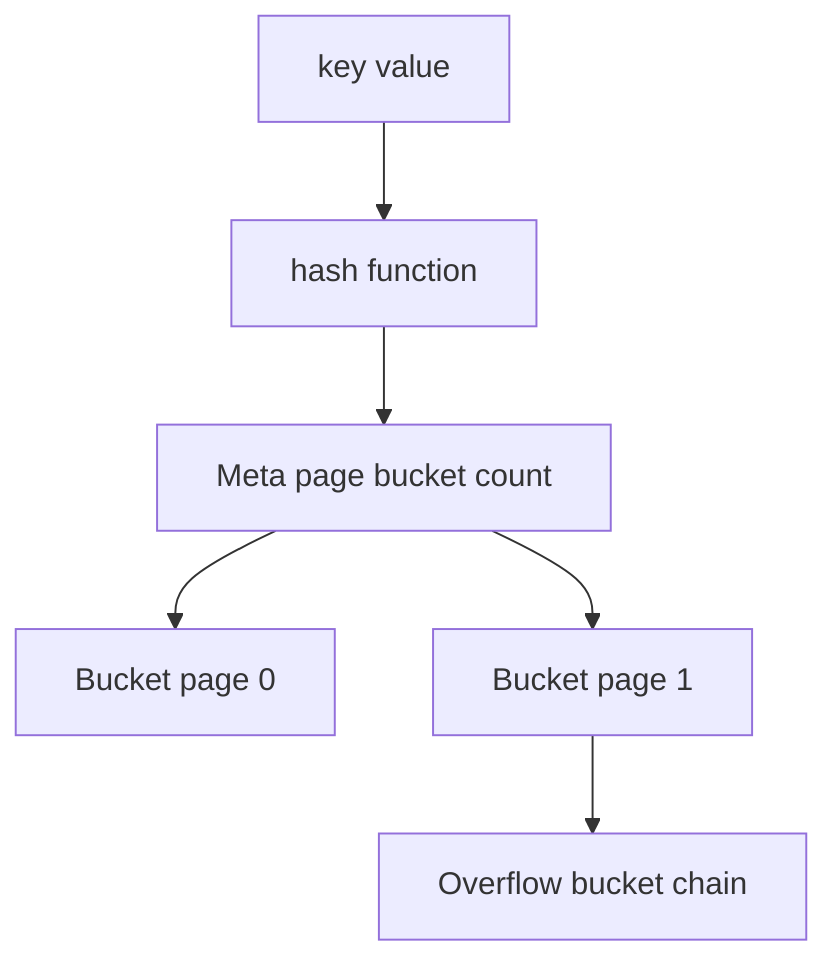
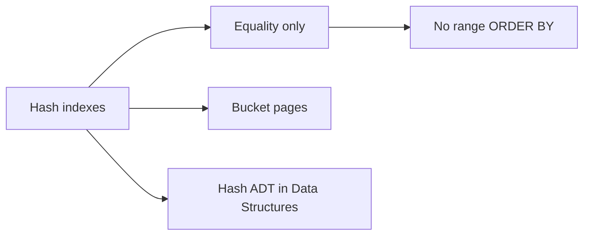
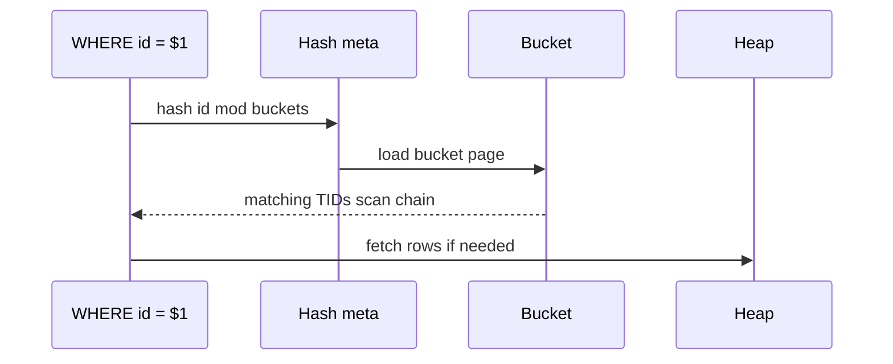

# Hash Indexes and Equality Lookups

## Overview

**Hash indexes** map hash(key) → **bucket pages** holding index tuples for **equality** lookups (`WHERE id = ?`). They ignore sort order—no range scans, no `ORDER BY` support from the index. PostgreSQL hash indexes are WAL-logged and crash-safe since v10; use remains niche vs B-tree.

Hash **bucket chaining** and collision theory live in [[04-Data-Structures/04-Hash-Tables-and-Sets/Separate Chaining|Separate Chaining]]. This note covers on-disk bucket pages, when hash wins, and engine limitations.

## Learning Objectives

- Contrast hash vs B-tree access paths for point queries
- Describe bucket overflow pages and split concepts (Postgres hash AM)
- Identify when hash index is appropriate vs misleading
- Explain why composite range queries need B-tree
- Read EXPLAIN for Index Scan using hash vs btree

## Prerequisites

- [[08-Databases/03-Indexing-on-Disk/B-Plus Trees as Page Structures|B-Plus Trees as Page Structures]]
- [[04-Data-Structures/04-Hash-Tables-and-Sets/Separate Chaining|Separate Chaining]]

## Difficulty

`intermediate`

## Estimated Time

- Reading: 1 hour
- Exercises: 45 minutes
- Mini project: 2 hours

## History

Static hash indexes appeared in early systems; lack of WAL crash safety made Postgres hash indexes **experimental caution** until recovery support (2010s). Most OLTP defaults to B-tree even for equality because one index serves range + FK + uniqueness. In-memory engines (Redis) are hash-first at a different layer (module 10).

## Problem It Solves

| Workload | Hash index | B-tree |
| --- | --- | --- |
| `WHERE uuid = ?` only | O(1) buckets average | O(log n) pages |
| `WHERE ts > ?` | Cannot use | Range scan |
| `ORDER BY key` | Sort separately | Index order |
| Low-cardinality equality | Poor buckets | Still ok with selectivity |

## Internal Implementation

### Hash index buckets (conceptual)



Each bucket page stores tuples hashing to that bucket; collisions chain overflow pages.

## Mermaid Diagrams

### Structure



### Sequence / Lifecycle — equality probe



## Examples

### Minimal Example — Postgres hash index

```sql
CREATE TABLE sessions (
  token UUID PRIMARY KEY,
  user_id BIGINT NOT NULL,
  expires_at TIMESTAMPTZ NOT NULL
);

-- Equality-only token lookup — rarely needed vs PK btree
CREATE INDEX sessions_token_hash ON sessions USING hash (token);

EXPLAIN SELECT * FROM sessions WHERE token = '550e8400-e29b-41d4-a716-446655440000';
```

### Production-Shaped Example — when B-tree still wins

```typescript
// Hot path: equality + occasional purge by expires_at
// B-tree on (token) or PK suffices; hash adds no range for expiry job

const byToken = `SELECT user_id FROM sessions WHERE token = $1`;

const expired = `
  SELECT token FROM sessions
  WHERE expires_at < now()
  LIMIT 1000
`; // needs btree on expires_at — hash useless here
```

```typescript
// Educational hash bucket map
export class DiskHashIndex {
  private buckets = new Map<number, string[]>(); // bucket -> tids

  hash(key: string, bucketCount: number): number {
    let h = 0;
    for (const c of key) h = (h * 31 + c.charCodeAt(0)) >>> 0;
    return h % bucketCount;
  }

  insert(key: string, tid: string, bucketCount: number) {
    const b = this.hash(key, bucketCount);
    const arr = this.buckets.get(b) ?? [];
    arr.push(tid);
    this.buckets.set(b, arr);
  }

  lookup(key: string, bucketCount: number): string[] {
    return this.buckets.get(this.hash(key, bucketCount)) ?? [];
  }
}
```

## Trade-offs

| Dimension | Hash | B-tree |
| --- | --- | --- |
| Point lookup | Fast buckets | Log height |
| Range | Not supported | Native |
| Duplicate hash keys | Chain scan in bucket | Ordered duplicates |
| Replication/DDL | Same as btree maint | Mature default |
| Planner support | Narrow | Universal |

Postgres guidance: prefer **B-tree** unless measured hash win on pure equality at huge scale.

### When to Use

- Proven equality-only at scale with benchmarks (rare in Postgres)
- Teaching hash-to-bucket disk mapping in labs
- Understanding Redis/Dynamo hash partitioning conceptually ([[09-System-Design/04-Partitioning-Sharding-and-Placement/Partition Keys Hotspots and Skew|Partition Keys Hotspots and Skew]] for sharding)

### When Not to Use

- Any range, sort, or prefix query on same column
- Replacing PK B-tree without measurement
- Low-cardinality columns (few distinct hashes → long chains)

## Exercises

1. Query three ways that cannot use hash index on `email`.
2. Compute average chain length if 1M keys, 10k buckets, uniform hash.
3. EXPLAIN compare hash vs btree on PK equality—often identical plan?
4. Why did Postgres hash indexes need WAL recovery work?
5. Implement rehash when bucket load factor > 2 in educational map.

## Mini Project

Micro-benchmark equality lookups: btree vs hash on 10M row table (if hash justified). Document in EXPLAIN workbench.

## Portfolio Project

Optional hash bucket module in [[08-Databases/projects/Mini B-Plus Index Lab/README|Mini B-Plus Index Lab]] comparing seek paths.

## Interview Questions

1. What queries can hash indexes answer?
2. How do hash collisions work on disk?
3. Why are B-trees default in Postgres?
4. Hash index vs hash join?
5. Where is hash partitioning taught for distributed DB?

### Stretch / Staff-Level

1. Compare Postgres hash AM to InnoDB adaptive hash index (AHI).
2. Design shard key hash for Dynamo—SD handoff.

## Common Mistakes

- Creating hash index for `LIKE 'prefix%'`
- Expecting hash to enforce uniqueness faster than btree unique
- Ignoring overflow chain length under skew
- Confusing index hash with `HASH()` partition expression

## Best Practices

- Default to B-tree; prove hash benefit with EXPLAIN ANALYZE
- Separate index for range columns (expires_at, created_at)
- Monitor bucket split/rehash if using hash AM
- Learn hash ADT in DS; learn bucket pages here

## Summary

**Hash indexes** optimize **equality** via bucket pages—not ordering. Collisions chain within buckets; rehash/split grows structure. Postgres uses them sparingly; **B-trees** remain the general-purpose on-disk index. Hash **concepts** also appear in distributed sharding (System Design) and in-memory stores (Redis module 10).

## Further Reading

- [[04-Data-Structures/04-Hash-Tables-and-Sets/Separate Chaining|Separate Chaining]]
- PostgreSQL hash index documentation
- [[08-Databases/04-Query-Processing-and-Planning/Access Paths Seq Scan vs Index|Access Paths Seq Scan vs Index]]

## Related Notes

- [[08-Databases/03-Indexing-on-Disk/B-Plus Trees as Page Structures|B-Plus Trees as Page Structures]]
- [[08-Databases/03-Indexing-on-Disk/GIN GiST and Bitmap Index Concepts|GIN GiST and Bitmap Index Concepts]]
- [[08-Databases/10-Redis-and-In-Memory-Engines/Redis Data Structures as Persistence API|Redis Data Structures as Persistence API]]
- [[04-Data-Structures/04-Hash-Tables-and-Sets/Separate Chaining|Separate Chaining]]
- [[05-Algorithms/README|Algorithms]]
- [[09-System-Design/README|System Design]]

## Progress Checklist

- [ ] Explained from first principles
- [ ] Drew at least one Mermaid diagram
- [ ] Implemented a minimal version
- [ ] Documented trade-offs and non-goals
- [ ] Completed exercises
- [ ] Practiced interview questions aloud
- [ ] Linked prerequisites and dependents
