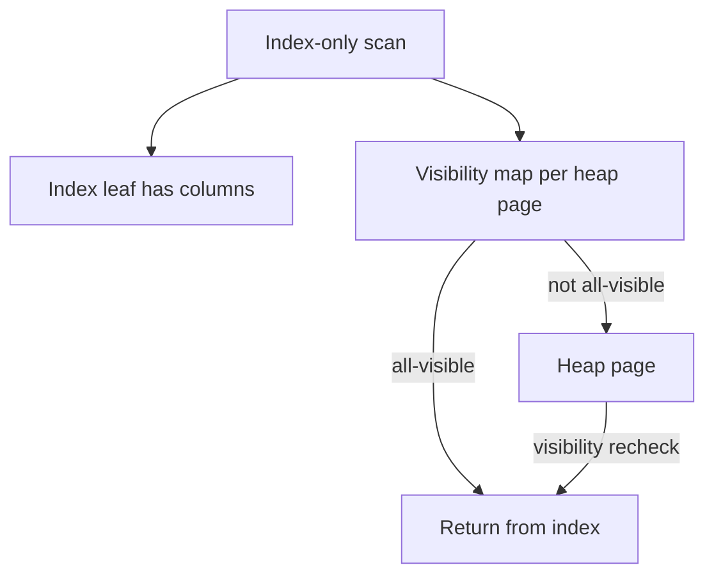
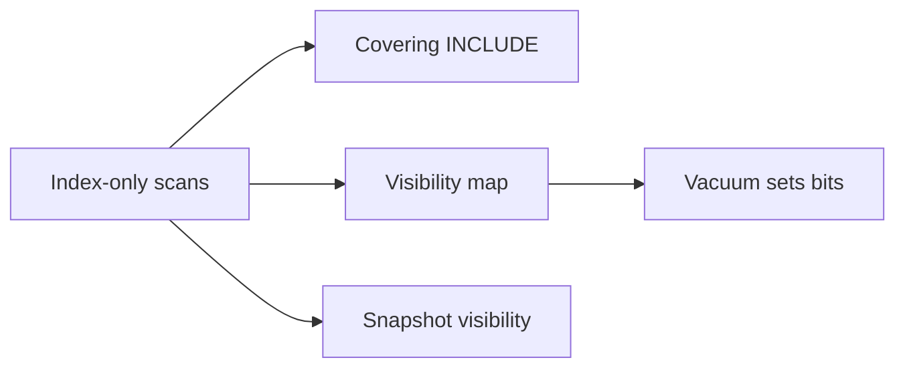
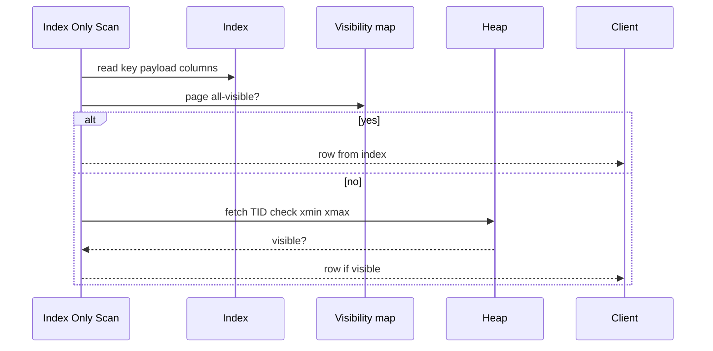

# Index-Only Scans and Visibility Map Hooks

## Overview

An **index-only scan** returns columns present in the index **without reading the heap**—but MVCC requires knowing if heap tuples are **visible** to your snapshot. PostgreSQL's **visibility map** (VM) marks pages **all-visible** (no hidden dead/live ambiguity for vacuum) enabling index-only plans; otherwise **heap fetch** rechecks visibility.

This note connects covering indexes to MVCC mechanics—a bridge to transactions module 05 and vacuum module 06.

## Learning Objectives

- Explain index-only scan prerequisites (covering columns + visibility)
- Describe visibility map bits: all-visible, all-frozen (conceptually)
- Interpret EXPLAIN "Heap Fetches" in Index Only Scan
- Relate VM maintenance to vacuum and long transactions
- Design indexes + vacuum strategy for index-only dashboards

## Prerequisites

- [[08-Databases/03-Indexing-on-Disk/Secondary Covering and Partial Indexes|Secondary Covering and Partial Indexes]]
- [[08-Databases/05-Transactions-and-Isolation/Locking vs MVCC|Locking vs MVCC]] (preview OK)

## Difficulty

`advanced`

## Estimated Time

- Reading: 1.5 hours
- Exercises: 1 hour
- Mini project: 2 hours

## History

Index-only access appeared in Oracle as **index fast full scan** variants. Postgres 9.2+ added **index-only scans** with **visibility map** to skip heap when safe—major win for covering dashboards if vacuum keeps VM current. Without VM, index-only degrades to index scan + many heap fetches.

## Problem It Solves

| Plan | I/O |
| --- | --- |
| Index Scan + heap per row | Random heap pages |
| Index Only Scan, VM hit | Index pages only |
| Index Only Scan, VM miss | Index + selective heap fetch |
| Seq Scan | All heap pages |

## Internal Implementation

### Visibility map + index-only



VM is **not** a substitute for row-level visibility—it **hints** page-level all-visible.

## Mermaid Diagrams

### Structure



### Sequence / Lifecycle — index-only with heap fetch



## Examples

### Minimal Example — covering + EXPLAIN

```sql
CREATE TABLE metrics (
  id         BIGSERIAL PRIMARY KEY,
  tenant_id  INT NOT NULL,
  name       TEXT NOT NULL,
  value      DOUBLE PRECISION NOT NULL,
  updated_at TIMESTAMPTZ NOT NULL
);

CREATE INDEX metrics_tenant_cover ON metrics (tenant_id)
  INCLUDE (name, value, updated_at);

EXPLAIN (ANALYZE, BUFFERS)
SELECT name, value, updated_at
FROM metrics
WHERE tenant_id = 42;
-- Index Only Scan — watch "Heap Fetches" line
```

### Production-Shaped Example — VM + vacuum monitoring

```sql
-- After heavy UPDATE churn, heap fetches rise until vacuum
SELECT relname, last_vacuum, last_autovacuum, n_dead_tup
FROM pg_stat_user_tables
WHERE relname = 'metrics';

-- Force visibility map refresh via routine vacuum
VACUUM (ANALYZE) metrics;
```

```typescript
import pg from "pg";

export async function readDashboard(pool: pg.Pool, tenantId: number) {
  const sql = `
    SELECT name, value, updated_at
    FROM metrics
    WHERE tenant_id = $1
    ORDER BY updated_at DESC
    LIMIT 100
  `;
  const t0 = performance.now();
  const res = await pool.query(sql, [tenantId]);
  return { rows: res.rows, ms: performance.now() - t0 };
}

// Ops: alert if EXPLAIN shows heap fetches > threshold after steady state
```

Vacuum depth: [[08-Databases/06-Concurrency-Internals/Vacuum Version GC and Bloat|Vacuum Version GC and Bloat]].

## Trade-offs

| Dimension | Index-only friendly | Hostile |
| --- | --- | --- |
| UPDATE wide rows | Dead tuples break VM | Narrow immutable INCLUDE cols |
| Long transactions | Delays vacuum, VM stale | Short snapshots |
| Partial index | Smaller, stable | Must match query |
| SELECT * | Needs all cols in index | Project narrow columns |

### When to Use

- Read-heavy dashboards with stable INCLUDE columns
- Monitor heap fetches; tune autovacuum on churn tables
- Pair partial index with partial query predicate

### When Not to Use

- INCLUDE frequently updated columns
- Assume index-only without EXPLAIN verification
- Skip vacuum on high-update table expecting IOS

## Exercises

1. Run index-only plan before/after bulk UPDATE; compare heap fetches.
2. Why must engine recheck visibility if VM bit clear?
3. What sets all-visible bit on page?
4. Can index-only scan work on non-covering index? (Hint: no)
5. Link VM to HOT update same-page rule.

## Mini Project

Dashboard query benchmark: measure heap fetches vs dead tuples on metrics table.

## Portfolio Project

Index-only scan tuning case study in [[08-Databases/projects/EXPLAIN Literacy Workbench/README|EXPLAIN Literacy Workbench]].

## Interview Questions

1. What is an index-only scan?
2. Role of visibility map?
3. What does non-zero "Heap Fetches" mean in EXPLAIN?
4. How do long transactions hurt index-only performance?
5. Difference between covering index and index-only scan?

### Stretch / Staff-Level

1. Compare Postgres VM to Oracle rowid visibility assumptions.
2. Design autovacuum policy for index-only SLA on 500GB table.

## Common Mistakes

- INCLUDE volatile columns; plan regresses to heap heavy
- Ignoring heap fetches metric in production EXPLAIN samples
- Disabling autovacuum on "read mostly" table with occasional bulk updates
- Confusing index-only with "no indexes on heap"

## Best Practices

- EXPLAIN (ANALYZE, BUFFERS) in CI for critical read paths
- Alert on rising dead tuples for IOS tables
- Keep INCLUDE columns narrow and stable
- Transaction boundaries in Backend to avoid long snapshots ([[07-Backend/08-Data-Access-and-Persistence-Patterns/Transactions as Used by Services|Transactions as Used by Services]])

## Summary

**Index-only scans** avoid heap I/O when the index **covers** projected columns and the **visibility map** certifies heap pages all-visible—or pay **heap fetches** for MVCC rechecks. Covering index design and **vacuum hygiene** are one problem: without garbage collection, the best index plan degrades. This ties indexing on disk to concurrency and vacuum internals.

## Further Reading

- [[00-References/Databases/README|Databases References]]
- PostgreSQL index-only scans and visibility map wiki
- [[08-Databases/06-Concurrency-Internals/Vacuum Version GC and Bloat|Vacuum Version GC and Bloat]]

## Related Notes

- [[08-Databases/03-Indexing-on-Disk/Secondary Covering and Partial Indexes|Secondary Covering and Partial Indexes]]
- [[08-Databases/05-Transactions-and-Isolation/Locking vs MVCC|Locking vs MVCC]]
- [[08-Databases/06-Concurrency-Internals/Vacuum Version GC and Bloat|Vacuum Version GC and Bloat]]
- [[08-Databases/04-Query-Processing-and-Planning/EXPLAIN and EXPLAIN ANALYZE Literacy|EXPLAIN and EXPLAIN ANALYZE Literacy]]
- [[07-Backend/README|Backend]]
- [[05-Algorithms/README|Algorithms]]

## Progress Checklist

- [ ] Explained from first principles
- [ ] Drew at least one Mermaid diagram
- [ ] Implemented a minimal version
- [ ] Documented trade-offs and non-goals
- [ ] Completed exercises
- [ ] Practiced interview questions aloud
- [ ] Linked prerequisites and dependents
