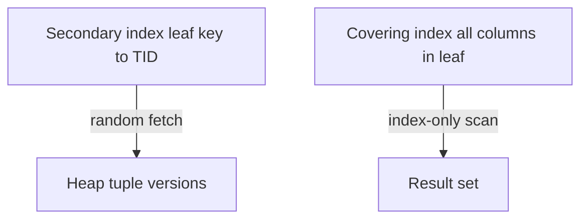
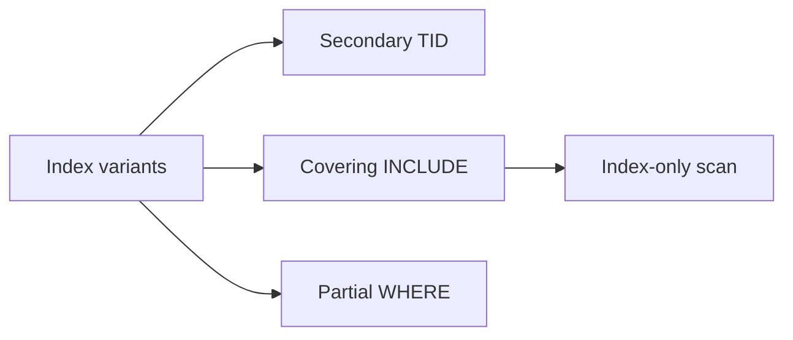
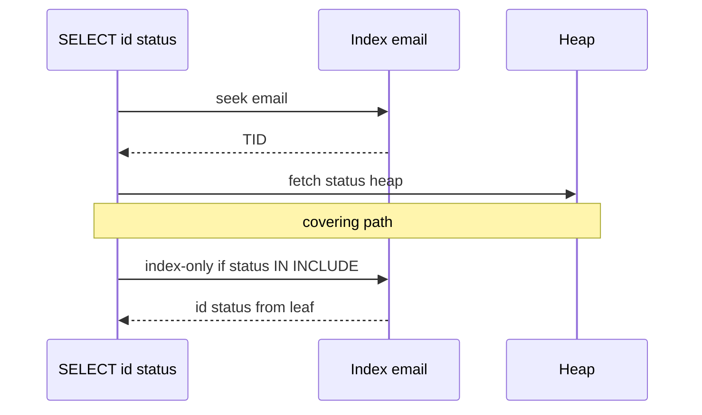

# Secondary Covering and Partial Indexes

## Overview

A **secondary index** is a separate B+ tree whose leaves point to **heap TIDs** (Postgres) or **PK values** (InnoDB clustered). A **covering index** (including **index-only** plans) stores all queried columns in the index—avoiding heap fetches. A **partial index** indexes a **subset of rows** matching a predicate—smaller, faster, more selective.

These are primary levers for access-path optimization before diving into EXPLAIN module 04.

## Learning Objectives

- Distinguish primary vs secondary index physical consequences
- Design covering indexes with `INCLUDE` (Postgres) or composite column order
- When partial indexes help (soft-delete flags, status filters)
- Predict index-only scan requirements (visibility map—next note)
- Avoid redundant overlapping indexes

## Prerequisites

- [[08-Databases/03-Indexing-on-Disk/B-Plus Trees as Page Structures|B-Plus Trees as Page Structures]]
- [[08-Databases/01-Storage-and-Buffer-Pool/Heap Tables vs Clustered Layouts|Heap Tables vs Clustered Layouts]]

## Difficulty

`intermediate`

## Estimated Time

- Reading: 1.5 hours
- Exercises: 1 hour
- Mini project: 3 hours

## History

Early systems allowed many secondary indexes with TID pointers. As tables grew, **covering indexes** reduced random heap I/O—SQL Server included columns; Postgres 11+ `INCLUDE`. **Partial indexes** (Postgres since 7.2) exploited common predicates (`WHERE deleted_at IS NULL`) to shrink index size dramatically.

## Problem It Solves

| Query pattern | Index tool |
| --- | --- |
| Filter active rows only | `CREATE INDEX ... WHERE active` |
| List view columns by key | Covering index with INCLUDE |
| FK lookups | Secondary on FK column |
| Avoid heap for dashboard | Index-only if visibility allows |

## Internal Implementation

### Secondary + heap fetch



Partial index stores entries **only** for matching rows—smaller tree, fewer writes on excluded rows.

## Mermaid Diagrams

### Structure



### Sequence / Lifecycle — non-covering vs covering



## Examples

### Minimal Example — index definitions

```sql
CREATE TABLE orders (
  id          BIGSERIAL PRIMARY KEY,
  user_id     BIGINT NOT NULL,
  status      TEXT NOT NULL,
  total_cents BIGINT NOT NULL,
  created_at  TIMESTAMPTZ NOT NULL DEFAULT now(),
  deleted_at  TIMESTAMPTZ
);

-- Secondary for user order history
CREATE INDEX orders_user_created ON orders (user_id, created_at DESC);

-- Partial: only open orders
CREATE INDEX orders_open_user ON orders (user_id)
  WHERE status IN ('pending', 'paid') AND deleted_at IS NULL;

-- Covering dashboard: avoid heap for listed columns
CREATE INDEX orders_user_cover ON orders (user_id)
  INCLUDE (status, total_cents)
  WHERE deleted_at IS NULL;
```

### Production-Shaped Example — query alignment

```typescript
// Query shape matches partial + covering index
const sql = `
  SELECT status, total_cents
  FROM orders
  WHERE user_id = $1
    AND deleted_at IS NULL
    AND status IN ('pending', 'paid')
  ORDER BY created_at DESC
  LIMIT 20
`;
// Ensure index columns match WHERE + ORDER BY discipline
await pool.query(sql, [userId]);
```

```sql
EXPLAIN (ANALYZE, BUFFERS)
SELECT status, total_cents FROM orders
WHERE user_id = 123 AND deleted_at IS NULL AND status = 'pending';
-- Look for: Index Only Scan vs Index Scan + heap blocks
```

Backend N+1 discipline: [[07-Backend/08-Data-Access-and-Persistence-Patterns/N-plus-1 and Query Shape Discipline|N-plus-1 and Query Shape Discipline]].

## Trade-offs

| Dimension | Partial index | Full index |
| --- | --- | --- |
| Size | Smaller | Larger |
| Writes on excluded rows | Skip index maint | Always update |
| Planner use | Must match predicate | General |
| Migration | Predicate change = new index | — |

| Covering | Upside | Downside |
| --- | --- | --- |
| INCLUDE columns | Fewer heap I/O | Wider index, slower writes |
| Duplicate indexes | — | Redundant maint cost |

### When to Use

- Partial for skewed predicates (active, unpublished, non-deleted)
- INCLUDE for read-heavy projections on stable columns
- Secondary on every FK used in joins

### When Not to Use

- Partial index when query omits predicate (planner ignores)
- Covering every column "just in case"
- Multiple indexes on same prefix without analysis

## Exercises

1. Write partial index for `WHERE published = true` and query that cannot use it.
2. Design covering index for `SELECT a,b WHERE c = ?`.
3. Estimate index size reduction if 90% rows deleted_at set.
4. EXPLAIN difference: Index Scan vs Index Only Scan.
5. List redundant pair: `(a)` and `(a,b)` when only `a` queried.

## Mini Project

Create orders table; benchmark heap fetch vs covering index-only plan with `BUFFERS`.

## Portfolio Project

Index design worksheet in [[08-Databases/projects/EXPLAIN Literacy Workbench/README|EXPLAIN Literacy Workbench]].

## Interview Questions

1. Secondary vs primary index storage difference in Postgres?
2. What is a partial index?
3. How does INCLUDE differ from composite key columns?
4. When cannot index-only scan run?
5. Trade-off of too many indexes on write path?

### Stretch / Staff-Level

1. Design indexes for soft-delete + multi-tenant `tenant_id` prefix.
2. When would you denormalize instead of covering index?

## Common Mistakes

- Partial index predicate not matching query exactly
- INCLUDE volatile columns bloating index
- Indexing low-cardinality alone (status only)
- ORM auto-index duplicates

## Best Practices

- Co-design indexes with query list from Backend
- Verify with EXPLAIN ANALYZE BUFFERS
- Drop unused indexes after pg_stat_user_indexes review
- Document partial predicate in migration comments

## Summary

**Secondary indexes** add seek paths at cost of extra B+ tree and heap fetches.**Covering** and **INCLUDE** columns shrink reads to index pages.**Partial** indexes trade generality for size and write savings when predicates are stable. All three are physical design tools grounded in page-level B+ trees—not ORM concerns.

## Further Reading

- [[00-References/Databases/README|Databases References]]
- PostgreSQL: partial indexes, INCLUDE
- [[08-Databases/04-Query-Processing-and-Planning/EXPLAIN and EXPLAIN ANALYZE Literacy|EXPLAIN and EXPLAIN ANALYZE Literacy]]

## Related Notes

- [[08-Databases/03-Indexing-on-Disk/B-Plus Trees as Page Structures|B-Plus Trees as Page Structures]]
- [[08-Databases/03-Indexing-on-Disk/Index-Only Scans and Visibility Map Hooks|Index-Only Scans and Visibility Map Hooks]]
- [[08-Databases/04-Query-Processing-and-Planning/Access Paths Seq Scan vs Index|Access Paths Seq Scan vs Index]]
- [[07-Backend/08-Data-Access-and-Persistence-Patterns/N-plus-1 and Query Shape Discipline|N-plus-1 and Query Shape Discipline]]
- [[04-Data-Structures/05-Trees-and-Ordered-Maps/B-Trees and B-Plus Trees Concepts|B-Trees and B-Plus Trees Concepts]]
- [[05-Algorithms/README|Algorithms]]

## Progress Checklist

- [ ] Explained from first principles
- [ ] Drew at least one Mermaid diagram
- [ ] Implemented a minimal version
- [ ] Documented trade-offs and non-goals
- [ ] Completed exercises
- [ ] Practiced interview questions aloud
- [ ] Linked prerequisites and dependents
