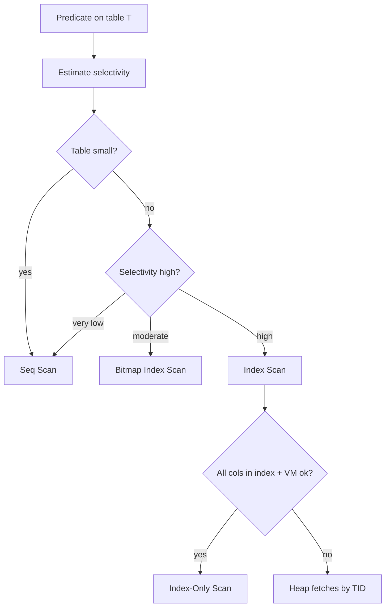
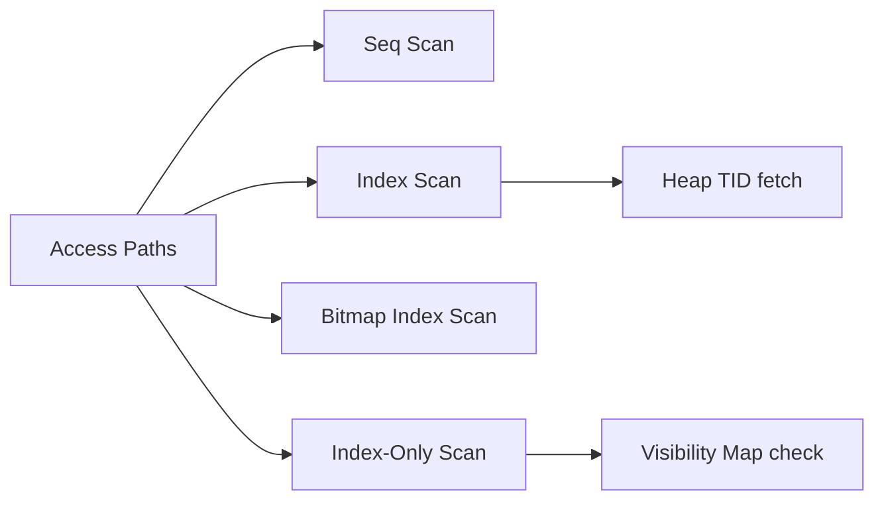
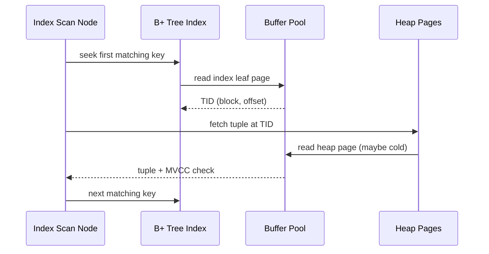

# Access Paths Seq Scan vs Index

## Overview

An **access path** is how the executor retrieves base-table rows: **sequential scan** reads heap pages in order; **index scan** walks a B+ tree (or hash structure) then fetches heap tuples by TID; **bitmap index scan** collects matching TIDs then visits heap pages in physical order; **index-only scan** satisfies queries from index leaf pages when visibility map guarantees are met. The planner picks among these using cost estimates—not "indexes are always faster."

## Learning Objectives

- Contrast seq scan, index scan, bitmap scan, and index-only scan mechanics
- Explain when high selectivity favors indexes and when seq scan wins
- Relate heap fetch random I/O to covering and partial indexes
- Read `EXPLAIN` nodes for access path choice and buffer behavior
- Diagnose missing-index vs wrong-index vs stale-stats scenarios

## Prerequisites

- [[08-Databases/04-Query-Processing-and-Planning/Cost Models Statistics and Cardinality|Cost Models Statistics and Cardinality]]
- [[08-Databases/03-Indexing-on-Disk/B-Plus Trees as Page Structures|B-Plus Trees as Page Structures]]
- [[08-Databases/03-Indexing-on-Disk/Index-Only Scans and Visibility Map Hooks|Index-Only Scans and Visibility Map Hooks]]

## Difficulty

`intermediate`

## Estimated Time

- Reading: 2 hours
- Exercises: 3 hours
- Mini project: 3 hours

## History

Early systems used ISAM indexes with separate heap files. Heap-organized tables with secondary B+ tree indexes (Ingres, Postgres, Oracle) made **clustered vs non-clustered** distinctions important. PostgreSQL's **bitmap index scan** (2000s) reduced random I/O for moderate selectivity by sorting heap visits. Index-only scans leveraged **visibility maps** to skip heap fetches when MVCC visibility could be inferred from the map.

## Problem It Solves

- **Table scans on tiny tables** where index overhead exceeds benefit
- **Random I/O storms** from naive index use on low-selectivity predicates
- **Wide rows** where covering indexes eliminate heap access
- **Production incidents** from "we added an index but query still seq scans"

## Internal Implementation

### Path selection logic (simplified)



**Seq scan** reads all pages (or visible pages), applies filter, benefits from sequential bandwidth and read-ahead. **Index scan** is O(log n + k) index pages plus k heap fetches—each heap fetch may be random. **Bitmap** amortizes heap visits by sorting TIDs.

### Visibility and index-only

Index-only scans require the **visibility map** bit for all relevant heap pages to be set (all-visible), proving no concurrent unvacuumed dead tuples hide visible versions. Otherwise the executor **heap fetches** to verify MVCC visibility.

## Mermaid Diagrams

### Structure



### Sequence / Lifecycle — index scan with heap fetch



## Examples

### Minimal Example — force plan comparison

```sql
-- PostgreSQL 15+
CREATE TABLE accounts (
  id bigint PRIMARY KEY,
  tenant_id int NOT NULL,
  balance numeric(12,2) NOT NULL
);
CREATE INDEX ON accounts (tenant_id);

-- Narrow selectivity — likely index
EXPLAIN (ANALYZE, BUFFERS)
SELECT * FROM accounts WHERE tenant_id = 42;

-- Wide selectivity — likely seq or bitmap
EXPLAIN (ANALYZE, BUFFERS)
SELECT * FROM accounts WHERE tenant_id > 0;

-- Covering index enables index-only when VM allows
CREATE INDEX ON accounts (tenant_id) INCLUDE (balance);
EXPLAIN (ANALYZE, BUFFERS)
SELECT tenant_id, balance FROM accounts WHERE tenant_id = 42;
```

### Production-Shaped Example — index discipline in application

```typescript
// Node 20+ — query shape must match index leading column
import pg from "pg";

export async function listOpenInvoicesForTenant(
  pool: pg.Pool,
  tenantId: number,
  since: Date,
): Promise<Array<{ id: string; total: string }>> {
  // Index: (tenant_id, status, created_at) — predicate order matches left-prefix
  const { rows } = await pool.query(
    `
    SELECT id, total
    FROM invoices
    WHERE tenant_id = $1
      AND status = 'open'
      AND created_at >= $2
    ORDER BY created_at DESC
    LIMIT 100
    `,
    [tenantId, since],
  );
  return rows;
}

// WHERE status = 'open' without tenant_id — may seq scan millions of rows
```

## Trade-offs

| Dimension | Upside | Downside | When it matters |
| --- | --- | --- | --- |
| Seq scan | Sequential bandwidth, simple | Reads entire table | small/wide scans |
| Index scan | Precise for selective preds | Random heap I/O | OLTP point lookups |
| Bitmap scan | Sorts heap visits | Setup cost for tiny k | moderate selectivity |
| Index-only | Avoids heap | VM maintenance, INCLUDE width | read-heavy dashboards |

### When to Use

- Seq scan (or accept it) when reading large fraction of table
- Composite indexes aligned with query filter order
- INCLUDE columns for read-heavy covering paths
- Partial indexes when queries always filter the same subset

### When Not to Use

- Do not index every column "just in case"
- Do not fight seq scan on small tables—it's correct
- Do not use function-wrapped columns without functional indexes

## Exercises

1. Create table with 1M rows; find selectivity crossover where plan flips seq ↔ index.
2. Compare `BUFFERS` shared hit/read for seq vs index scan on cold cache.
3. Build covering index; run query before/after VACUUM to observe index-only eligibility.
4. Explain why `SELECT count(*) FROM t` often seq scans despite indexes.
5. Add partial index `WHERE status = 'open'`; verify planner uses it for matching query only.

## Mini Project

**Access path lab.** Script loads dataset, runs predicate grid, records plan type and execution time heatmap.

## Portfolio Project

Access path explorer in [[08-Databases/projects/EXPLAIN Literacy Workbench/README|EXPLAIN Literacy Workbench]].

## Interview Questions

1. When does PostgreSQL prefer seq scan over index scan?
2. What is a bitmap index scan and why does it exist?
3. What conditions enable index-only scans?
4. What is selectivity and how does it affect access paths?
5. Why might an unused index still hurt write performance?

### Stretch / Staff-Level

1. Explain HOT updates and reduced index maintenance for indexed columns not in update.
2. How do clustered (Postgres: lack thereof) vs heap-ordered tables change index scan costs?

## Common Mistakes

- Adding secondary index without matching query predicate leading edge
- Reading `Seq Scan` in EXPLAIN as automatic failure
- Ignoring visibility map / bloat blocking index-only scans
- Low-cardinality indexes (e.g., boolean) that never get used

## Best Practices

- Design indexes from query shapes and EXPLAIN evidence
- Monitor index usage via `pg_stat_user_indexes`
- Keep statistics fresh after bulk changes
- B-tree fanout pedagogy → [[04-Data-Structures/05-Trees-and-Ordered-Maps/B-Trees and B-Plus Trees Concepts|B-Trees and B-Plus Trees Concepts]]

## Summary

Access paths are the planner's answer to "how do I find rows?" Seq scans leverage sequential I/O when reading much of the table; index paths target selective predicates but pay random heap fetches unless bitmap or index-only optimizations apply. Correct diagnosis requires statistics, selectivity, index definition alignment, and buffer behavior—not reflexive index creation.

## Further Reading

- [[00-References/Databases/README|Databases References]]
- PostgreSQL — Index Types and Using EXPLAIN
- Leis et al., "How Good Are Query Optimizers, Really?"

## Related Notes

- [[08-Databases/04-Query-Processing-and-Planning/Cost Models Statistics and Cardinality|Cost Models Statistics and Cardinality]]
- [[08-Databases/04-Query-Processing-and-Planning/EXPLAIN and EXPLAIN ANALYZE Literacy|EXPLAIN and EXPLAIN ANALYZE Literacy]]
- [[08-Databases/03-Indexing-on-Disk/Secondary Covering and Partial Indexes|Secondary Covering and Partial Indexes]]
- [[08-Databases/03-Indexing-on-Disk/Index-Only Scans and Visibility Map Hooks|Index-Only Scans and Visibility Map Hooks]]

## Progress Checklist

- [ ] Explained from first principles
- [ ] Drew at least one Mermaid diagram
- [ ] Implemented a minimal version
- [ ] Documented trade-offs and non-goals
- [ ] Completed exercises
- [ ] Practiced interview questions aloud
- [ ] Linked prerequisites and dependents
