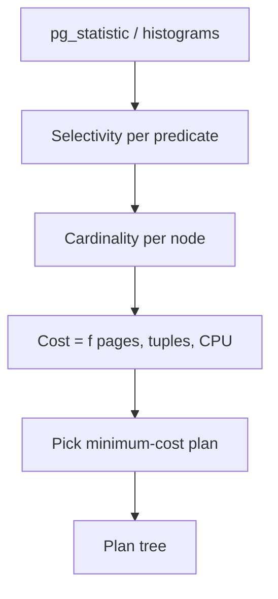
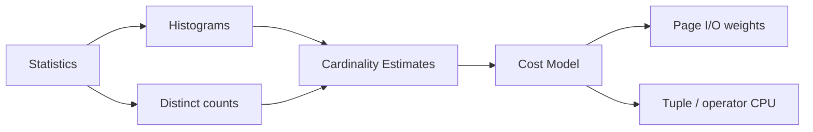
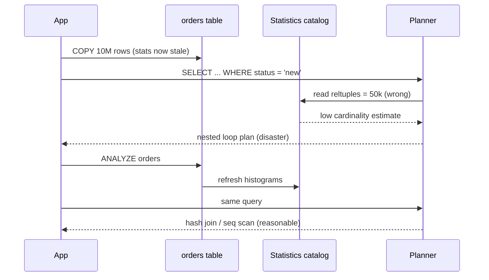

# Cost Models Statistics and Cardinality

## Overview

A **cost-based optimizer** chooses among alternative plans by estimating **cardinality** (row counts at each plan node) and assigning **costs** (abstract units weighting sequential I/O, random I/O, CPU). **Statistics**—table row counts, column histograms, distinct-value counts, correlation summaries—feed those estimates. When statistics lie, plans lie: nested loops on millions of rows, hash joins spilling to disk, or indexes ignored entirely.

## Learning Objectives

- Define cardinality, selectivity, and cost units in optimizer terms
- Explain what `ANALYZE` collects and how stale stats skew plans
- Predict plan flips when data distribution crosses threshold boundaries
- Read `EXPLAIN` row estimates vs actuals as a statistics health signal
- Describe trade-offs between accuracy and analyze/maintenance overhead

## Prerequisites

- [[08-Databases/04-Query-Processing-and-Planning/Parse Bind Plan Execute Pipeline|Parse Bind Plan Execute Pipeline]]
- [[08-Databases/03-Indexing-on-Disk/Secondary Covering and Partial Indexes|Secondary Covering and Partial Indexes]]

## Difficulty

`advanced`

## Estimated Time

- Reading: 2.5 hours
- Exercises: 3 hours
- Mini project: 4 hours

## History

System R (1970s) introduced cost-based optimization with catalog statistics. Commercial systems added histograms (equi-width, equi-depth), multi-column stats, and feedback loops. PostgreSQL's planner uses a configurable cost model (`seq_page_cost`, `random_page_cost`, `cpu_tuple_cost`) and extended statistics for expressions and dependencies. The fundamental tension—cheap estimates vs accurate plans—remains unsolved for arbitrary correlated predicates.

## Problem It Solves

- **Wrong join order** exploding intermediate row counts
- **Index avoidance** when the optimizer underestimates result size
- **Sudden regressions** after bulk load without `ANALYZE`
- **Parameter sniffing** when one plan fits the common case but not tail values

## Internal Implementation

### Estimation chain



**Selectivity** for `col = constant` often uses histogram frequency; for ranges, cumulative bucket counts. **Join cardinality** assumes independence unless extended stats declare correlation: `rows(A ⋈ B) ≈ rows(A) × rows(B) × sel(A) × sel(B) / max(distinct join keys)` (simplified).

PostgreSQL **cost** is not milliseconds—it is a linear combination of estimated page fetches and tuple processing. Calibrate with `EXPLAIN ANALYZE` on representative hardware.

### Key catalog objects (PostgreSQL)

| Object | Role |
| --- | --- |
| `pg_class.reltuples` | Estimated live rows |
| `pg_statistic` | Per-column histograms, null fraction, avg width |
| Extended stats | Functional dependencies, ndistinct combinations |
| `default_statistics_target` | Histogram resolution vs analyze time |

## Mermaid Diagrams

### Structure



### Sequence / Lifecycle — ANALYZE after bulk load



## Examples

### Minimal Example — estimate vs actual

```sql
-- PostgreSQL 15+
CREATE TABLE events (
  id bigserial PRIMARY KEY,
  kind text NOT NULL,
  created_at timestamptz NOT NULL DEFAULT now()
);
CREATE INDEX ON events (kind);

INSERT INTO events (kind)
SELECT CASE WHEN random() < 0.01 THEN 'rare' ELSE 'common' END
FROM generate_series(1, 500_000);

ANALYZE events;

EXPLAIN (ANALYZE, BUFFERS)
SELECT * FROM events WHERE kind = 'rare';
-- Compare rows= estimate vs actual — tail skew stresses histograms
```

### Production-Shaped Example — monitor stats freshness

```typescript
// Node 20+ — alert when reltuples diverges from live count
import pg from "pg";

type StaleStat = { table: string; estimated: number; live: number; ratio: number };

export async function findStaleTableStats(
  pool: pg.Pool,
  thresholdRatio = 2.0,
): Promise<StaleStat[]> {
  const sql = `
    SELECT
      c.relname AS table,
      c.reltuples::bigint AS estimated,
      s.n_live_tup AS live,
      CASE WHEN c.reltuples > 0
        THEN s.n_live_tup / c.reltuples
        ELSE 1
      END AS ratio
    FROM pg_class c
    JOIN pg_stat_user_tables s ON s.relid = c.oid
    WHERE c.relkind = 'r'
      AND s.n_live_tup > 10000
  `;
  const { rows } = await pool.query(sql);
  return rows.filter(
    (r) => r.ratio > thresholdRatio || r.ratio < 1 / thresholdRatio,
  );
}
```

### Toy cost chooser (TypeScript)

```typescript
type AccessPath = "seqScan" | "indexScan";

function estimateSeqCost(pages: number, seqPageCost = 1.0): number {
  return pages * seqPageCost;
}

function estimateIndexCost(
  indexPages: number,
  heapPages: number,
  matchingTuples: number,
  randomPageCost = 4.0,
): number {
  // index walk + heap fetches (simplified correlation=0 worst case)
  return indexPages * randomPageCost + matchingTuples * randomPageCost;
}

function choosePath(
  tablePages: number,
  selectivity: number,
  tableRows: number,
): AccessPath {
  const matching = tableRows * selectivity;
  const seq = estimateSeqCost(tablePages);
  const idx = estimateIndexCost(
    Math.ceil(tablePages / 50),
    tablePages,
    matching,
  );
  return seq <= idx ? "seqScan" : "indexScan";
}
```

## Trade-offs

| Dimension | Upside | Downside | When it matters |
| --- | --- | --- | --- |
| Higher statistics target | Finer histograms | Longer ANALYZE, bigger catalog | skewed columns |
| Extended stats | Better correlated preds | Manual creation/maintenance | composite filters |
| Simple cost constants | Portable EXPLAIN reading | Mis-ranked plans on SSD/NVMe | cloud disk tiers |
| Frequent autovacuum/analyze | Fresh plans | Background I/O | churning tables |

### When to Use

- `ANALYZE` after large loads, migrations, or partition swaps
- Extended statistics for known correlated columns (e.g., `country`, `postal_code`)
- Compare estimated vs actual rows in `EXPLAIN ANALYZE` during query reviews

### When Not to Use

- Do not hand-tune `random_page_cost` without measurement on your storage
- Do not create extended stats on every column pair preemptively
- Do not assume ORM-generated SQL has stable selectivity—verify plans

## Exercises

1. Load a skewed column; plot estimate/actual ratio for 10 predicate values.
2. Change `random_page_cost` from 4 to 1.1; document plan flips for one query.
3. Create extended statistics on two correlated columns; compare plans before/after.
4. Explain why independence assumption breaks for `WHERE a BETWEEN x AND y AND b BETWEEN x AND y`.
5. Implement `choosePath` and find selectivity crossover where index wins.

## Mini Project

**Stats drift dashboard.** Nightly job comparing `reltuples` vs `n_live_tup`; Slack alert with suggested `ANALYZE`.

## Portfolio Project

Cost estimation module in [[08-Databases/projects/EXPLAIN Literacy Workbench/README|EXPLAIN Literacy Workbench]] with synthetic skew datasets.

## Interview Questions

1. What is cardinality estimation and why do optimizers depend on it?
2. What happens to plans when statistics are stale after a bulk insert?
3. Difference between selectivity and distinct count?
4. Why are PostgreSQL costs unitless, not milliseconds?
5. What is extended statistics used for?

### Stretch / Staff-Level

1. Explain parameter sniffing and mitigation strategies (adaptive plans, statement-level hints trade-offs).
2. How would you detect correlated predicates breaking independence without extended stats?

## Common Mistakes

- Running benchmarks on empty tables (optimizer chooses nested loops forever)
- Ignoring `rows=` mismatch in EXPLAIN ANALYZE
- Creating indexes without checking whether planner would use them at realistic selectivity
- Forgetting ANALYZE on newly created partitions

## Best Practices

- Automate post-migration ANALYZE; monitor stats/row-count drift
- Review worst queries by total time *and* by estimate error
- Store production-shaped data volumes in staging for plan validation
- External sort algorithm details → [[05-Algorithms/README|Algorithms]]

## Summary

Optimizers rank plans with abstract costs driven by cardinality estimates from catalog statistics. Histograms and distinct-value counts approximate selectivity; when they diverge from reality, plans become silently wrong long before queries error. Operational discipline—timely ANALYZE, extended stats for correlated columns, and estimate-vs-actual review—is as important as index design.

## Further Reading

- [[00-References/Databases/README|Databases References]]
- PostgreSQL — Planner Cost Constants and Statistics Used by the Planner
- Ioannidis, "The History of Histograms"

## Related Notes

- [[08-Databases/04-Query-Processing-and-Planning/Access Paths Seq Scan vs Index|Access Paths Seq Scan vs Index]]
- [[08-Databases/04-Query-Processing-and-Planning/Join Algorithms Nested Loop Hash Merge|Join Algorithms Nested Loop Hash Merge]]
- [[08-Databases/04-Query-Processing-and-Planning/EXPLAIN and EXPLAIN ANALYZE Literacy|EXPLAIN and EXPLAIN ANALYZE Literacy]]
- [[08-Databases/03-Indexing-on-Disk/Secondary Covering and Partial Indexes|Secondary Covering and Partial Indexes]]

## Progress Checklist

- [ ] Explained from first principles
- [ ] Drew at least one Mermaid diagram
- [ ] Implemented a minimal version
- [ ] Documented trade-offs and non-goals
- [ ] Completed exercises
- [ ] Practiced interview questions aloud
- [ ] Linked prerequisites and dependents
