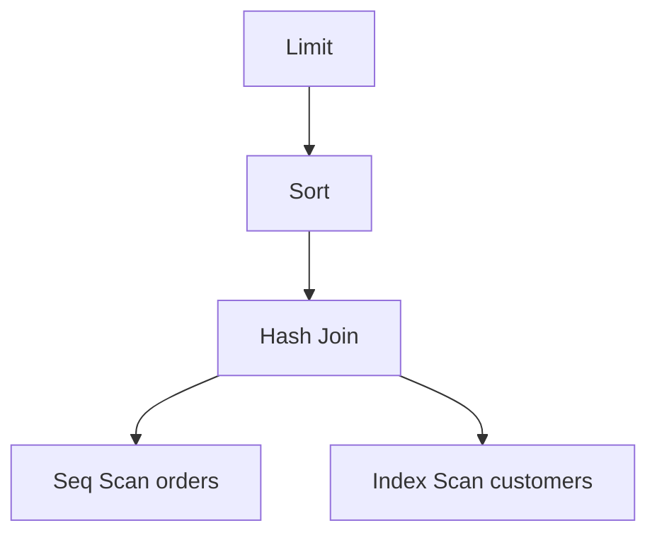
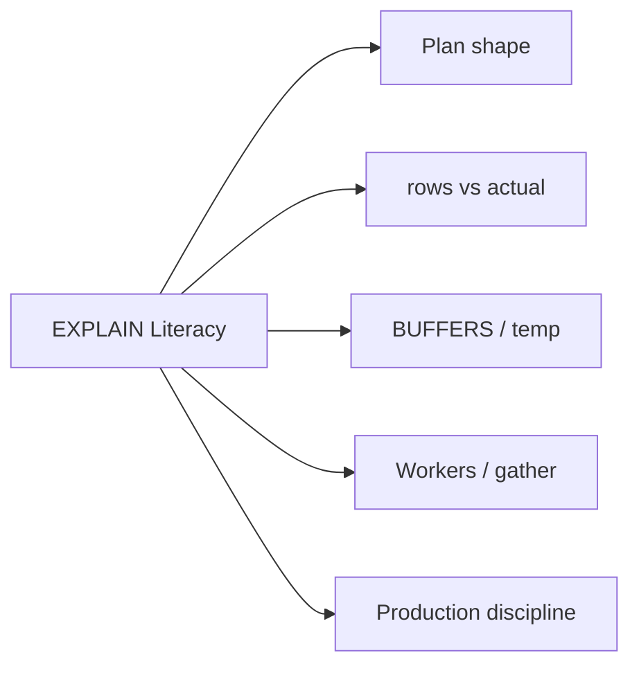
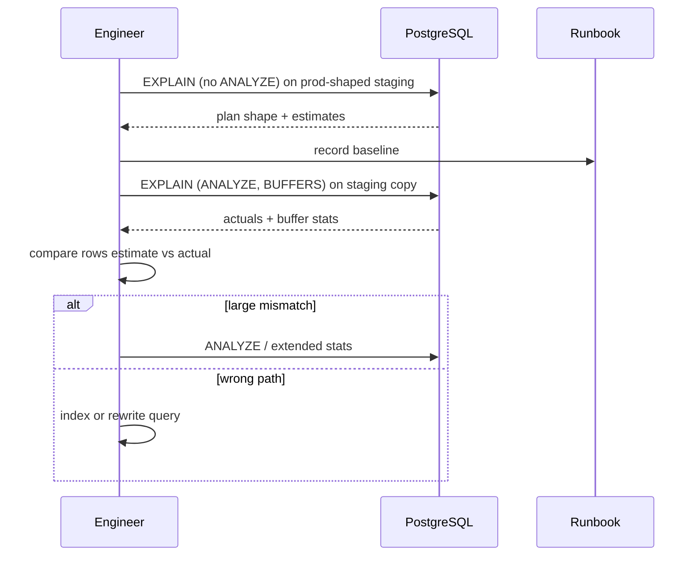

# EXPLAIN and EXPLAIN ANALYZE Literacy

## Overview

`EXPLAIN` shows the **planned** execution tree without running the query (except planning side effects). `EXPLAIN ANALYZE` **executes** the query and annotates nodes with **actual** timings, row counts, and loops. Options like `BUFFERS`, `WAL`, and `SETTINGS` expose I/O and configuration context. Reading plans is the primary skill for distinguishing index problems, join explosions, spill-to-disk, and stale statistics.

## Learning Objectives

- Read nested plan nodes: scans, joins, sorts, aggregates, limits
- Compare estimated vs actual rows to detect stats issues
- Interpret `BUFFERS` shared hit/read and temp file usage
- Use safe EXPLAIN ANALYZE practices on production-shaped workloads
- Map plan symptoms to remediation (stats, indexes, query rewrite, config)

## Prerequisites

- [[08-Databases/04-Query-Processing-and-Planning/Parse Bind Plan Execute Pipeline|Parse Bind Plan Execute Pipeline]]
- [[08-Databases/04-Query-Processing-and-Planning/Access Paths Seq Scan vs Index|Access Paths Seq Scan vs Index]]

## Difficulty

`intermediate`

## Estimated Time

- Reading: 2 hours
- Exercises: 4 hours
- Mini project: 5 hours

## History

IBM System R pioneered EXPLAIN-style plan display. PostgreSQL's text plan format evolved with new nodes (CTE scans, parallel gather, incremental sort). `EXPLAIN ANALYZE` adds executor instrumentation—critical but dangerous on mutating statements without transactions. Modern tools (PEV, explain.depesz.com, pgMustard) visualize plans but cannot replace knowing node semantics.

## Problem It Solves

- **Blind index creation** without evidence of seq scans at scale
- **Misread latency** attributing execution time to wrong node
- **Hidden spills** when sorts/hash joins write temp files
- **Production debugging** without repeatable plan artifacts

## Internal Implementation

### Plan tree reading order

Plans are **inside-out** or **top-down** depending on format; PostgreSQL text format is depth-indented. Key fields:

| Field | Meaning |
| --- | --- |
| `cost=startup..total` | Unitless planner estimate |
| `rows=` | Estimated rows at this node |
| `width=` | Avg row bytes estimate |
| `actual time=.. rows=` | Measured (ANALYZE only) |
| `loops=` | Nested loop iterations |
| `Buffers: shared hit/read` | Cache vs disk pages |



### EXPLAIN vs EXPLAIN ANALYZE

| Mode | Runs query? | Timing | Side effects |
| --- | --- | --- | --- |
| EXPLAIN | No | Planner costs only | None on data |
| EXPLAIN ANALYZE | Yes | Actual per-node | Writes if DML |
| EXPLAIN (BUFFERS) | With ANALYZE | + buffer counts | Needs track_io_timing optional |

## Mermaid Diagrams

### Structure



### Sequence / Lifecycle — diagnostic workflow



## Examples

### Minimal Example — canonical EXPLAIN ANALYZE

```sql
-- PostgreSQL 15+ — run on staging, not prod writes without rollback
BEGIN;
EXPLAIN (ANALYZE, BUFFERS, VERBOSE, FORMAT TEXT)
SELECT o.id, c.name
FROM orders o
JOIN customers c ON c.id = o.customer_id
WHERE o.status = 'pending'
ORDER BY o.created_at DESC
LIMIT 50;
ROLLBACK;
```

### Production-Shaped Example — capture plans in TypeScript

```typescript
// Node 20+ — log plans for slow queries in staging mirror
import pg from "pg";

export type PlanCapture = {
  queryId: string;
  plan: string;
  planningMs: number;
  executionMs: number;
};

export async function captureExplainAnalyze(
  client: pg.PoolClient,
  sql: string,
  params: unknown[],
): Promise<PlanCapture> {
  await client.query("BEGIN");
  try {
    const explainSql = `EXPLAIN (ANALYZE, BUFFERS, FORMAT JSON) ${sql}`;
    const start = performance.now();
    const { rows } = await client.query(explainSql, params);
    const elapsed = performance.now() - start;
    const planJson = rows[0]["QUERY PLAN"][0];
    return {
      queryId: planJson["Query Identifier"] ?? "unknown",
      plan: JSON.stringify(planJson, null, 2),
      planningMs: planJson["Planning Time"] ?? 0,
      executionMs: planJson["Execution Time"] ?? elapsed,
    };
  } finally {
    await client.query("ROLLBACK");
  }
}
```

### Reading checklist (TypeScript comment artifact)

```typescript
/**
 * Plan review checklist:
 * 1. Largest actual time node — is it expected?
 * 2. rows= estimate vs actual — >10x mismatch → stats
 * 3. Seq Scan on large table — selective predicate?
 * 4. Hash Join Batches > 1 — work_mem spill
 * 5. Sort Method: external merge — sort spill
 * 6. Buffers: read >> hit on hot query — cache miss / cold start
 * 7. Nested Loop inner seq scan — missing index?
 */
```

## Trade-offs

| Dimension | Upside | Downside | When it matters |
| --- | --- | --- | --- |
| EXPLAIN only | Safe on prod | No actuals | quick shape check |
| EXPLAIN ANALYZE | Ground truth timing | Runs query, load | staging / rollback |
| JSON format | Tooling integration | Harder human read | CI plan diff |
| VERBOSE | Column lists | Noise | deep debugging |

### When to Use

- `EXPLAIN` first for DDL-sensitive or production read traffic
- `EXPLAIN (ANALYZE, BUFFERS)` on staging with production stats snapshot
- JSON plans stored in CI for regression detection on critical queries

### When Not to Use

- Do not `EXPLAIN ANALYZE` destructive DML on production without safeguards
- Do not optimize cold-cache single runs as SLA proof
- Do not trust plans on empty dev databases

## Exercises

1. Annotate each node in a sample plan with plain-English role.
2. Find a query where actual rows differ 100× from estimate; fix with ANALYZE or extended stats.
3. Force hash join spill; identify `temp read/written` in EXPLAIN ANALYZE.
4. Compare `FORMAT TEXT` vs `FORMAT JSON` for same query; extract execution time programmatically.
5. Write a runbook: when to use EXPLAIN vs ANALYZE in prod incident response.

## Mini Project

**Plan diff tool.** Store JSON plans before/after migration; fail CI if critical node adds Seq Scan on large rel.

## Portfolio Project

[[08-Databases/projects/EXPLAIN Literacy Workbench/README|EXPLAIN Literacy Workbench]] — interactive plan annotator.

## Interview Questions

1. Difference between EXPLAIN and EXPLAIN ANALYZE?
2. What does `rows=` mismatch indicate?
3. How do you read `BUFFERS: shared hit= vs read=`?
4. What does `Hash Join Batches: 2` suggest?
5. Why wrap EXPLAIN ANALYZE DML in a transaction?

### Stretch / Staff-Level

1. Explain parallel gather nodes and when workers help vs hurt.
2. How would you detect plan regression automatically in CI with noisy timings?

## Common Mistakes

- Running ANALYZE on `UPDATE`/`DELETE` in production without rollback
- Optimizing the wrong node (parent time includes children)
- Ignoring `loops=` multiplying nested loop cost
- Single cold-run benchmark after restart

## Best Practices

- Always pair plan review with buffer stats for I/O-bound queries
- Capture parameters used when plan is sensitive to bind values
- Use pg_stat_statements for aggregate stats; EXPLAIN for individual shape
- Service query shaping → [[07-Backend/08-Data-Access-and-Persistence-Patterns/N-plus-1 and Query Shape Discipline|N-plus-1 and Query Shape Discipline]]

## Summary

EXPLAIN reveals the planner's intent; EXPLAIN ANALYZE measures reality at each node. Literacy means reading scan/join/sort nodes, comparing estimates to actuals, and interpreting buffer and temp I/O—not memorizing node names. Safe discipline separates read-only shape checks from analyze runs on staging copies with production-like data and rollback for writes.

## Further Reading

- [[00-References/Databases/README|Databases References]]
- PostgreSQL — Using EXPLAIN
- explain.depesz.com plan visualizer

## Related Notes

- [[08-Databases/04-Query-Processing-and-Planning/Cost Models Statistics and Cardinality|Cost Models Statistics and Cardinality]]
- [[08-Databases/04-Query-Processing-and-Planning/Join Algorithms Nested Loop Hash Merge|Join Algorithms Nested Loop Hash Merge]]
- [[08-Databases/04-Query-Processing-and-Planning/Access Paths Seq Scan vs Index|Access Paths Seq Scan vs Index]]
- [[08-Databases/12-Production-Database-Ops/Monitoring Checkpoints Lag Bloat Cache Hit|Monitoring Checkpoints Lag Bloat Cache Hit]]

## Progress Checklist

- [ ] Explained from first principles
- [ ] Drew at least one Mermaid diagram
- [ ] Implemented a minimal version
- [ ] Documented trade-offs and non-goals
- [ ] Completed exercises
- [ ] Practiced interview questions aloud
- [ ] Linked prerequisites and dependents
