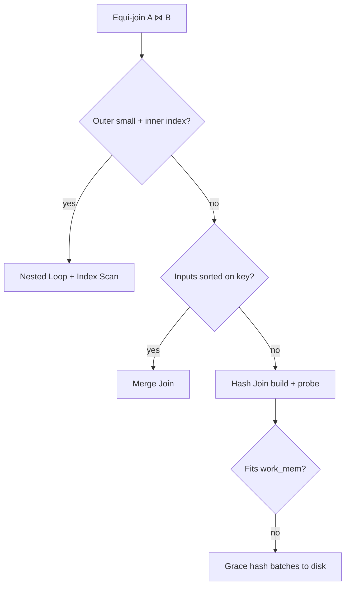
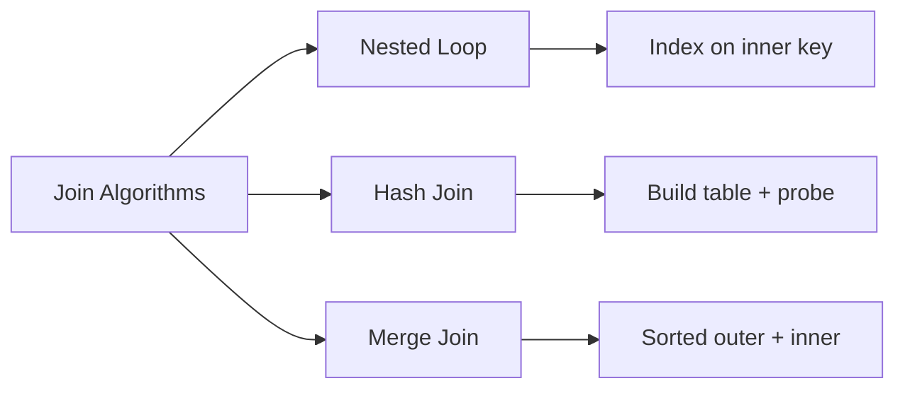
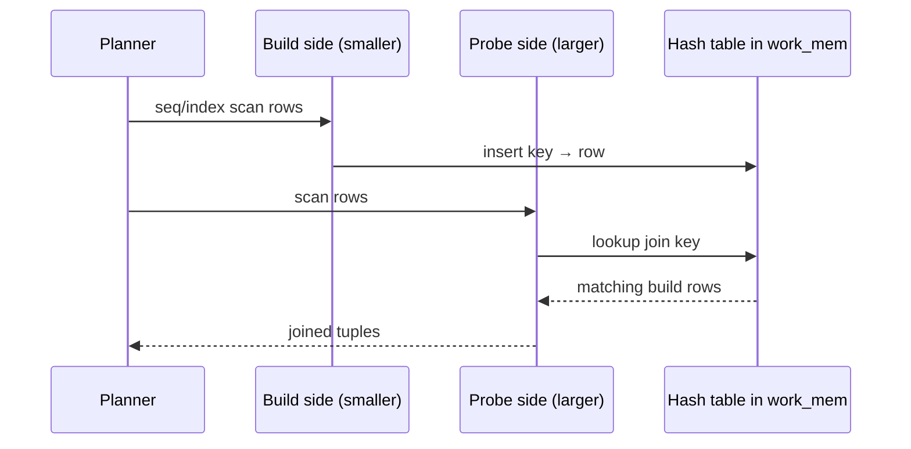

# Join Algorithms Nested Loop Hash Merge

## Overview

Relational joins combine rows from two inputs on a predicate (typically equality on keys). Executors implement **nested loop join** (for each outer row, scan inner), **hash join** (build hash table on smaller input, probe with larger), and **merge join** (both inputs sorted on join keys, single synchronized pass). The planner picks based on cardinality, available indexes/sorts, and memory (`work_mem`).

## Learning Objectives

- Describe algorithmic behavior and complexity of nested loop, hash, and merge joins
- Explain when hash join spills to disk and how batching works
- Predict join order impact on intermediate row counts
- Read join nodes in EXPLAIN (`Nested Loop`, `Hash Join`, `Merge Join`)
- Connect join choice to index availability and sort requirements

## Prerequisites

- [[08-Databases/04-Query-Processing-and-Planning/Access Paths Seq Scan vs Index|Access Paths Seq Scan vs Index]]
- [[08-Databases/04-Query-Processing-and-Planning/Cost Models Statistics and Cardinality|Cost Models Statistics and Cardinality]]

## Difficulty

`advanced`

## Estimated Time

- Reading: 2.5 hours
- Exercises: 3.5 hours
- Mini project: 4 hours

## History

System R introduced dynamic programming for join ordering. Hash joins (early 1980s, e.g., Grace hash join) made equi-joins feasible without sorting both sides. Merge joins exploit sorted inputs—cheap when indexes provide order. PostgreSQL supports all three; MySQL historically leaned nested loop with index lookups; SQL Server and Oracle use hybrid strategies with bitmap/filter optimizations.

## Problem It Solves

- **Cartesian explosions** from wrong join order
- **Memory blowups** when hash tables exceed `work_mem`
- **Repeated index probes** when nested loop inner side lacks index
- **Sort-heavy plans** when merge join is chosen without pre-sorted inputs

## Internal Implementation

### Algorithm summary

| Algorithm | Best when | Risk |
| --- | --- | --- |
| Nested Loop | Outer small, inner indexed | O(n×m) without index |
| Hash Join | Equi-join, one side fits memory | Spill to disk if oversized |
| Merge Join | Both sides sorted on join key | Sort cost if inputs unsorted |



### Hash join phases

1. **Build**: scan smaller relation, insert join-key → row into in-memory hash table (buckets).
2. **Probe**: scan larger relation, lookup key, emit matches.
3. **Spill**: if build exceeds `work_mem`, partition both sides to temp files, join per partition (Grace).

Nested loop with **inner index scan** is effectively O(n log m) when outer has n rows and inner index supports O(log m) lookup per row.

## Mermaid Diagrams

### Structure



### Sequence / Lifecycle — hash join



## Examples

### Minimal Example — observe join types

```sql
-- PostgreSQL 15+
CREATE TABLE customers (id int PRIMARY KEY, region text);
CREATE TABLE orders (
  id bigserial PRIMARY KEY,
  customer_id int REFERENCES customers(id),
  amount numeric(10,2)
);
CREATE INDEX ON orders (customer_id);

INSERT INTO customers SELECT g, 'us' FROM generate_series(1, 10000) g;
INSERT INTO orders
SELECT g, (random() * 9999 + 1)::int, random() * 1000
FROM generate_series(1, 500000) g;

ANALYZE customers; ANALYZE orders;

-- Small outer filter → nested loop common
EXPLAIN (ANALYZE, BUFFERS)
SELECT c.id, o.amount
FROM customers c
JOIN orders o ON o.customer_id = c.id
WHERE c.id = 42;

-- Large join → hash join common
EXPLAIN (ANALYZE, BUFFERS)
SELECT count(*)
FROM customers c
JOIN orders o ON o.customer_id = c.id;
```

### Production-Shaped Example — avoid join shape mistakes

```typescript
// Node 20+ — filter before join in SQL, not in app memory
import pg from "pg";

export async function revenueByRegion(
  pool: pg.Pool,
  year: number,
): Promise<Array<{ region: string; revenue: string }>> {
  // Planner can hash join filtered subsets; pushing filter enables index use
  const { rows } = await pool.query(
    `
    SELECT c.region, sum(o.amount) AS revenue
    FROM orders o
    JOIN customers c ON c.id = o.customer_id
    WHERE o.created_at >= make_date($1, 1, 1)
      AND o.created_at < make_date($1 + 1, 1, 1)
    GROUP BY c.region
    `,
    [year],
  );
  return rows;
}
```

### Toy hash join (TypeScript)

```typescript
function hashJoin(
  build: Array<{ key: number; payload: string }>,
  probe: Array<{ key: number; payload: string }>,
): Array<[string, string]> {
  const table = new Map<number, Array<string>>();
  for (const row of build) {
    const bucket = table.get(row.key) ?? [];
    bucket.push(row.payload);
    table.set(row.key, bucket);
  }
  const out: Array<[string, string]> = [];
  for (const row of probe) {
    const matches = table.get(row.key);
    if (!matches) continue;
    for (const b of matches) out.push([b, row.payload]);
  }
  return out;
}
```

## Trade-offs

| Dimension | Upside | Downside | When it matters |
| --- | --- | --- | --- |
| Nested loop | Low memory, fast for tiny outer | Disaster without inner index | ORM N+1 patterns |
| Hash join | Great for large equi-joins | Memory + spill risk | analytics joins |
| Merge join | Streaming if sorted | Sort/setup cost | time-series on indexed ts |
| Join order | Minimizes intermediates | Wrong order = temp files | multi-table OLAP |

### When to Use

- Ensure join keys indexed when nested loop expected (FK lookups)
- Increase `work_mem` session-local for known large hash joins (carefully)
- Pre-sort or index on merge join keys for recurring reports

### When Not to Use

- Do not join in application code row-by-row when SQL join is appropriate
- Do not globally raise `work_mem` without connection limits
- Do not assume merge join without verifying sort avoided

## Exercises

1. Produce EXPLAIN plans showing nested loop, hash, and merge joins on same schema (hint: adjust sizes/filters).
2. Lower `work_mem` until hash join spills; observe temp file usage in EXPLAIN ANALYZE.
3. Remove inner index; compare nested loop cost before/after.
4. Implement `hashJoin` and verify output matches SQL join on sample data.
5. Draw join order tree for 4-table query and identify largest intermediate.

## Mini Project

**Join micro-benchmark.** Same equi-join at three scale points; chart algorithm choice and runtime vs `work_mem`.

## Portfolio Project

Join visualization in [[08-Databases/projects/EXPLAIN Literacy Workbench/README|EXPLAIN Literacy Workbench]].

## Interview Questions

1. Compare nested loop, hash, and merge joins.
2. When does hash join spill to disk?
3. Why is join order important?
4. What makes nested loop join efficient in OLTP?
5. What is `work_mem` and what does it affect?

### Stretch / Staff-Level

1. Explain Grace hash join partitioning at a high level.
2. How would you diagnose a sudden shift from hash join to nested loop after a deployment?

## Common Mistakes

- ORM lazy-loading causing nested loop in application (N+1), not in database
- Missing FK indexes turning hash-eligible joins into seq nested loops
- Ignoring `Hash Buckets` / `Batches` lines in EXPLAIN ANALYZE
- Filtering after join in subquery instead of pushing predicates

## Best Practices

- Index foreign keys used in joins
- Review multi-table EXPLAIN for intermediate row estimates
- Use SQL to join; reserve app-side joins for tiny in-memory sets
- External merge sort details → [[05-Algorithms/README|Algorithms]]

## Summary

Join algorithms trade memory, sort requirements, and index availability. Nested loops excel when the outer set is small and the inner side is indexed; hash joins dominate large equi-joins until memory forces spill; merge joins win when inputs arrive sorted. Wrong cardinality estimates or missing indexes silently flip algorithms—EXPLAIN and realistic stats are mandatory.

## Further Reading

- [[00-References/Databases/README|Databases References]]
- PostgreSQL — Join Planning
- Schneider & DeWitt, "A Performance Evaluation of Four Parallel Join Algorithms"

## Related Notes

- [[08-Databases/04-Query-Processing-and-Planning/Cost Models Statistics and Cardinality|Cost Models Statistics and Cardinality]]
- [[08-Databases/04-Query-Processing-and-Planning/EXPLAIN and EXPLAIN ANALYZE Literacy|EXPLAIN and EXPLAIN ANALYZE Literacy]]
- [[07-Backend/08-Data-Access-and-Persistence-Patterns/N-plus-1 and Query Shape Discipline|N-plus-1 and Query Shape Discipline]]
- [[08-Databases/03-Indexing-on-Disk/B-Plus Trees as Page Structures|B-Plus Trees as Page Structures]]

## Progress Checklist

- [ ] Explained from first principles
- [ ] Drew at least one Mermaid diagram
- [ ] Implemented a minimal version
- [ ] Documented trade-offs and non-goals
- [ ] Completed exercises
- [ ] Practiced interview questions aloud
- [ ] Linked prerequisites and dependents
