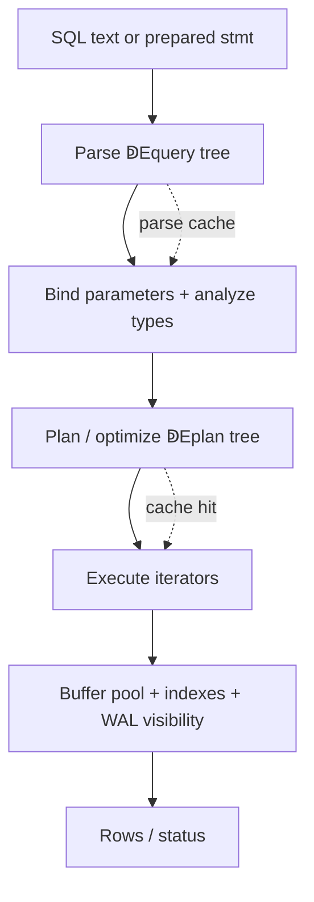
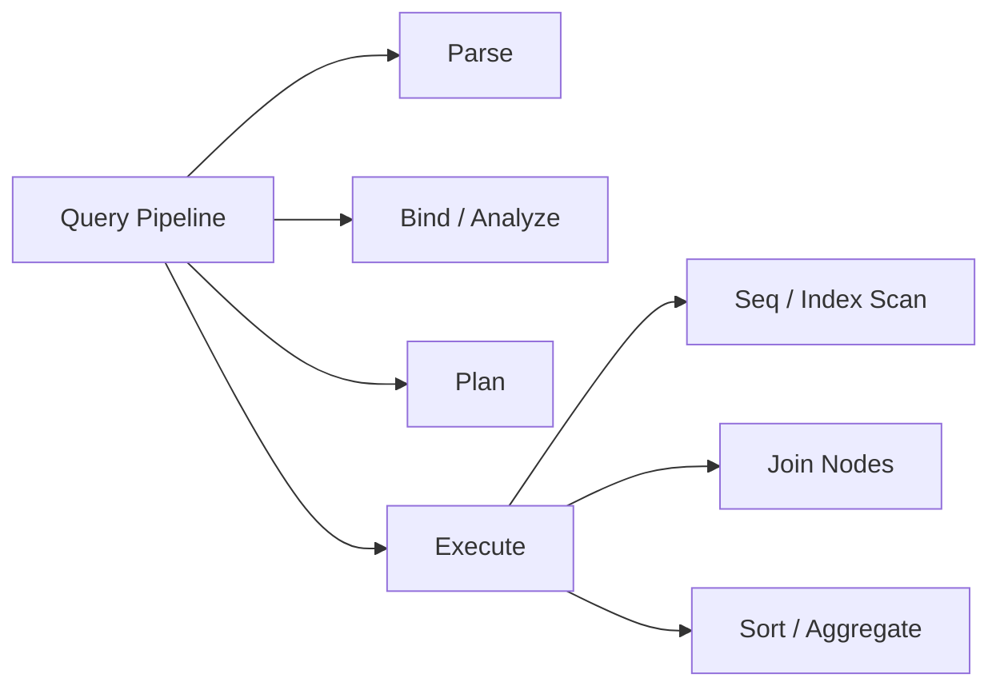
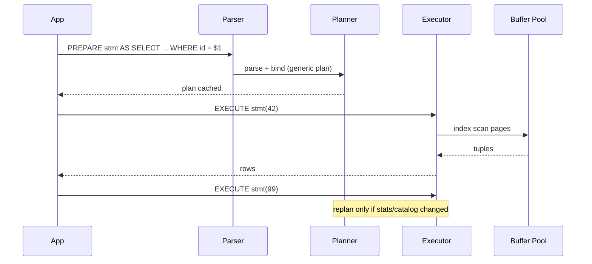

# Parse Bind Plan Execute Pipeline

## Overview

Every SQL statement traverses a **pipeline**: **parse** (text ↁEsyntax tree), **bind** (substitute parameters, resolve names/types), **plan** (choose access paths and join order), **execute** (run iterators against pages/buffers). Understanding this pipeline explains why identical-looking queries differ in latency, why prepared statements help, and why ORMs that emit dynamic SQL defeat plan caching.

## Learning Objectives

- Name the four pipeline stages and what each produces
- Explain parse vs plan cache behavior and invalidation triggers
- Describe how bind parameters affect security and plan reuse
- Connect the executor to buffer pool page fetches and WAL visibility
- Diagnose "slow only first time" vs "slow every time" from pipeline symptoms

## Prerequisites

- [[08-Databases/01-Storage-and-Buffer-Pool/Pages Blocks and IO Units|Pages Blocks and I/O Units]]
- [[08-Databases/03-Indexing-on-Disk/B-Plus Trees as Page Structures|B-Plus Trees as Page Structures]]

## Difficulty

`intermediate`

## Estimated Time

- Reading: 2 hours
- Exercises: 2.5 hours
- Mini project: 3 hours

## History

Early relational systems parsed and executed immediately. As optimizers grew (System R, Postgres, Oracle), **separation of planning from execution** became mandatory: planning is CPU-heavy and benefits from caching; execution is I/O-heavy and must be restartable after errors. Prepared statements (ODBC, JDBC, PostgreSQL extended query protocol) formalized **bind** as a distinct stage so applications could reuse plans safely.

## Problem It Solves

- **SQL injection** when user input is concatenated instead of bound
- **Plan instability** when literals force re-planning on every call
- **Misattributed latency** ("DB is slow" when parse/plan dominates short queries)
- **Wrong optimization target** tuning indexes without knowing whether the planner even considered them

## Internal Implementation

### Stage responsibilities

| Stage | Input | Output | Typical cost |
| --- | --- | --- | --- |
| Parse | SQL text | Query tree (unresolved) | CPU, cached in PG |
| Bind / Analyze | Tree + params + catalog | Query tree with types, constraints | Catalog lookups |
| Plan / Optimize | Bound tree + stats | Plan tree (access paths, joins) | CPU, may cache |
| Execute | Plan + params | Result tuples / row count | I/O, locks, CPU |



### Executor model

Modern engines compile plans into **iterator trees** (Volcano/Graffiti model): each node implements `open`, `next`, `close`. A sequential scan node reads heap pages; an index scan walks B+ tree leaves; a nested-loop join calls `next` on outer then inner. Execution is **pull-based**: the root node drives work.

PostgreSQL additionally supports **JIT compilation** of expression evaluation (not whole-plan compilation) for CPU-heavy analytics queries.

## Mermaid Diagrams

### Structure



### Sequence / Lifecycle  Eprepared statement



## Examples

### Minimal Example  Eobserve parse vs execute

```sql
-- PostgreSQL 15+
-- First run pays parse+plan; subsequent identical text may hit caches.
EXPLAIN (VERBOSE, COSTS OFF)
SELECT o.id, c.name
FROM orders o
JOIN customers c ON c.id = o.customer_id
WHERE o.status = 'pending';

-- Repeat immediately  Ecompare Total Time in EXPLAIN ANALYZE if enabled.
```

### Production-Shaped Example  Eparameterized query from TypeScript

```typescript
// Node 20+ / pg 8.x  Ebind parameters, reuse client, avoid string concat
import pg from "pg";

const pool = new pg.Pool({ connectionString: process.env.DATABASE_URL });

export async function findOrdersByStatus(
  status: string,
  limit: number,
): Promise<Array<{ id: number; customerName: string }>> {
  // Named prepared statement: parse+plan once per connection/session semantics vary
  const sql = `
    SELECT o.id, c.name AS customer_name
    FROM orders o
    JOIN customers c ON c.id = o.customer_id
    WHERE o.status = $1
    ORDER BY o.created_at DESC
    LIMIT $2
  `;
  const { rows } = await pool.query(sql, [status, limit]);
  return rows.map((r) => ({ id: r.id, customerName: r.customer_name }));
}

// Anti-pattern (do NOT): `WHERE status = '${status}'`  Eparse/plan churn + injection
```

### Educational TypeScript  Etoy pipeline sketch

```typescript
// Educational only  Enot a real SQL engine
type BoundQuery = { table: string; filter: { col: string; paramIndex: number } };
type PlanNode =
  | { kind: "seqScan"; table: string }
  | { kind: "indexScan"; table: string; index: string };

function parse(sql: string): BoundQuery {
  // lexer/parser ↁEtree (omitted)
  return { table: "orders", filter: { col: "status", paramIndex: 0 } };
}

function plan(q: BoundQuery, hasIndex: boolean): PlanNode {
  return hasIndex
    ? { kind: "indexScan", table: q.table, index: `idx_${q.table}_${q.filter.col}` }
    : { kind: "seqScan", table: q.table };
}

function execute(node: PlanNode, params: unknown[]): unknown[] {
  // pull tuples from storage layer (omitted)
  console.log("executing", node, "with", params);
  return [];
}
```

## Trade-offs

| Dimension | Upside | Downside | When it matters |
| --- | --- | --- | --- |
| Plan caching | Fast repeat execution | Stale plans after DDL/stats drift | high-QPS OLTP |
| Generic vs custom plans | Stable latency for prepared stmts | Suboptimal for skewed params | uneven data distribution |
| Dynamic SQL | Flexible ORM queries | Parse/plan overhead | short transactions |
| Simple executor (iterators) | Uniform interface | Interpretation overhead vs compiled | analytics vs OLTP |

### When to Use

- Prepared statements with bound parameters for hot OLTP paths
- `EXPLAIN` (without ANALYZE first) to inspect plan shape cheaply
- Stable query shapes so plan cache hits remain high

### When Not to Use

- Do not disable bind parameters for "convenience"
- Do not assume one plan fits all parameter values—verify with realistic binds
- Do not micro-manage parse cache; fix schema stats and indexes first

## Exercises

1. Run the same `SELECT` with a literal vs `$1` bind; compare `EXPLAIN (ANALYZE, BUFFERS)` planning time.
2. `PREPARE` a statement, `EXECUTE` with two vastly different parameter values; check if PostgreSQL chooses custom vs generic plan (`plan_cache_mode` experiment).
3. Draw the iterator tree for a two-table nested-loop join plan from `EXPLAIN`.
4. List three catalog changes that invalidate cached plans in PostgreSQL.
5. Implement the toy `parse ↁEplan ↁEexecute` functions for a single-table equality filter.

## Mini Project

**Pipeline tracer.** Log timestamps for parse/bind/plan/execute using PostgreSQL's `auto_explain` or application-level wrapping; produce a histogram for one endpoint's queries.

## Portfolio Project

Query pipeline section of [[08-Databases/projects/EXPLAIN Literacy Workbench/README|EXPLAIN Literacy Workbench]] with prepared-statement benchmarks.

## Interview Questions

1. What are the four major stages between SQL text and result rows?
2. Why do prepared statements reduce SQL injection risk?
3. When might a prepared statement perform worse than ad hoc SQL?
4. What is an iterator (Volcano) execution model?
5. What triggers plan invalidation in PostgreSQL?

### Stretch / Staff-Level

1. Contrast PostgreSQL's generic vs custom prepared plans and when the planner switches.
2. How does connection pooling (PgBouncer transaction mode) interact with prepared statement caching?

## Common Mistakes

- Measuring query time without separating first-call planning cost
- ORMs emitting different SQL text per request (defeats plan cache)
- Using string interpolation for identifiers *and* values (only values belong in binds)
- Assuming `EXPLAIN ANALYZE` reflects planning time—it executes the plan

## Best Practices

- Bind all user-supplied values; validate identifiers separately if dynamic
- Keep query shapes stable; push variability into parameters
- Use `EXPLAIN (ANALYZE, BUFFERS)` on production-shaped data volumes
- Hand off service-level transaction boundaries to [[07-Backend/08-Data-Access-and-Persistence-Patterns/Transactions as Used by Services|Transactions as Used by Services]]

## Summary

SQL processing is a pipeline: parse builds a tree, bind attaches types and parameters, plan chooses storage access and algorithms, execute pulls tuples through iterator nodes backed by the buffer pool. Latency and correctness incidents often trace to this boundary—dynamic SQL defeating caches, unbound literals skewing plans, or executors scanning far more pages than expected. Diagnose from plans first, then pages.

## Further Reading

- [[00-References/Databases/README|Databases References]]
- PostgreSQL  EParser/Planner/Executor documentation
- Graefe, "Volcano  EAn Extensible and Parallel Query Evaluation System"

## Related Notes

- [[08-Databases/04-Query-Processing-and-Planning/Cost Models Statistics and Cardinality|Cost Models Statistics and Cardinality]]
- [[08-Databases/04-Query-Processing-and-Planning/EXPLAIN and EXPLAIN ANALYZE Literacy|EXPLAIN and EXPLAIN ANALYZE Literacy]]
- [[08-Databases/03-Indexing-on-Disk/B-Plus Trees as Page Structures|B-Plus Trees as Page Structures]]
- [[07-Backend/08-Data-Access-and-Persistence-Patterns/Mini ORM Concepts and Query Builders|Mini ORM Concepts and Query Builders]]

## Progress Checklist

- [ ] Explained from first principles
- [ ] Drew at least one Mermaid diagram
- [ ] Implemented a minimal version
- [ ] Documented trade-offs and non-goals
- [ ] Completed exercises
- [ ] Practiced interview questions aloud
- [ ] Linked prerequisites and dependents
