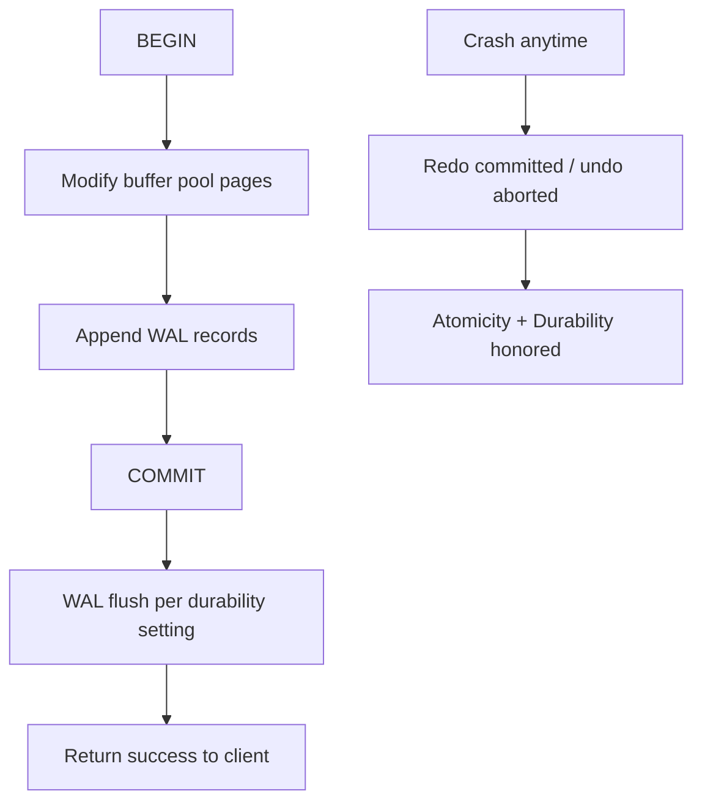
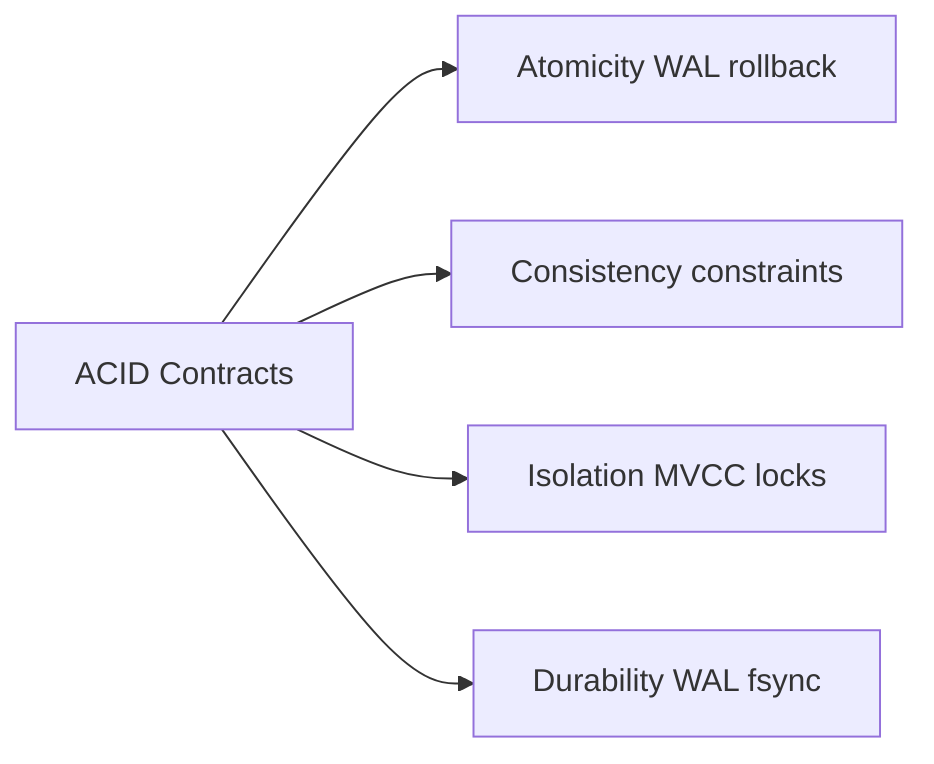
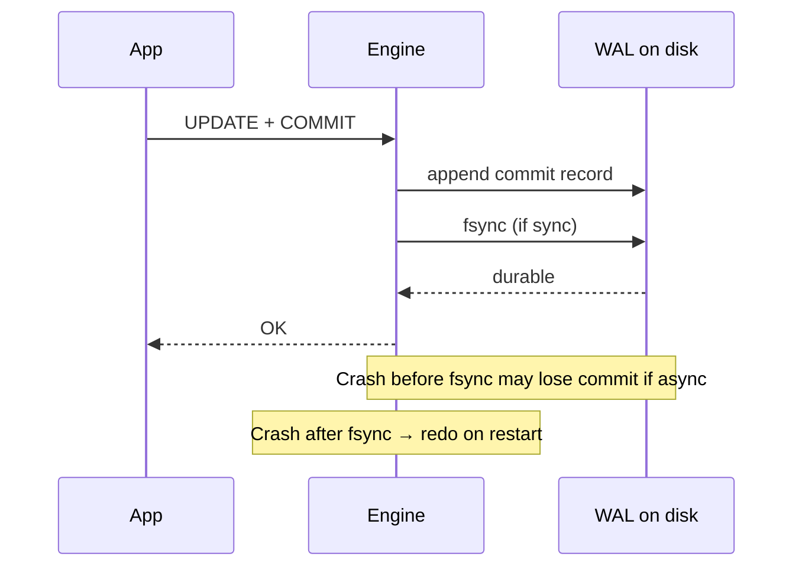

# ACID as Engine Contracts

## Overview

**ACID** names four **engine-level contracts** for transaction groups: **Atomicity** (all-or-nothing), **Consistency** (invariants enforced—often via constraints plus app rules), **Isolation** (concurrent transactions appear appropriately separated), **Durability** (committed work survives crash after ack). These are not slogans; each maps to WAL records, lock/MVCC rules, and recovery procedures inside the storage engine.

## Learning Objectives

- Define each ACID property as an implementable engine guarantee
- Connect atomicity and durability to WAL commit records and fsync policy
- Separate engine consistency (constraints) from application invariants
- Explain what "commit returned" means under synchronous vs asynchronous durability
- Hand off service-layer transaction boundaries to Backend track

## Prerequisites

- [[08-Databases/02-WAL-Durability-and-Recovery/Write-Ahead Logging Protocol|Write-Ahead Logging Protocol]]
- [[08-Databases/02-WAL-Durability-and-Recovery/Crash Recovery Redo and Undo Concepts|Crash Recovery Redo and Undo Concepts]]

## Difficulty

`intermediate`

## Estimated Time

- Reading: 2 hours
- Exercises: 2.5 hours
- Mini project: 3 hours

## History

Jim Gray formalized transaction properties in the 1970s–80s as databases moved from ad hoc file updates to concurrent multi-user systems. WAL (ARIES) unified atomicity and durability after crash. The industry later learned ACID defaults differ by product—MongoDB write concern, Redis fsync modes—so **contract literacy** matters more than the acronym.

## Problem It Solves

- **Partial updates** visible after crash mid-transfer
- **False confidence** that ORM `@Transactional` implies cross-service atomicity
- **Durability misunderstandings** when commit succeeds before disk fsync
- **Debugging** whether bugs are app logic vs engine isolation vs durability config

## Internal Implementation

### Property → mechanism map (PostgreSQL-oriented)

| Property | Engine mechanism |
| --- | --- |
| Atomicity | WAL + undo/rollback; single commit record |
| Consistency | Catalog constraints, triggers, checks (plus app) |
| Isolation | MVCC snapshots + locks for write conflicts |
| Durability | WAL flush (`commit_delay`, `synchronous_commit`) |



**Atomicity** spans rollback of uncommitted work and crash recovery eliminating partial committed transactions (via commit ordering in WAL). **Durability** is graded: `synchronous_commit=off` trades last-second commits for throughput.

## Mermaid Diagrams

### Structure



### Sequence / Lifecycle — commit and crash window



## Examples

### Minimal Example — atomic transfer

```sql
-- PostgreSQL 15+
BEGIN;
UPDATE accounts SET balance = balance - 100 WHERE id = 1;
UPDATE accounts SET balance = balance + 100 WHERE id = 2;
-- Constraint CHECK (balance >= 0) enforces consistency
COMMIT;
-- Either both updates durable (per sync settings) or neither visible after crash
```

### Production-Shaped Example — durability awareness in TypeScript

```typescript
// Node 20+ — engine commit ≠ cross-service saga
import pg from "pg";

export async function transferFunds(
  pool: pg.Pool,
  fromId: number,
  toId: number,
  amount: number,
): Promise<void> {
  const client = await pool.connect();
  try {
    await client.query("BEGIN");
    await client.query(
      "UPDATE accounts SET balance = balance - $1 WHERE id = $2",
      [amount, fromId],
    );
    await client.query(
      "UPDATE accounts SET balance = balance + $1 WHERE id = $2",
      [amount, toId],
    );
    await client.query("COMMIT"); // durability per DB synchronous_commit / replication
  } catch (err) {
    await client.query("ROLLBACK");
    throw err;
  } finally {
    client.release();
  }
}

// Payment + email notification: NOT one ACID transaction across services
// → [[07-Backend/08-Data-Access-and-Persistence-Patterns/Transactions as Used by Services|Transactions as Used by Services]]
```

## Trade-offs

| Dimension | Upside | Downside | When it matters |
| --- | --- | --- | --- |
| Strict sync durability | Strong commit guarantee | Higher commit latency | financial ledger |
| async commit | Throughput | Window of loss | metrics ingestion |
| Engine constraints | Enforced invariants | Migration complexity | balance non-negative |
| Distributed "ACID" | Marketing clarity | Not single-engine ACID | Spanner vs Postgres |

### When to Use

- Single-database transactions for money movement and tightly coupled rows
- Explicit durability/replication settings documented in runbooks
- Constraints for invariants that must never be violated

### When Not to Use

- Do not assume ACID across microservices without a distributed protocol
- Do not disable sync commit without quantifying RPO
- Do not conflate application validation with engine consistency

## Exercises

1. Simulate failed transfer mid-transaction; verify balances unchanged after ROLLBACK.
2. Set `synchronous_commit=off`; measure commit TPS and document crash loss window.
3. List three application rules Postgres constraints cannot enforce alone.
4. Draw WAL timeline for BEGIN → UPDATE → COMMIT → crash → recovery.
5. Contrast Redis MULTI/EXEC atomicity with Postgres ACID durability.

## Mini Project

**Commit ack lab.** Benchmark commit latency vs `synchronous_commit` and replica sync modes; write RPO/RTO paragraph.

## Portfolio Project

[[08-Databases/projects/Isolation Anomaly Clinic/README|Isolation Anomaly Clinic]] — ACID baseline scenarios.

## Interview Questions

1. Define ACID; which properties does WAL primarily support?
2. Difference between consistency in ACID vs CAP consistency?
3. What does COMMIT return guarantee under async durability?
4. Can atomicity span two PostgreSQL databases?
5. How do CHECK constraints relate to consistency?

### Stretch / Staff-Level

1. Explain how ARIES redo/undo supports atomicity after crash.
2. When is "eventual consistency + idempotency" preferable to stretching ACID across services?

## Common Mistakes

- Treating `@Transactional` in app server as durability across Kafka + DB
- Ignoring replication lag when defining "committed"
- Using eventually durable stores as ledger without compensation logic
- Calling read-modify-write in app "atomic" without transaction isolation

## Best Practices

- Document durability contract per environment (sync, replicas, backups)
- Keep financial invariants in constraints where possible
- Service orchestration patterns → [[07-Backend/08-Data-Access-and-Persistence-Patterns/Transactions as Used by Services|Transactions as Used by Services]]
- Multi-region CAP trade-offs → [[09-System-Design/03-Consistency-Models-and-CAP/CAP and PACELC as Product Constraints|CAP and PACELC as Product Constraints]]

## Summary

ACID describes engine contracts implemented with WAL, buffer pool state, lock/MVCC rules, and catalog constraints—not application wishes. Atomicity and durability hinge on log records and flush policy; isolation on concurrency implementation; consistency split between declarative constraints and code only the app can enforce. Engineers must know what commit acknowledgment actually guarantees on their configured engine.

## Further Reading

- [[00-References/Databases/README|Databases References]]
- Gray & Reuter, *Transaction Processing: Concepts and Techniques*
- PostgreSQL — WAL and Transaction Commit

## Related Notes

- [[08-Databases/05-Transactions-and-Isolation/Isolation Levels and Product Defaults|Isolation Levels and Product Defaults]]
- [[08-Databases/05-Transactions-and-Isolation/Locking vs MVCC|Locking vs MVCC]]
- [[08-Databases/02-WAL-Durability-and-Recovery/fsync Group Commit and Durability Levels|fsync Group Commit and Durability Levels]]
- [[07-Backend/08-Data-Access-and-Persistence-Patterns/Transactions as Used by Services|Transactions as Used by Services]]

## Progress Checklist

- [ ] Explained from first principles
- [ ] Drew at least one Mermaid diagram
- [ ] Implemented a minimal version
- [ ] Documented trade-offs and non-goals
- [ ] Completed exercises
- [ ] Practiced interview questions aloud
- [ ] Linked prerequisites and dependents
