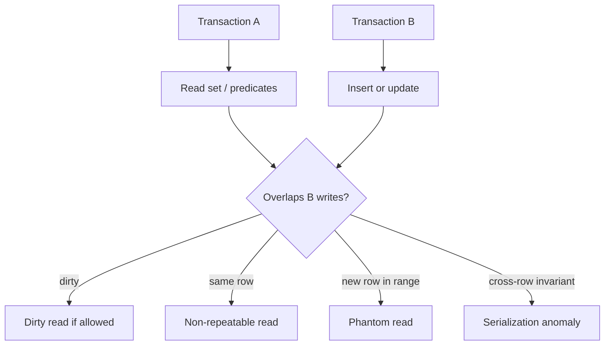
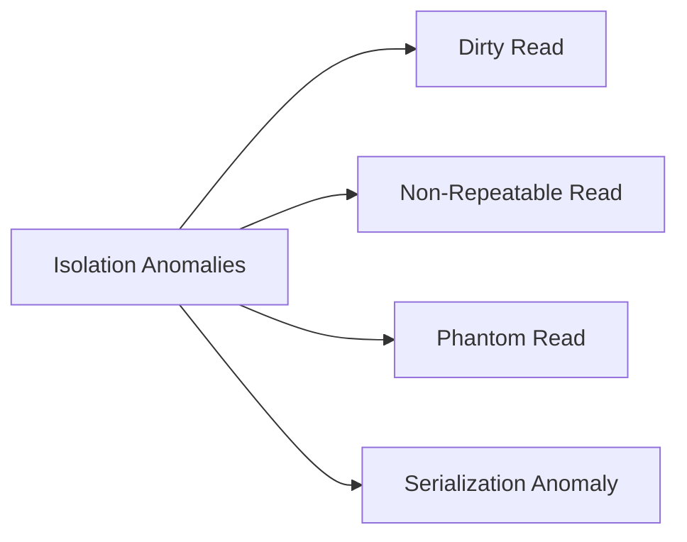
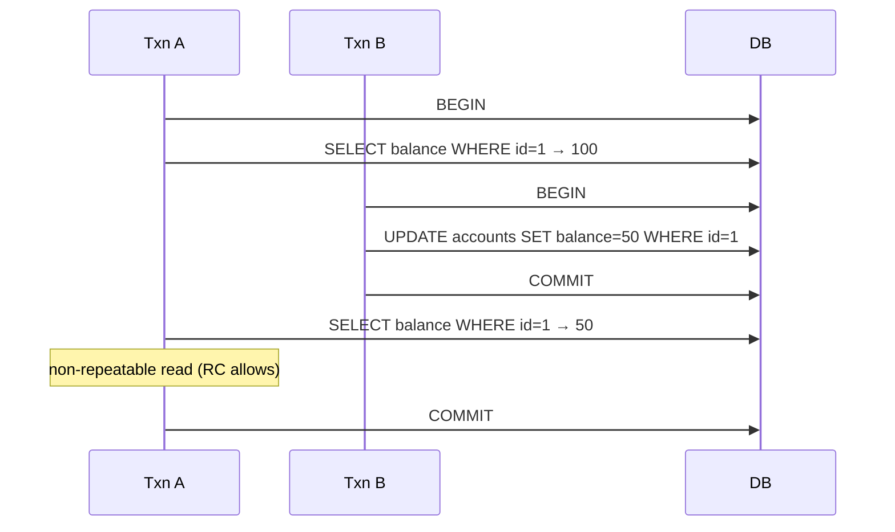

# Anomalies Dirty Nonrepeatable Phantom Serialization

## Overview

**Isolation anomalies** are observable behaviors when concurrent transactions interleave in ways applications did not expect: **dirty read** (see uncommitted writes), **non-repeatable read** (same row differs on re-read), **phantom read** (new rows appear in repeated range scan), and **serialization anomaly** ( outcome not equivalent to any serial order). SQL isolation levels standardize which anomalies are forbidden; engines may use stronger mechanisms than the standard minimum.

## Learning Objectives

- Define dirty, non-repeatable, phantom, and serialization anomalies with examples
- Map SQL isolation levels to forbidden anomaly classes
- Reproduce anomalies in controlled sessions with timing
- Distinguish phantoms from write skew (different failure mode)
- Predict application bugs from allowed anomalies under default isolation

## Prerequisites

- [[08-Databases/05-Transactions-and-Isolation/ACID as Engine Contracts|ACID as Engine Contracts]]
- [[08-Databases/05-Transactions-and-Isolation/Locking vs MVCC|Locking vs MVCC]]

## Difficulty

`advanced`

## Estimated Time

- Reading: 2.5 hours
- Exercises: 4 hours
- Mini project: 4 hours

## History

ANSI SQL-92 defined isolation phenomena and four levels (READ UNCOMMITTED through SERIALIZABLE). Research (Berenson et al., Adya) showed real engines and weaker definitions allowed additional anomalies—especially under MVCC and snapshot isolation. PostgreSQL's `SERIALIZABLE` uses **SSI** (Serializable Snapshot Isolation), stronger than snapshot alone for some write patterns.

## Problem It Solves

- **Double booking** from read-modify-write races
- **Reports with moving totals** under concurrent inserts
- **"Impossible" balances** from interleaved transfers without proper isolation
- **False assumptions** that READ COMMITTED prevents all races

## Internal Implementation

### Anomaly catalog

| Anomaly | Pattern | Example impact |
| --- | --- | --- |
| Dirty read | T2 reads T1 uncommitted | sees rolled-back data |
| Non-repeatable read | T1 reads row twice; T2 updates between | inconsistent row state |
| Phantom read | T1 range scan twice; T2 inserts matching row | count changes |
| Serialization anomaly | Arbitrary interleaving | invariant broken globally |



### PostgreSQL defaults

PostgreSQL **READ COMMITTED** prevents dirty reads; each statement sees a fresh snapshot. Non-repeatable and phantom reads **within a single statement** are largely masked, but **across statements** in one transaction, rows can change. **REPEATABLE READ** holds snapshot for transaction—no non-repeatable reads; phantoms possible in theory but PostgreSQL blocks inserting conflicts for snapshot isolation on indexed keys. **SERIALIZABLE** adds SSI detection.

## Mermaid Diagrams

### Structure



### Sequence / Lifecycle — non-repeatable read



## Examples

### Minimal Example — phantom under READ COMMITTED

```sql
-- Session A (PostgreSQL)
BEGIN;
SELECT count(*) FROM rooms WHERE hotel_id = 1 AND booked = false;
-- Session B: INSERT new available room + COMMIT
SELECT count(*) FROM rooms WHERE hotel_id = 1 AND booked = false;
-- Count may increase — phantom relative to predicate
COMMIT;
```

### Production-Shaped Example — guard with explicit isolation

```typescript
// Node 20+ — inventory decrement needs stronger isolation or locking
import pg from "pg";

export async function bookSeat(
  pool: pg.Pool,
  showId: number,
  seatId: number,
  userId: string,
): Promise<"ok" | "taken"> {
  const client = await pool.connect();
  try {
    // SERIALIZABLE or SELECT ... FOR UPDATE on seat row
    await client.query("BEGIN ISOLATION LEVEL SERIALIZABLE");
    const { rows } = await client.query(
      `SELECT status FROM seats WHERE show_id = $1 AND seat_id = $2`,
      [showId, seatId],
    );
    if (rows.length === 0 || rows[0].status !== "available") {
      await client.query("ROLLBACK");
      return "taken";
    }
    await client.query(
      `UPDATE seats SET status = 'sold', user_id = $3
       WHERE show_id = $1 AND seat_id = $2`,
      [showId, seatId, userId],
    );
    await client.query("COMMIT");
    return "ok";
  } catch (err: unknown) {
    await client.query("ROLLBACK");
    // 40001 serialization_failure → retry
    if (isSerializationFailure(err)) return bookSeat(pool, showId, seatId, userId);
    throw err;
  } finally {
    client.release();
  }
}

function isSerializationFailure(err: unknown): boolean {
  return typeof err === "object" && err !== null && (err as pg.DatabaseError).code === "40001";
}
```

## Trade-offs

| Dimension | Upside | Downside | When it matters |
| --- | --- | --- | --- |
| READ COMMITTED | Low blocking | Cross-statement races | most OLTP |
| REPEATABLE READ | Stable reads in txn | Write skew still possible | reporting snapshots |
| SERIALIZABLE | Strongest ANSI | Retries, aborts | inventory, scheduling |
| App-level locks | Explicit | Deadlock risk, complexity | hot rows |

### When to Use

- SERIALIZABLE or row locks for invariant-critical read-modify-write
- Idempotent retries on serialization failure (40001)
- Explicit isolation in code when default insufficient

### When Not to Use

- Do not upgrade entire app to SERIALIZABLE without measuring abort rate
- Do not confuse statement-level consistency with transaction-level
- Do not rely on READ UNCOMMITTED (Postgres treats as READ COMMITTED)

## Exercises

1. Reproduce non-repeatable read with two psql sessions under READ COMMITTED.
2. Attempt phantom insert; observe behavior under REPEATABLE READ vs READ COMMITTED.
3. Construct write skew scenario two doctors on call (see Snapshot Isolation note).
4. Map each anomaly to forbidden/allowed at four SQL isolation levels (table).
5. Implement retry wrapper for serialization failures with exponential backoff cap.

## Mini Project

**Anomaly theater.** Scripted concurrent clients demonstrating four anomalies; record timelines.

## Portfolio Project

[[08-Databases/projects/Isolation Anomaly Clinic/README|Isolation Anomaly Clinic]]

## Interview Questions

1. Define dirty, non-repeatable, and phantom reads.
2. Which anomalies does READ COMMITTED prevent in PostgreSQL?
3. Difference between phantom read and write skew?
4. What error code indicates serialization failure in PostgreSQL?
5. Why might SERIALIZABLE require application retries?

### Stretch / Staff-Level

1. Explain Adya phenomena G0–G3 and how they relate to SQL levels.
2. Design seat booking without SERIALIZABLE using `SELECT FOR UPDATE`—trade-offs?

## Common Mistakes

- Assuming ORM transaction equals SERIALIZABLE
- Checking-then-inserting without unique constraint or lock
- Ignoring serialization failure retries
- Using aggregate read + insert without predicate locking strategy

## Best Practices

- Encode invariants with UNIQUE constraints where possible
- Choose isolation per use case, not globally
- Test concurrency with parallel integration tests
- Service patterns → [[07-Backend/08-Data-Access-and-Persistence-Patterns/Transactions as Used by Services|Transactions as Used by Services]]

## Summary

Isolation anomalies describe how concurrent transactions can observe each other's effects at the wrong time. Dirty reads are largely solved; non-repeatable and phantom behaviors still appear under common defaults unless snapshots, locks, or serializable detection intervene. Serialization anomalies break global invariants and require strongest isolation or explicit locking—applications must handle retries and design constraints accordingly.

## Further Reading

- [[00-References/Databases/README|Databases References]]
- Berenson et al., "A Critique of ANSI SQL Isolation Levels"
- Adya, "Weak Consistency: A Generalized Theory and Optimistic Implementations"

## Related Notes

- [[08-Databases/05-Transactions-and-Isolation/Isolation Levels and Product Defaults|Isolation Levels and Product Defaults]]
- [[08-Databases/05-Transactions-and-Isolation/Snapshot Isolation and SSI Concepts|Snapshot Isolation and SSI Concepts]]
- [[08-Databases/06-Concurrency-Internals/Hot Rows Write Skew and Contention|Hot Rows Write Skew and Contention]]
- [[08-Databases/05-Transactions-and-Isolation/Locking vs MVCC|Locking vs MVCC]]

## Progress Checklist

- [ ] Explained from first principles
- [ ] Drew at least one Mermaid diagram
- [ ] Implemented a minimal version
- [ ] Documented trade-offs and non-goals
- [ ] Completed exercises
- [ ] Practiced interview questions aloud
- [ ] Linked prerequisites and dependents
